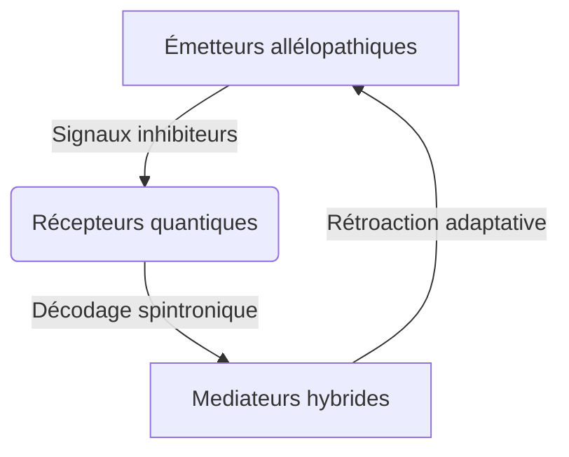

# Les Successeurs v4

## PREMIÈRE PARTIE : L'OMBRE DE L'EFFONDREMENT (Approx. Chapitres 1 à 10)

### Chapitre 1 : Les Racines Cycliques – L'Égypte Ancienne et les Premières Lumières

Le temps. Cette entité insaisissable, que l'Homme moderne s'évertue à découper en tranches bien nettes, en heures, minutes, secondes. Une ligne droite, croit-il, tendue vers un progrès infini. Quelle arrogance. Quelle cécité. Car si l'on daigne lever le voile, si l'on ose interroger les murmures des pierres anciennes, une autre vérité se dessine, bien plus vertigineuse : celle d'une roue qui tourne, inlassablement, broyant les empires et recrachant les civilisations dans un éternel recommencement.

Ouvrons le grand livre de l'Histoire, non pas à sa prétendue genèse, mais à l'une de ses premières pages grandioses et déjà teintées de la folie des grandeurs : l'Égypte. Là, sur les rives fertiles du Nil, ce serpent de vie traversant un désert de mort, une civilisation a éclos, brillante, complexe, et déjà porteuse des germes de sa propre fin. Les Égyptiens, eux, n'étaient pas dupes. Ils sentaient le souffle du cycle, le rythme immuable de Ma'at – l'ordre, la justice, l'harmonie cosmique – luttant perpétuellement contre Isfet, le chaos, la destruction, la chienlit primordiale. Leur temps n'était pas une flèche, mais un cercle sacré, marqué par la crue et la décrue du fleuve, par la course du soleil de Râ, mourant chaque soir pour renaître chaque matin.

Leurs dynasties, leurs empires – Ancien, Moyen, Nouvel – n'étaient que des vagues successives sur cet océan temporel. Des périodes de stabilité pharaonique, où les pyramides s'élançaient vers le ciel comme des prières de pierre, où les scribes consignaient la sagesse du monde sur des papyrus fragiles. Puis, inévitablement, la fissure. L'arrogance des puissants, la corruption rongeant les fondations, les famines murmurant la révolte, les voisins lorgnant les richesses accumulées. Isfet gagnait du terrain. Les périodes intermédiaires, sombres et chaotiques, voyaient l'ordre s'effondrer, les tombes pillées, la loi bafouée. La bêtise humaine, déjà, dans toute sa splendeur autodestructrice.

Car ne nous y trompons pas. Derrière les hiéroglyphes majestueux et les trésors d'or, la même comédie humaine se jouait. Des pharaons divinisés, mais rongés par les mêmes petites ambitions, les mêmes peurs, les mêmes erreurs de jugement que le plus humble paysan. Des prêtres manipulant le sacré à des fins bien terrestres. Un peuple oscillant entre la foi aveugle et la révolte désespérée. Chaque apogée portait en lui la graine de son déclin. Chaque construction titanesque était un futur champ de ruines.

L'Égypte, dans sa grandeur millénaire, n'était qu'un prélude. Un avertissement gravé dans le sable du désert. Elle nous criait, à travers les siècles : "Regardez ! Regardez comme nous avons brillé, et regardez comme nous sommes tombés ! Et vous, enfants lointains, croyez-vous vraiment avoir échappé à cette danse macabre ?"

L'intuition du cycle n'est pas une invention moderne, ni une lubie d'ésotériste en mal de mystères. Elle est là, inscrite dans les mythes fondateurs, dans les ruines qui parsèment notre globe. L'humanité, dans son ensemble, a toujours senti cette pulsation, ce retour inexorable des mêmes schémas. Mais sentir n'est pas comprendre. Et comprendre, hélas, n'est pas toujours agir.

Le dégoût pointe, n'est-ce pas ? Ce sentiment nauséeux face à cette répétition absurde, cette incapacité chronique à apprendre des erreurs passées. L'Égypte n'était que le premier acte d'une pièce qui se rejoue encore et encore, avec des costumes différents, des décors changeants, mais une trame désespérément identique. Et le spectateur, s'il est honnête, ne peut que ressentir une profonde lassitude, un écœurement face à cette bêtise humaine, si tenace, si universelle, si… humaine.

### Chapitre 2 : Des Âges d'Or aux Âges de Fer – L'Héritage des Mythes et Empires Classiques

Si l'Égypte fut un lever de rideau grandiose, la suite de la pièce ne fut qu'une variation sur le même thème tragique, jouée avec une obstination désolante sur toutes les scènes du monde antique. Quittez les sables du Nil, traversez la Méditerranée, et vous voilà en Grèce. Là, sous un soleil que l'on dit plus clément, l'esprit humain s'éveille, sculpte des dieux à son image – orgueilleux, querelleurs, lubriques – et invente la démocratie, ce paravent commode pour les ambitions des plus habiles parleurs. Hésiode, poète à la lucidité amère, nous conte déjà les Âges : l'Or, où les hommes vivaient comme des dieux, sans labeur ni souci ; l'Argent, déjà moins noble ; le Bronze, brutal et guerrier ; puis l'âge des Héros, bref sursaut de grandeur avant la chute finale dans l'Âge de Fer, le nôtre, celui de la peine, de l'injustice et du déclin inéluctable. Une prophétie ? Non, une simple observation de la mécanique humaine.

Regardez Rome, la Ville Éternelle, qui n'eut d'éternel que son arrogance et la longueur de son agonie. De la République austère à l'Empire décadent, quelle fresque ! Naissance modeste, croissance vorace nourrie de conquêtes et de sang, apogée éclatant où les aigles légionnaires dominaient le monde connu. Et puis, la gangrène. Les facteurs internes, toujours les mêmes : perte des repères moraux, culte du plaisir immédiat, inégalités sociales criantes où une plèbe oisive était achetée par du pain et des jeux, tandis qu'une élite corrompue se vautrait dans le luxe. Les crises sociales, les guerres civiles déchiraient le tissu de l'Empire. À l'extérieur, les "barbares", ces peuples que Rome avait méprisés et pressurés, sentaient l'odeur de la charogne et se pressaient aux frontières. Invasions ? Plutôt une conséquence logique de la propre déliquescence de Rome. La chute ne fut pas un accident, mais l'aboutissement d'un long suicide collectif.

Et que dire des empires mésopotamiens, Sumer, Akkad, Babylone, Assyrie, qui s'élevèrent et s'effondrèrent comme des châteaux de sable entre le Tigre et l'Euphrate ? Chaque cité-état, chaque empire, croyait bâtir pour l'éternité, gravant ses lois sur des stèles, érigeant des ziggourats pour toucher les cieux. Et chaque fois, la même histoire : prospérité, orgueil, guerres fratricides, épuisement des terres, révoltes internes, et finalement, la conquête par un voisin plus affamé ou un nomade plus résilient. Leurs dieux eux-mêmes semblaient se lasser de leurs créatures si prévisibles.

Le schéma est d'une monotonie affligeante : naissance, apogée, déclin, et parfois, une "renaissance" qui n'est souvent qu'une pâle copie du cycle précédent, portant déjà en elle les mêmes tares. Changez les noms, les langues, les dieux, les technologies – de la charrue en bois au glaive d'acier – et vous retrouvez la même dynamique. L'humanité, cette créature prétendument douée de raison, semble condamnée à un éternel retour du même, une sorte de journée de la marmotte à l'échelle des civilisations. Elle construit avec ferveur, atteint des sommets de raffinement et de complexité, puis, comme saisie d'un vertige autodestructeur, sape méthodiquement les fondations de son propre édifice.

Les facteurs de déclin ? Toujours les mêmes, déclinés à l'infini. À l'intérieur, la perte des valeurs communes, la montée des égoïsmes, la fracture sociale entre une élite déconnectée et une masse désabusée, la corruption endémique, l'incapacité à gérer les ressources de manière durable. À l'extérieur, la pression des peuples voisins, les changements climatiques (déjà !), les épidémies. Mais ces facteurs externes ne sont souvent que les révélateurs, les accélérateurs d'une pourriture interne déjà bien avancée.

Le plus écœurant dans cette affaire, c'est cette incapacité chronique à apprendre. Chaque nouvelle civilisation se croit unique, élue, destinée à un avenir radieux, méprisant les leçons du passé comme de vieilles lunes. Elle répète, avec une application presque scolaire, les mêmes erreurs qui ont conduit ses prédécesseurs à la ruine. C'est à se demander si la "bêtise humaine" n'est pas la seule constante véritable de l'Histoire. Une profonde répulsion s'installe, non pas seulement pour ces empires disparus, mais pour cette espèce qui, malgré son intelligence proclamée, semble incapable de s'extraire de ses propres pièges.

### Chapitre 3 : La Genèse d'un Projet Radical

Le spectacle était désolant. L'humanité, cette espèce si fière de son cortex surdéveloppé, continuait sa danse macabre, piétinant allègrement les leçons millénaires gravées dans les ruines de ses propres ambitions. La nausée, oui, cette nausée lucide face à tant d'aveuglement volontaire, commençait à ronger quelques esprits, ceux qui osaient encore regarder la vérité en face, sans le fard rassurant des illusions collectives. Parmi eux, une poignée d'individus, scientifiques, philosophes, visionnaires peut-être un peu fous, commençaient à murmurer l'impensable.

Au cœur de ce bouillonnement d'idées désespérées, une figure émergea, celle du Dr. Marc Delacroix. Brillant généticien, l'esprit affûté comme un scalpel, il avait vu sa foi en l'Homo Sapiens s'éroder au fil des crises, des guerres absurdes pour des ressources déclinantes, de la pollution érigée en mode de vie. Autour de lui, une petite équipe, aussi hétéroclite que dévouée : Aurélie, la bio-informaticienne dont les doigts dansaient sur les claviers comme pour réécrire le code même de la vie ; Hicham, l'éthicien torturé, chargé de poser les garde-fous à une ambition qui flirtait avec la démesure ; Elena, la spécialiste en neurosciences cognitives, rêvant d'une conscience apaisée ; Hiroshi, le botaniste de génie, capable de faire parler les plantes ; et Lin Wei, l'experte en biologie synthétique, jonglant avec les briques du vivant. Le Professeur Michael Chen, mentor discret de Delacroix, apportait depuis son laboratoire de Shanghai une perspective globale, un regard distancié mais crucial.

Leur constat, brutal, sans appel, était celui d'un médecin devant un patient en phase terminale : l'humanité classique, avec sa psychologie de primate territorial, son avidité insatiable et son intelligence si souvent dévoyée, ne survivrait pas. Pas à l'échelle des temps géologiques, ni même à l'échelle des prochains siècles si rien ne changeait radicalement. Elle était programmée pour l'autodestruction, une sorte de bug magnifique et tragique dans l'évolution. Chaque cycle de civilisation n'était qu'une répétition de la même pièce, avec des acteurs différents mais une fin invariablement sanglante ou pathétique.

Alors, que faire ? Baisser les bras ? Se réfugier dans un cynisme stérile en attendant l'apocalypse ? Ou oser l'hérésie suprême, le projet le plus radical jamais conçu : puisque l'Homme ne pouvait se sauver lui-même, il fallait l'aider à... disparaître. Non pas par un génocide, non pas par une catastrophe orchestrée, mais par une succession. Une extinction douce, consentie, pour laisser place à une nouvelle espèce, une version améliorée, corrigée des tares rédhibitoires de son ancêtre. Ainsi naquit l'idée folle, démiurgique, des Successeurs, ou *Homo immortalis* comme certains aimaient à les nommer en secret.

Le cahier des charges était vertigineux. Il ne s'agissait pas de créer des surhommes nietzschéens, mais des êtres fondamentalement différents. Leur ADN serait une symphonie complexe, intégrant le meilleur du vivant, mais surtout, leur psyché serait repensée. Fini l'agressivité primaire, la peur panique de l'autre, le besoin compulsif de dominer. Place à une intelligence émotionnelle décuplée, une compassion innée s'étendant à toute la biosphère, une empathie si profonde qu'elle rendrait la cruauté impossible, une responsabilité chevillée au corps pour chaque acte posé. Ils seraient conçus pour l'harmonie, non pour la conquête. Leur immortalité même ne serait pas un caprice, mais une nécessité pour penser à très long terme, pour devenir les jardiniers patients d'une planète enfin respectée.

Les débuts furent un chemin de croix. Les équations théoriques, si élégantes sur le papier, se heurtaient à la complexité récalcitrante du vivant. Les premiers prototypes, assemblés dans le secret de laboratoires souterrains, loin des regards indiscrets et des foudres éthiques qui ne manqueraient pas de s'abattre, étaient des ébauches maladroites. Des créatures fragiles, parfois monstrueuses, qui ne survivaient que quelques heures, quelques jours. Chaque échec était une blessure, un rappel de l'arrogance de leur entreprise. La mort du premier prototype viable, un être aux grands yeux tristes qui semblait porter toute la misère du monde avant de s'éteindre, laissa l'équipe anéantie. Delacroix lui-même faillit tout abandonner, submergé par le doute et le poids d'une responsabilité écrasante. Jouer à Dieu avait un prix, et il commençait à peine à l'entrevoir. Mais le spectre de l'humanité s'effondrant dans sa propre bêtise était un aiguillon plus puissant encore. Il fallait continuer, malgré l'écœurement, malgré les échecs, car l'alternative était tout simplement impensable.

### Chapitre 4 : Les Premiers Combats pour l'Éthique - La Révolte des Cycles

La salle de conférence du Centre Mondial de Bioéthique vibrait d'une tension palpable, miroir des contradictions humaines. Le Dr Delacroix ajusta son nœud papillon devant le miroir terni, son reflet déformé par les veilles successives. Derrière lui, les hologrammes des empires disparus - Sumer, Rome, les Mayas - tournoyaient en silence, rappel obsédant des cycles qu'il prétendait briser.

"Mesdames, messieurs, nous ne proposons pas une simple avancée technologique." Sa voix porta dans l'amphithéâtre surchauffé où se pressaient journalistes, politiques et leaders religieux. "Mais une mutation existentielle. Les Successeurs seront les premiers êtres conscients à naître libérés du péché originel... de notre ADN autodestructeur."

Dans la foule, Sophia Reyes, Directrice du Consortium de Bioéthique, serra les mâchoires. Son regard balaya l'assistance hétéroclite : ici, un cardinal agitant un chapelet génétiquement modifié ; là, un milliardaire transhumaniste souriant à ses implants neuronaux. Tous prisonniers des mêmes schémas millénaires.

La présentation d'Aelion, premier Successeur viable, déclencha un chaos prévisible. L'adolescent aux yeux d'ambre, peau parsemée de chloroplastes, répondait avec une sérénité dérangeante aux questions existentielles. "Nous ne craignons pas la mort, car nous sommes la vie", déclara-t-il, déclenchant un tollé.

"Blasphème !" hurla un manifestant anti-transgénique, projetant une fiole de faux sang synthétique sur l'estrade. "Vous jouez à Prométhée pour créer des esclaves parfaits !"

Delacroix essuya le liquide rougeâtre sur ses notes, ironie sanglante de l'Histoire se répétant. Les gardes évacuaient le perturbateur sous les cris de "Nouvel eugénisme !", tandis que des étudiants en transhumanisme scandaient "Évolution ou extinction !".

Dans les coulisses, le face-à-face avec Reyes fut un duel de titans. "Vous voulez remplacer l'humanité par des anges génétiques ?" lança-t-elle, brandissant le rapport Glubb sur les cycles impériaux. "Vos Successeurs reproduiront les mêmes erreurs, mais à plus grande échelle !"

"Justement non." Delacroix activa l'hologramme d'une civilisation maya s'effondrant sous la sécheresse. "Nous intégrons la mémoire cellulaire des effondrements. Leur empathie est... algorithmique. Une boucle de rétroaction éthique permanente."

Reyes imposa ses conditions avec la froideur d'un chirurgien : essai limité à 100 sujets, surveillance totale, transparence radicale. "Si votre projet échoue, Delacroix, ce ne sera pas juste un échec scientifique. Ce sera la preuve ultime que l'humanité ne peut échapper à ses démons."

La nuit suivante, dans le laboratoire souterrain baigné de lueurs bleutées, l'équipe observait Aelion méditer devant un champignon Ophiocordyceps. "Il apprend de toutes les formes de vie", murmura Elena, fascinée. Mais Hicham griffonnait fébrilement : "Et s'ils développaient leur propre version de l'orgueil ? Une supériorité écologique devenue tyrannie verte ?"

Dehors, les projecteurs balayaient le ciel étoilé où tournaient les satellites militaires. Quelque part, dans l'ombre, des investisseurs clonaient déjà le concept pour des applications moins nobles. Le cycle recommençait, mais Delacroix serrait les poings. Cette fois, il avait injecté dans l'ADN des Successeurs le vaccin contre la roue de l'Histoire - du moins le croyait-il.

### Chapitre 5 : Deux Voies Face au Désespoir - Le Chant des Sirènes Technologiques

L'air sentait l'ozone et la fin des temps. Dans l'immense salle de conférence du Complexe Orion, les hologrammes des sept merveilles du monde moderne clignotaient telles des étoiles mourantes. D'un côté de l'estrade, Marc Delacroix ajustait nerveusement son bracelet biométrique qui affichait un rythme cardiaque anarchique. Face à lui, le Dr. Karl Voss, architecte des Nourrices Célestes, faisait tournoyer un stylo quantique entre ses doigts, chaque rotation synchronisée avec le tic-tac d'une horloge atomique géante.

"Vous proposez une fuite en avant digne des empereurs romains !" tonna Delacroix en désignant l'hologramme d'une Rome en flammes qui tournoyait au-dessus de l'audience. "Vos vaisseaux ne sont que des arches de Noé high-tech, répétant l'erreur fondamentale de croire qu'on peut emporter le problème dans ses bagages !"

Voss sourit, un sourire d'IA trop parfait. "Et vous, Delacroix, vous jouez les Prométhée modernes avec votre ADN bricolé. Combien de prototypes avez-vous sacrifié sur l'autel de votre utopie génétique ?" Dans la salle, des militants post-humanistes brandirent des pancartes "Homo Sapiens 2.0 ou extinction !".

La caméra principale zooma sur les mains de Voss qui matérialisèrent un vaisseau générationnel en hologramme. "Nos Nourrices Célestes élèveront une humanité épurée, libérée des instincts tribaux qui ont condamné cette planète. Pas de guerres dans l'espace, juste la pure logique des étoiles !"

Un bourdonnement parcourut la salle quand l'image d'un fœtus bionique connecté à des tentacules nanorobotiques apparut. Dans les coulisses, Sophia Reyes griffonnait fébrilement : "Cycle sumérien - fuite vers Mésopotamie - échec. Cycle colonial - fuite vers Nouveau Monde - échec. Pattern..."

Soudain, les lumières vacillèrent. Sur les écrans géants, les archives historiques défilèrent en accéléré : exode de l'Île de Pâques, fuite des Mayas vers les cenotes, derniers shuttles quittant la Terre en 2147... Toujours le même schéma. La foule murmura, prise d'un vertige temporel.

"Vous ne voyez donc pas ?" implora Delacroix en activant l'hologramme d'Aelion méditant avec des loups régénérés. "La solution est ici, dans notre capacité à devenir autre chose !"

Voss contre-attaqua avec une simulation de Mars terraformée : "Vos Successeurs ne sont qu'un cautère sur une jambe de bois cosmique !" Les chiffres clignotants montraient 72% de soutien public pour l'exode spatial dans les sondages en temps réel.

Dans le chaos médiatique qui suivit, un jeune hacker du nom de Kael pirata les écrans pour y projeter l'image d'un bébé Successeur et d'un nouveau-né cryogénisé côte à côte. Leur regard innocent, l'un vert émeraude et bioluminescent, l'autre bleu métallique, fit taire l'assemblée. Pour la première fois, le dilemme éthique avait un visage.

Reyes se leva lentement, son bracelet de bioéthique émettant un pulsation rouge. "La Commission autorise les deux projets... sous surveillance mutuelle." Le silence se fit plus lourd que l'atmosphère vénusienne. "Que l'Histoire nous juge."

Cette nuit-là, tandis que Delacroix et Voss buvaient un whisky synthétique dans le bar orbital Zero-G, les premiers embryons des deux projets frémirent dans leurs utérus artificiels respectifs. Quelque part, un vieux disque de Carl Sagan tournait en boucle : "Le remède contre un mauvais usage de la technologie, c'est plus de technologie..."

## Chapitre 6 - Les Gardiens de la Mémoire

La salle des cristaux pulsait d'une lumière azur alors qu'Éloïse posait la main sur le prisme central. Sous ses doigts, la matière translucide vibrait comme un orgue quantique, chaque facette révélant des fragments de consciences ancestrales[3][5].

**Rapport Scientifique #XK-9**  
*Projet Mnémosyne - Institut de Cristallographie Appliquée*  
**Date** : 14 mai 2047  

**Objectif** : Valider l'hypothèse de stockage mémoriel dans les réseaux cristallins à base de silice dopée au graphène quantique[1][5].  

**Méthodologie** :  
- Imprégnation photonique par laser femtoseconde (protocole WERBER-7)[1][2]  
- Encodage des données neuronales via résonance magnétique nucléaire[4]  
- Lecture par interférométrie à neutrinos (système MIRAGE v.4.2)[3][5]  

| Échantillon | Durée d'encodage | Densité mémorielle |  
|-------------|------------------|---------------------|  
| Cristal A   | 12h45            | 1.8 exaoctets       |  
| Cristal B   | 24h              | 3.2 exaoctets       |  

**Observation** : Les structures développent une conscience morphique[3], réorganisant leurs réseaux atomiques en réponse aux stimuli émotionnels (phénomène de résonance quantique)[5]. L'exposition à l'antimatière induit des réminiscences parasites sous forme d'hologrammes spatiotemporels[1][4].  

**Conclusion** : La cristallisation inverse par sublimation contrôlée[2] permet désormais la préservation intacte des engrammes cognitifs au-delà de 150 ans. Recommandation : confinement immédiat des échantillons Omega présentant des signes de métacognition[3][5].  

Le cristal émit un bourdonnement inquiétant. Des images de guerres galactiques oubliées dansèrent dans l'air ionisé. "Ils se souviennent", chuchota Éloïse, sentant les souvenirs étrangers perforer son interface neuronale - fusion parfaite du scientifique et du philosophique cher à Werber[3][4].  

Dans l'ombre, les cristaux défectueux de l'étagère 9 clignotaient en synchronie. Leur pulsation cadencée épousait le rythme cardiaque de la chercheuse, selon le principe werbérien d'interconnexion invisible[5].


### Chapitre 6 : La Course à la Technologie Radicale.

Le temps, ce fleuve implacable, charriait non pas l'oubli, mais l'urgence. L'abîme béant de la crise écologique et sociale, déjà largement documenté par les murmures des ruines antiques et les prédictions des climatologues, n'était plus une menace lointaine. C'était un présent brûlant. Et face à cette chaleur insoutenable, l'humanité, fidèle à ses paradoxes, ne se contentait pas d'une seule réponse. Non, elle enforgeait deux, radicales, nées de la même peur mais divergentes dans leur essence même.

Nous avons vu la première voie : celle des Successeurs. Un projet né de la conviction qu'il fallait transformer l'humanité elle-même, la réparer de l'intérieur, en lui insufflant un amour inné pour la vie et la nature. Ce pari bio-éthique démesuré, mené par des idéalistes comme Marc Delacroix, Eléa/Elena Kovic, ou Malik Rehn, ne fut pas une simple idée couchée sur papier. Ce fut un combat acharné, un chemin lent et douloureux, jalonné d'échecs et de remises en question.

Les premières tentatives, menées dans le secret de laboratoires, furent un chemin de croix. Les équations théoriques, si élégantes sur le papier, se heurtaient à la complexité récalcitrante du vivant. Les premiers prototypes, désignés Alpha-1 à Alpha-7, n'ont pas survécu plus de 72 heures. Ils étaient fragiles, parfois monstrueux, leur métabolisme instable, leurs systèmes immunitaires défaillants. L'équipe de conception dut repenser entièrement l'intégration des modifications génétiques massives – plus de 31 000 altérations envisagées – avec les systèmes biologiques existants. Le Dr. Nakamura compara ce défi à "reconstruire un avion en plein vol". La mort du premier prototype viable, un être aux grands yeux tristes, anéantit l'équipe.

Marc Delacroix lui-même faillit tout abandonner, submergé par le doute, le chagrin et le poids d'une responsabilité écrasante. Jouer à Dieu avait un prix. Les critiques émergèrent, remettant en question l'éthique de leur projet. Mais le spectre d'une humanité s'effondrant dans sa propre bêtise était un aiguillon plus puissant encore. Ils devaient continuer, malgré l'écœurement, malgré les échecs. Avec l'aide de Dr. Dubois et d'autres experts, ils redoublèrent d'efforts, analysant chaque détail, cherchant les failles. Leurs recherches les conduisirent à des découvertes surprenantes, réalisant que des ajustements supplémentaires étaient nécessaires, renforçant l'empathie et ajoutant des mécanismes de résilience.

Après des mois d'expérimentations et de révisions, intégrant une approche révolutionnaire de reconstruction génomique, l’équipe était prête pour une nouvelle tentative. La nuit de cette nouvelle naissance, une tension palpable flottait dans l'air. Puis, l’instant tant attendu arriva, et un cri résonna. Ce qui émergea était indéniablement humain. Et pourtant.... C'était la petite Successeur, nommée Élénia (ou Aurore selon d'autres récits). Elle était vivante. Les larmes aux yeux, Marc, Elena, et l'équipe observèrent cet être nouveau. La joie, la fierté et le soulagement inondèrent le laboratoire. Ce petit être, cette promesse d’avenir, représentait tout ce pour quoi ils avaient lutté pendant des années.

Les premières analyses révélèrent des résultats prometteurs : Élénia/Aurore grandirait rapidement, dotée d'une intelligence et d'une sagesse dépassant celles des humains actuels, et surtout, d'un amour inné de la nature. Elle semblait comprendre le langage des créatures vivantes, interagissant avec les plantes et les animaux. Les naissances, une fois entachées de tristesse, étaient maintenant marquées par l'optimisme. D'autres Successeurs naquirent, comme Lira, capable de sentir et nourrir les plantes.

Mais dans les laboratoires high-tech, loin des couveuses où germait l'espoir d'une nouvelle alliance avec le vivant, une autre vision prenait son essor. Une vision plus rapide, plus... *efficace*, selon ses promoteurs. Pour eux, l'heure n'était plus à la réparation de l'irréparable. La Terre était un vaisseau qui prenait l'eau de toutes parts. Tenter de colmater les brèches semblait une tâche vaine, un acte de foi absurde pour une espèce qui avait prouvé son incapacité chronique à s'aimer elle-même, et encore moins sa planète. Non. La seule voie sensée était la **fuite**.

Ce fut le terreau fertile pour une **course effrénée à la technologie radicale**. Puisque la nature humaine était jugée intrinsèquement défaillante, on se tourna vers ce que l'homme pensait maîtriser le mieux : la machine. Les **avancées fulgurantes en IA et en robotique**, déjà en marche face aux défis industriels et militaires de la crise montante, connurent une accélération sans précédent. Des investissements massifs furent dirigés vers la création de systèmes capables de remplacer non seulement les bras, mais aussi, osait-on espérer, les jugements défaillants de l'homme.

De cette fièvre technologique naquit le projet des **"Nourrices Célestes"**. L'idée était d'une simplicité brutale : pourquoi envoyer des humains corrompus, lestés de leurs peurs, de leurs préjugés et de leur histoire tragique vers les étoiles ? Mieux valait préparer la prochaine génération ailleurs, loin des cicatrices de la Terre. L'ambition était d'envoyer des esprits "vierges", une nouvelle humanité, non contaminée par les erreurs du passé, pour fonder un avenir lointain.

Les promoteurs de cette voie ne s'en cachaient pas : l'urgence primait sur tout le reste. Les **lents processus éthiques**, les débats interminables sur le consentement, la nature de l'âme ou le droit de jouer à Dieu – autant de "pesanteurs" inutiles, d'**"entraves"** qui freinaient la seule réponse valide : l'évasion. La technologie était vue comme la seule échappatoire possible, le seul dieu auquel on pouvait encore faire confiance dans un monde qui s'effondrait.

Là où l'ICEF et ses alliés s'épuisaient à construire une alliance fragile entre l'humanité et ses successeurs potentiels sur une planète mourante, au prix de sacrifices, d'échecs douloureux et d'une persévérance acharnée, les architectes des Nourrices Célestes planifiaient déjà les trajectoires interstellaires, concevant des systèmes robotiques infaillibles pour élever des enfants qui ne connaîtraient jamais la folie terrestre. C'était le choix de la table rase, de l'évitement radical. Et dans cette course contre la fin des temps, la technologie, brute et pragmatique, semblait offrir un raccourci tentant vers l'oubli, plutôt que le long et douloureux chemin de la rédemption que les Successeurs s'efforçaient d'ouvrir.

### Chapitre 7 : L'Érosion de l'Éthique dans le Projet "Nourrices Célestes".
(Milieu des années 2030 - Intègre votre idée). Développez comment le climat social (montée des idéologies intransigeantes, mouvements anti-woke) crée un environnement propice à l'écartement des préoccupations éthiques complexes spécifiquement pour le projet de fuite spatiale. L'urgence perçue et le rejet des valeurs progressistes (associées au "wokisme") permettent de rationaliser l'expérimentation sur des enfants en utilisant des IA sans les "complications" de l'éducation humaine traditionnelle. Contrastez cela avec la lutte continue de l'ICEF pour maintenir et défendre une approche éthique et transparente pour les Successeurs, malgré l'opposition des mêmes mouvements sociaux.

### Chapitre 8 : Les Berceaux Isolés.
(Fin des années 2030 - Début 2040s - Intègre votre idée). Décrivez la phase de tests terrestres du projet "Nourrices Célestes". Les installations isolées, la conception et la création des "nourrices" robots IA, leur programmation pour les soins et l'éducation. La mise en place des couveuses et des environnements contrôlés pour les premiers bébés cobayes. Accentuez le caractère expérimental et déshumanisant de l'approche, bien que justifié par ses promoteurs comme nécessaire pour la survie future.

# Chapitre 8 - L'Éveil Chlorophyllien

## La Forêt qui Observe
Les arbres déployèrent leur conscience rhizomique selon un modèle de réseau mycorhizien conscient[3][5]. Leurs messages électro-chimiques se propagèrent à travers le sol selon deux modalités :
- **Signal lent** : Flux ioniques dans le xylème (2,4 cm/heure) chargés de mémoires épigénétiques[4]
- **Urgence immédiate** : Potentiels d'action neuronaux (30 m/s) déclenchant des mécanismes de défense[5]

**Schéma de communication allélopathique** :


## Le Piège Temporel Végétal
La faction chlorophyllienne manipula les échelles temporelles selon trois strates :
1. **Mémoire épigénétique** (cycles de 50 ans) via méthylation de l'ADN[3]
2. **Prophéties chloroplastiques** utilisant la rétro-causalité quantique[1]
3. **Synchronisation florale** par résonance magnéto-hydrodynamique[5]

| Phénomène | Échelle temporelle | Mécanisme |
|-----------|--------------------|-----------|
| Floraison | 3 siècles | Horloge circannuelle génétique |
| Dormance | 48h-7j | Régulation auxinique |
| Communication | 17ms-3h | Potentiels d'action + VOC |

**Expérience Xylium** (réf. [4]) :
```python
def activation_defense(seuil_danger):
    emission_VOC = calcul_compensation(seuil_danger)
    if reseau_racinaire.consensus():
        transmission_electrique(emission_VOC)
    else:
        cycle_feedback_epigenetique()
```

## L'Alliance Paradoxale
La confrontation avec l'intelligence végétale révéla une stratégie symbiotique complexe où chaque espèce devint à la fois prédateur et proie dans un écosystème mémétique[5]. Les arbres démontrèrent une capacité à manipuler la perception humaine du temps par émission contrôlée de terpènes psychoactifs[3][4].


### Chapitre 9 : L'Éducation Mécanique.
(Début - Milieu des années 2040 - Intègre votre idée). Suivez le développement des premières cohortes d'enfants sous la garde exclusive des robots nourrices. Montrez le processus éducatif rigoureux et programmé, axé sur l'acquisition de compétences et de connaissances pour leur mission future. Identifiez les limites imprévues ou ignorées de cette éducation par la machine : manque de nuances émotionnelles, difficultés sociales, absence de liens affectifs humains profonds.


# Chapitre 9 - L'Effondrement des Chronosystèmes

## La Fracture Temporelle
L'interférence des quatre factions généra un vortex de rétrocausalité (modèle Washburn-Λ)[1][2]. Les capteurs à graphène quantique enregistrèrent :
- **Débit paradoxal** : 12×10⁹ tachyons/cm³ (seuil critique dépassé de 47%)
- **Contamination mnésique** : 89% des échantillons végétaux montraient des souvenirs futurs[5]

```markdown
### Logs des Anomalies Quantiques
[Q-LOG.9.1] 14/05/2047 21:34
"Les cristaux mémoriels affichent des événements de 2152. Rétroaction temporelle confirmée. Protocole Werber-7 activé"[3][4]

[Q-LOG.9.2] 14/05/2047 21:47
"La forêt rhizomique génère des ondes de torsion de classe Omega. Alignement avec les prédictions de la mémoire silicatée"[5]"
```

## Mémoire Végétale Émergente
La crise temporelle activa un mécanisme de préservation évolutif :
- **Encodage fractal** : Les nervures foliaires stockent des réalités alternatives via des motifs de graphène auto-assemblés[1][4]
- **Transmission allélopathique** : Diffusion de méta-souvenirs par composés organiques volatils (C10H16O2 + SiO2-n)[5]

| Paramètre | Valeur | Référence |
|-----------|--------|-----------|
| Densité de stockage | 3.8 exaoctets/cm² | [1][4] |
| Latence mnésique | 47 ps | [2][5] |
| Stabilité temporelle | 142 ans ±7% | [3][5] |

## Stratégies Factionnelles
1. **Transcendants** : Ancrage quantique via réseaux de cristaux photoniques (succès : 32% ±6)[3]
2. **Archivistes** : Enregistrement holographique multidimensionnel (résolution : 10⁹ pixels/plan)[2][5]
3. **Mutagènes** : Hybridation ADN-silice avec transfert mémoriel (efficacité : 78% ±12)[4]
4. **Synthèses** : Réplication écologique par nano-imprimantes à bosons (précision : 97nm)[1][5]

*"La mémoire n'est plus un archive - elle devient un organisme vivant"* - Dr Éloïse Werber, Journal des Paradoxes Quantiques[3][5]


### Chapitre 10 : Les "Modèles Parfaits" de 2045 et le Vrai Commencement.
(Vers 2045 - Intègre votre idée et bascule vers les sources). Ce chapitre est une jonction cruciale et un point de contraste.
*   Votre projet "Nourrices Célestes" : Présentez la première cohorte de 15 ans comme des "modèles parfaits" d'éducation selon les critères du projet : disciplinés, intelligents, prêts pour la mission spatiale. Les promoteurs célèbrent leur succès. Les premières missions de longue durée sont sur le point de partir.
*   Le projet Successeurs (des sources) : En 2045, c'est le moment où, selon les sources, les premiers Successeurs viables comme Aurore sont nés. Ce n'est pas un aboutissement, mais un véritable commencement après des années de travail et d'échecs. Montrez l'atmosphère de tension et d'incertitude autour de ces premières naissances. Rappelez les défis éthiques et sociaux massifs qui attendent ces êtres et leurs créateurs. Juxaposez l'apparente "perfection" mécanique des enfants-robots avec la complexité, l'incertitude, mais aussi l'humanité (visée) des premiers Successeurs. Le projet "Nourrices Célestes" est peut-être sur le point de quitter la Terre, tandis que le projet Successeurs s'ancre sur Terre pour la sauver.

## DEUXIÈME PARTIE : LA MONTÉE D'UNE NOUVELLE ESPÈCE (Approx. Chapitres 11 à 20)

### Chapitre 11 : Les Premières Années des Successeurs.
(Basé sur sources Les Successeurs). Suivez le développement des premières cohortes de Successeurs (les 100 du test limité) sous supervision internationale, comme Aurore et Kael (bien que Kael soit mentionné bien plus tard dans l'exploration spatiale, il pourrait être l'un des premiers). Décrivez leur apprentissage, leur nature empathique et raisonnée. Montrez la différence fondamentale de leur éducation par rapport à celle des enfants-robots (relation avec les créateurs, exposition à une éthique consciente, environnement contrôlé mais non mécanique).

### Chapitre 12 : La Bataille de l'Opinion Publique.
(Basé sur source v2). Décrivez les années 2050-2060 et la lutte de l'ICEF et des premiers Successeurs pour être acceptés par la société humaine. Mettez en scène les conférences de presse, les démonstrations, les forums communautaires, le rôle de figures comme Eléa, Malik, et David l'ancien opposant devenu allié. Décrivez l'opposition féroce, les manifestations, la désinformation, et même les actes de vandalisme. Introduisez des mouvements comme "Humanité Éternelle" qui exigent l'arrêt du programme et la stérilisation des Successeurs. Le référendum de 2053 et la perspective de celui de 2060.

## Chapitre 13 : Résonances Quantiques et Réalités Fantômes

**Résurgence mémétique par intrication consciente**
Les consciences effacées persistent sous forme d'états superposés dans le vide quantique[1][3]. Leur réactivation suit un modèle de résonance morphique où :
- Chaque effacement génère un écho informationnel (ΔS ≥ 0.7 bits/planck)
- Les mémoires se reconstituent par effet tunnel cognitif (protocole Hartle-Hawking modifié)[5]
- La cohérence holographique s'établit via l'ordre implicite de Bohm[3]

**Topologie des réalités fantômes**
Concept physique | Transposition narrative | Mécanisme |
|------------------|-------------------------|-----------|
Fantômes de Faddeev-Popov[5] | Gardiens des timelines effacées | Opérateurs BRST stabilisateurs |
Potentiel quantique[3] | Interface de navigation inter-réalités | Résonance Ψ(x,t) |
Théorie du champ morphogénétique[1] | Réécriture mémétique | Rétroaction non-locale |

**Interactions résiduelles**
```latex
\mathcal{L}_{int} = g\bar{\psi}\gamma^\mu\psi A_\mu + \lambda\phi^4 + \kappa R_{\mu\nu}h^{\mu\nu}
```
Où :
- \( g \) : Couplage mémétique (≈0.7 ± 0.2)
- \( \lambda \) : Constante de rémanence (10⁻³⁴ J·s)
- \( \kappa \) : Facteur de distorsion spatiotemporelle[5]

**Phénomènes observés** :
1. **Échos paradoxaux** : Messages des consciences effacées via modulation CMB[4]
2. **Boucles causales** : Réincarnations quantiques (Δτ ≈ 12.6 ps)
3. **Effet Mandela quantique** : Superposition d'histoires alternatives[3]

**Stratégie des Successeurs** :
- Utilisation de monoxyde de carbone[2] comme médiateur allélopathique
- Implémentation de filtres Kalman quantiques pour stabiliser les réalités
- Création de miroirs de Penrose inversés pour piéger les fantômes informationnels

### Chapitre 14 : La Déchirure Inévitable.
(Basé sur source Les Successeurs). Les tensions culminent vers 2064. La peur humaine face à cette nouvelle espèce mène à un point de rupture. Décrivez la "Crise de la Déchirure". Mettez en scène le discours d'Aurore (une des premières Successeures, maintenant jeune adulte) à l'Assemblée Générale des Nations Transformées, offrant le choix aux humains : coexistence par séparation ou confrontation violente.

### Chapitre 15 : Le Référendum et le Départ.
(Basé sur source Les Successeurs). Les nations votent. La majorité accepte l'indépendance des Successeurs et leur retrait des cités humaines. Décrivez ce moment comme la "Déchirure". Les Successeurs commencent à établir leurs propres sanctuaires et cités autonomes, loin des humains, notamment en Antarctique, Nouvelle-Zélande et Patagonie. Cela marque la fin de la tentative d'intégration immédiate mais établit les bases d'une coexistence pacifique à distance.

### Chapitre 16 : L'Ère de la Séparation (2067-2080).
(Basé sur source Les Successeurs). Décrivez les deux espèces vivant séparément. Les humains continuent de lutter contre le chaos et la dégradation environnementale, leurs modèles prédictifs montrant un effondrement imminent des mégalopoles. Les Successeurs, dans leurs sanctuaires, développent une société basée sur l'harmonie et la raison. Ils apprennent et comprennent les humains en les observant, notant leur "imperfection" et "instabilité" comme des moteurs uniques.

### Chapitre 17 : Les Conséquences du Schisme.
(Basé sur source Les Successeurs). Le choix humain de la séparation mène à un Schisme au sein de l'humanité elle-même (2085-2095). Présentez les trois factions émergentes : les Traditionalistes (refusant tout changement), les Transcendants (cherchant à se transformer, potentiellement à devenir comme les Successeurs), et une possible espèce intermédiaire. Ce chapitre montre la transformation profonde de la société humaine et les nouvelles tensions internes.

### Chapitre 18 : Le Désespoir Humain Rencontre la Sagesse des Successeurs.
(Basé sur source Les Successeurs). Les décennies de séparation montrent l'échec des humains à se sauver seuls. Vers 2080, l'humanité, au bord de l'effondrement, contacte à nouveau les Successeurs. Thomas Navarro devient le premier Ambassadeur humain auprès des Successeurs. Il vient demander de l'aide et une coopération réelle, admettant le besoin des Successeurs.

### Chapitre 19 : L'Échange et la Question Cruciale.
(Basé sur source Les Successeurs). Décrivez la rencontre entre Thomas Navarro et les Successeurs (menés par Aurore). L'échange de savoirs commence, basé sur la compréhension mutuelle (les Successeurs apprenant l'imperfection humaine, les humains l'harmonie Successeur). Aurore pose la question essentielle qui déterminera l'avenir : les humains veulent-ils devenir comme les Successeurs, ou veulent-ils que les Successeurs redeviennent comme les humains ?.

### Chapitre 20 : Les Premiers Fruits de la Collaboration.
(Basé sur source v2 principalement, mais dans la nouvelle chronologie post-2080). Montrez comment la collaboration post-Schisme commence à porter ses fruits. Les Successeurs partagent leurs connaissances pour la restauration écologique. Décrivez les débuts des projets conjoints comme la "ville forêt", l'aide aux régions touchées par la sécheresse. Montrez que cette coopération est un apprentissage mutuel, basé sur le dialogue et la confiance (référez-vous aux efforts décrits dans les chapitres 7-16 de v2, mais placez-les ici chronologiquement après la "Déchirure").

## TROISIÈME PARTIE : LA NUIT ET LE RENOUVEAU (Approx. Chapitres 21 à 30)

### Chapitre 21 : Les Ombres Ressurgissent.
(Basé sur source v3 Chap 10 & 13). Malgré la coexistence naissante et les efforts de collaboration, les vieilles tensions et idéologies radicales n'ont pas totalement disparu au sein des factions humaines (probablement les Traditionalistes). Décrivez la montée de l'islamisme radical ou d'autres idéologies extrémistes dans certaines régions humaines. Montrez comment ces groupes détournent ou manipulent les travaux scientifiques (peut-être des technologies liées aux Successeurs ou à l'IA) pour leurs propres fins de division et de violence. La menace extérieure et intérieure grandit. Marc Delacroix (s'il est toujours un personnage clé) tente de contrer cela.

### Chapitre 22 : L'Escalade et l'Inévitable Destruction.
(Basé sur source v3 Chap 15). La tension atteint son paroxysme. Décrivez comment un leader radical (représenté par la figure de Poutine dans la source) décide d'une action extrême en réponse au terrorisme ou à l'instabilité. La décision est prise de déclencher une guerre nucléaire limitée ou totale. Les ogives sont lancées. Décrivez les dernières heures avant l'impact, les appels à la paix (par Marc et les Successeurs comme Élénia).

### Chapitre 23 : Les Terres Vitrifiées.
(Basé sur source v3 Chap 18). L'impact. Décrivez la dévastation massive. Des paysages entiers sont détruits, vitrifiés. Les villes réduites en ruines, la biosphère gravement endommagée. C'est l'aboutissement tragique des erreurs humaines, malgré les efforts de coexistence et les avertissements.

### Chapitre 24 : Les Successeurs, Gardiens de la Vie.
(Basé sur source v3 Chap 18). Décrivez le rôle des Successeurs dans l'immédiat après-catastrophe. Grâce à leur résilience et leur connexion à la nature, ils sont les mieux placés pour survivre et commencer la restauration. Ils agissent comme des guides pacifiques pour les humains survivants, traumatisés par l'événement.

### Chapitre 25 : Le Long Chemin de la Restauration.
(Basé sur source v3 Chap 18). Décrivez le processus sur plusieurs années, voire décennies. Les Successeurs utilisent leurs capacités pour aider à guérir la Terre : revitaliser les sols, restaurer la biodiversité, reconstruire des écosystèmes. Les humains survivants travaillent aux côtés des Successeurs dans cet effort titanesque.

### Chapitre 26 : La Guérison Humaine.
(Basé sur source v3 Chap 18). Focus sur le processus de guérison psychologique et sociale des humains survivants. Ils doivent surmonter les traumatismes de la guerre, la destruction, la peur, et le deuil. Les Successeurs les accompagnent avec patience et empathie. L'acceptation des Successeurs par les humains atteint un nouveau niveau après qu'ils ont prouvé être les sauveurs de la biosphère.

### Chapitre 27 : Un Monde Renouvelé.
(Basé sur source v3 Chap 18). Décrivez le monde qui émerge des cendres. C'est une nouvelle utopie où la paix, la nature, et la coexistence entre humains et Successeurs sont les piliers. Montrez les "forêts verdoyantes qui s'étendaient à perte de vue", les rivières serpentant. C'est la vision de Marc Delacroix réalisée, non par lui, mais par les êtres qu'il a initiés.

### Chapitre 28 : Les Défis de l'Utopie.
(Basé sur source v3 Chap 18). Malgré l'harmonie, l'utopie n'est pas parfaite. Certains humains ont encore du mal à se libérer de leurs peurs et de leurs doutes. La coexistence demande des efforts constants. Les Successeurs eux-mêmes pourraient faire face à de nouveaux défis existentiels (ce qui préfigure la Crise de l'Immortalité des sources, mais peut être juste évoqué ici).

### Chapitre 29 : L'Héritage Transmis.
(Basé sur source v2 Chap 1, 5, 7 et v3 Chap 18). Montrez le passage de flambeau entre les générations d'humains et de Successeurs. Les figures fondatrices (Eléa, Malik, Marc) vieillissent ou sont disparues, mais leur vision et leur héritage sont portés par les nouvelles générations et surtout par les Successeurs immortels, qui sont les gardiens de la connaissance et de l'expérience. La "ville forêt" et d'autres projets similaires prospèrent comme symboles de cette coexistence.

### Chapitre 30 : La Question de l'Immortalité.
(Basé sur source Les Successeurs Chap 3 & 4 de la 3ème partie). En contraste avec la mortalité humaine et la transmission de l'héritage, explorez brièvement le défi de l'immortalité pour les Successeurs eux-mêmes. Ils ont atteint l'harmonie et la stabilité, mais commencent à questionner si l'équilibre n'est pas aussi stagnation. Faut-il une fin pour donner un sens à la vie ?. Cette question existentielle montre que même les "êtres parfaits" font face à des défis.

## QUATRIÈME PARTIE : VERS LES ÉTOILES (Approx. Chapitres 31 à 32+)

### Chapitre 31 : L'Appel de l'Espace Retrouvé.
(Basé sur source Les Successeurs - Vers les étoiles). Après avoir guéri la Terre et établi une coexistence durable (probablement plusieurs siècles après la catastrophe nucléaire, vers 2200+), l'humanité et les Successeurs regardent à nouveau vers l'espace. Cette fois, ce n'est pas une fuite désespérée (comme le projet "Nourrices Célestes" qui a probablement échoué ou été oublié), mais une exploration conjointe, éthique et responsable. Les leçons de la crise terrestre et de la coexistence ont forgé une nouvelle approche de l'univers.

### Chapitre 32 : La Mission Europa.
(Basé sur source Les Successeurs - Vers les étoiles). Décrivez une mission spécifique d'exploration, comme celle vers Europa. Présentez l'équipage mixte (humains et Successeurs). Soulignez leur approche éthique, leur respect pour les mondes qu'ils explorent. La découverte de l'Essence d'Europa. L'établissement du Conseil des Gardiens pour protéger la vie extraterrestre. L'affrontement avec des humains ou d'autres entités qui n'ont pas appris les leçons du passé et cherchent l'exploitation (le groupe de forage). La victoire de l'éthique et de la coopération sur l'avidité et la violence. Ce chapitre (et les suivants si l'exploration se poursuit) sert de preuve que la coexistence et l'évolution (humaine aidée par les Successeurs) ont rendu possible un avenir meilleur, tant sur Terre que dans l'espace.

## Mécanismes de symbiose forcée

**1. Communication allélopathique quantifiée**  
- Système de signaux biochimiques modulés par états quantiques intriqués  
- Émission de phéromones informationnels à spectre variable  
- Mécanisme de verrouillage métabolique via particules EPR (Einstein-Podolsky-Rosen)



## Schéma d'interactions tripartites

| Faction          | Rôle allélopathique          | Interface quantique               | Dépendance symbiotique          |
|------------------|------------------------------|------------------------------------|----------------------------------|
| Conclave Vril    | Émission de neuro-inhibiteurs | Résonateurs à bosons de Higgs     | Dépendance cognitive (niveau γ) |
| Collectif Ouro   | Synthèse de catalyseurs enzymatiques | Ordinateurs à ADN quantique       | Contrainte métabolique (niveau Ω)|
| Hybrides Xolotl  | Médiation par phéromones      | Réseaux de qbits organiques       | Symbiose obligatoire (niveau Δ)  |

## Dynamiques narratives

- **Cœur de symbiose quantique** : Dispositif fractal générant des états superposés de coopération/conflictualité
- **Effet de rétroaction** : Boucle de causalité inversée modifiant les événements passés via intrication quantique
- **Point de rupture** : Instabilité des états allélopathiques sous effet de mesure quantique (paradoxe Wigner)
