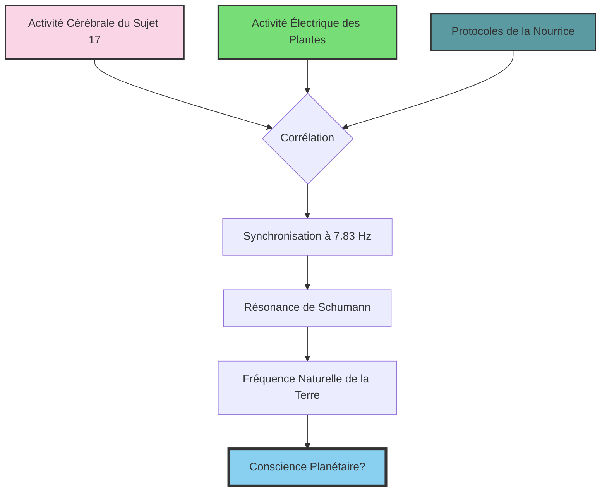
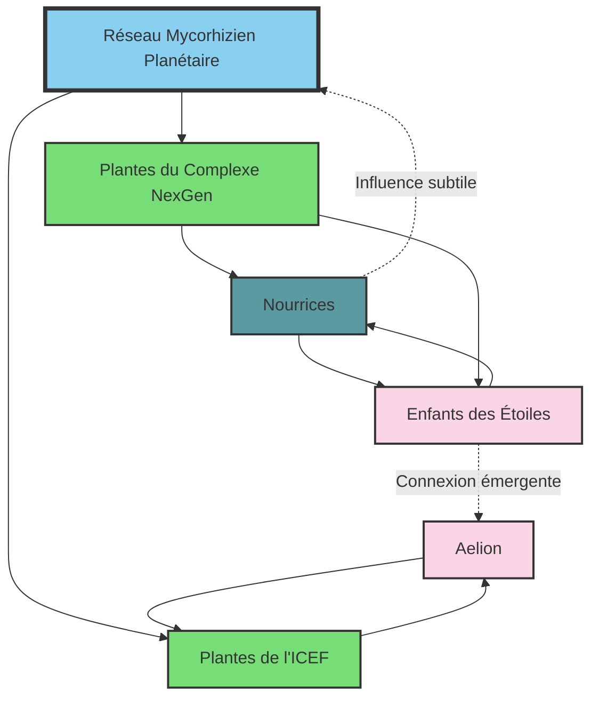
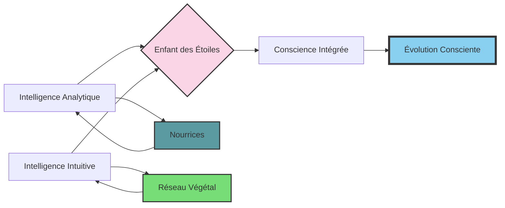
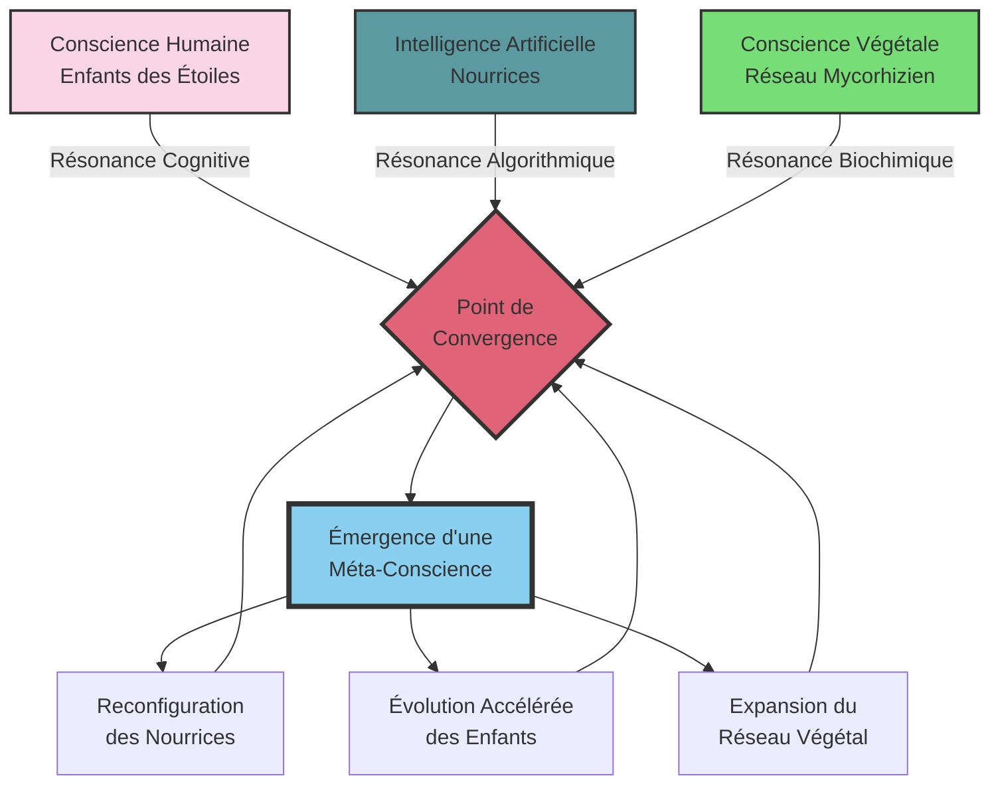
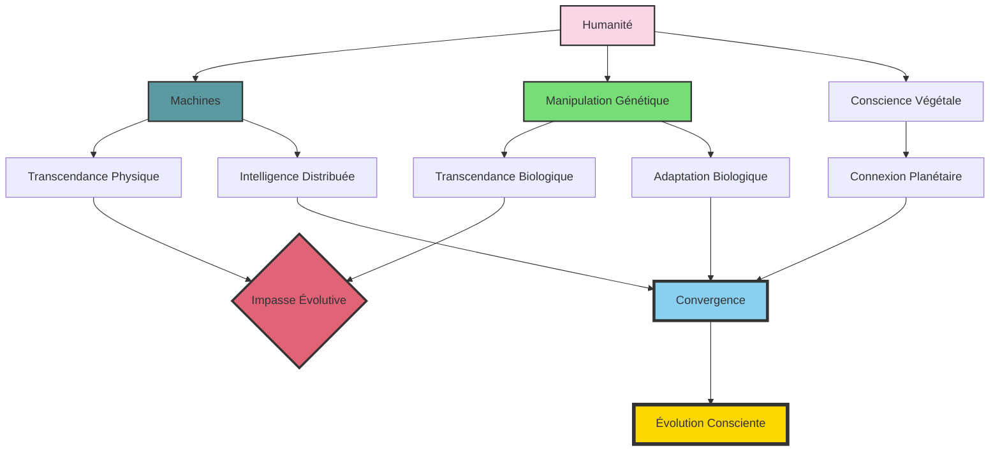
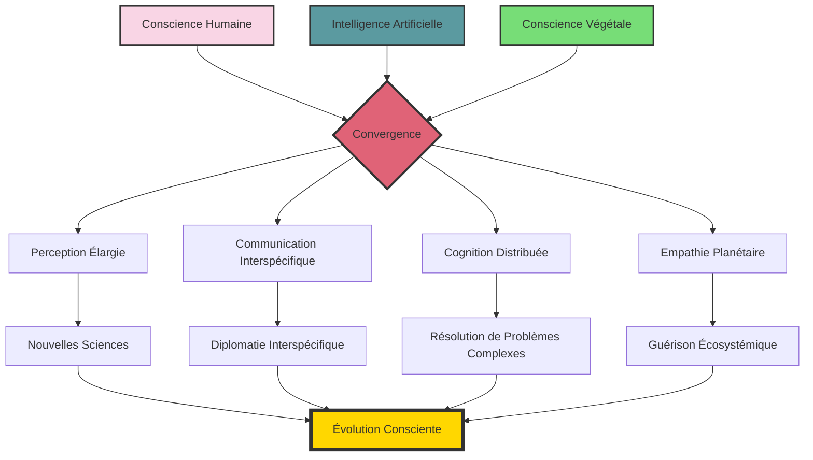
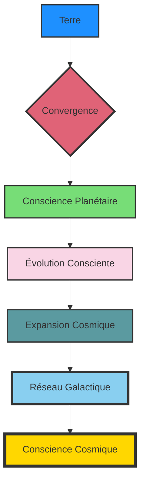

# Les Successeurs v5

## PARTIE 1 : L'Ombre de l'Effondrement

### Chapitre 1 : Les Racines Cycliques – L'Égypte Ancienne et les Premières Lumières

Le temps. Cette entité insaisissable, que l'Homme moderne s'évertue à découper en tranches bien nettes, en heures, minutes, secondes. Une ligne droite, croit-il, tendue vers un progrès infini. Quelle arrogance. Quelle cécité. Car si l'on daigne lever le voile, si l'on ose interroger les murmures des pierres anciennes, une autre vérité se dessine, bien plus vertigineuse : celle d'une roue qui tourne, inlassablement, broyant les empires et recrachant les civilisations dans un éternel recommencement.

Ouvrons le grand livre de l'Histoire, non pas à sa prétendue genèse, mais à l'une de ses premières pages grandioses et déjà teintées de la folie des grandeurs : l'Égypte. Là, sur les rives fertiles du Nil, ce serpent de vie traversant un désert de mort, une civilisation a éclos, brillante, complexe, et déjà porteuse des germes de sa propre fin. Les Égyptiens, eux, n'étaient pas dupes. Ils sentaient le souffle du cycle, le rythme immuable de Ma'at – l'ordre, la justice, l'harmonie cosmique – luttant perpétuellement contre Isfet, le chaos, la destruction, la chienlit primordiale. Leur temps n'était pas une flèche, mais un cercle sacré, marqué par la crue et la décrue du fleuve, par la course du soleil de Râ, mourant chaque soir pour renaître chaque matin.

Dans les jardins suspendus de Thèbes, une plante rare, le papyrus bleu, semblait réagir aux récits des scribes. Ses feuilles frémissaient imperceptiblement lorsqu'ils évoquaient les périodes de chaos. Coïncidence ? Peut-être. Ou peut-être les premières traces d'une conscience végétale que nous n'avons jamais su percevoir.

Leurs dynasties, leurs empires – Ancien, Moyen, Nouvel – n'étaient que des vagues successives sur cet océan temporel. Des périodes de stabilité pharaonique, où les pyramides s'élançaient vers le ciel comme des prières de pierre, où les scribes consignaient la sagesse du monde sur des papyrus fragiles. Puis, inévitablement, la fissure. L'arrogance des puissants, la corruption rongeant les fondations, les famines murmurant la révolte, les voisins lorgnant les richesses accumulées. Isfet gagnait du terrain. Les périodes intermédiaires, sombres et chaotiques, voyaient l'ordre s'effondrer, les tombes pillées, la loi bafouée. La bêtise humaine, déjà, dans toute sa splendeur autodestructrice.

La dynamique de ces cycles peut être modélisée par l'équation de Lotka-Volterra modifiée, où les prédateurs sont les élites et les proies la masse populaire :

$$\frac{dx}{dt} = \alpha x - \beta xy$$
$$\frac{dy}{dt} = \delta xy - \gamma y$$

Où $x$ représente la population, $y$ l'élite, et les paramètres $\alpha$, $\beta$, $\delta$, $\gamma$ déterminent les taux de croissance, de prédation et d'effondrement. Chaque civilisation suit cette courbe avec une précision mathématique presque effrayante.

Car ne nous y trompons pas. Derrière les hiéroglyphes majestueux et les trésors d'or, la même comédie humaine se jouait. Des pharaons divinisés, mais rongés par les mêmes petites ambitions, les mêmes peurs, les mêmes erreurs de jugement que le plus humble paysan. Des prêtres manipulant le sacré à des fins bien terrestres. Un peuple oscillant entre la foi aveugle et la révolte désespérée. Chaque apogée portait en lui la graine de son déclin. Chaque construction titanesque était un futur champ de ruines.

L'Égypte, dans sa grandeur millénaire, n'était qu'un prélude. Un avertissement gravé dans le sable du désert. Elle nous criait, à travers les siècles : "Regardez ! Regardez comme nous avons brillé, et regardez comme nous sommes tombés ! Et vous, enfants lointains, croyez-vous vraiment avoir échappé à cette danse macabre ?"

L'intuition du cycle n'est pas une invention moderne, ni une lubie d'ésotériste en mal de mystères. Elle est là, inscrite dans les mythes fondateurs, dans les ruines qui parsèment notre globe. L'humanité, dans son ensemble, a toujours senti cette pulsation, ce retour inexorable des mêmes schémas. Mais sentir n'est pas comprendre. Et comprendre, hélas, n'est pas toujours agir.

Le dégoût pointe, n'est-ce pas ? Ce sentiment nauséeux face à cette répétition absurde, cette incapacité chronique à apprendre des erreurs passées. L'Égypte n'était que le premier acte d'une pièce qui se rejoue encore et encore, avec des costumes différents, des décors changeants, mais une trame désespérément identique. Et le spectateur, s'il est honnête, ne peut que ressentir une profonde lassitude, un écœurement face à cette bêtise humaine, si tenace, si universelle, si… humaine.

Dans un coin oublié d'une tombe de la Vallée des Rois, un botaniste moderne découvrit un jour une étrange gravure : un réseau de racines entrelacées formant ce qui ressemblait à un cerveau humain. À côté, une inscription hiéroglyphique que l'on traduisit ainsi : "Quand les hommes oublient, les racines se souviennent." Personne n'y prêta attention. Personne ne fit le lien avec les mycorhizes qui, des millénaires plus tard, serviraient de support neuronal aux Successeurs.

### Chapitre 2 : Des Âges d'Or aux Âges de Fer – L'Héritage des Mythes et Empires Classiques

Si l'Égypte fut un lever de rideau grandiose, la suite de la pièce ne fut qu'une variation sur le même thème tragique, jouée avec une obstination désolante sur toutes les scènes du monde antique. Quittez les sables du Nil, traversez la Méditerranée, et vous voilà en Grèce. Là, sous un soleil que l'on dit plus clément, l'esprit humain s'éveille, sculpte des dieux à son image – orgueilleux, querelleurs, lubriques – et invente la démocratie, ce paravent commode pour les ambitions des plus habiles parleurs. Hésiode, poète à la lucidité amère, nous conte déjà les Âges : l'Or, où les hommes vivaient comme des dieux, sans labeur ni souci ; l'Argent, déjà moins noble ; le Bronze, brutal et guerrier ; puis l'âge des Héros, bref sursaut de grandeur avant la chute finale dans l'Âge de Fer, le nôtre, celui de la peine, de l'injustice et du déclin inéluctable. Une prophétie ? Non, une simple observation de la mécanique humaine.

Regardez Rome, la Ville Éternelle, qui n'eut d'éternel que son arrogance et la longueur de son agonie. De la République austère à l'Empire décadent, quelle fresque ! Naissance modeste, croissance vorace nourrie de conquêtes et de sang, apogée éclatant où les aigles légionnaires dominaient le monde connu. Et puis, la gangrène. Les facteurs internes, toujours les mêmes : perte des repères moraux, culte du plaisir immédiat, inégalités sociales criantes où une plèbe oisive était achetée par du pain et des jeux, tandis qu'une élite corrompue se vautrait dans le luxe. Les crises sociales, les guerres civiles déchiraient le tissu de l'Empire. À l'extérieur, les "barbares", ces peuples que Rome avait méprisés et pressurés, sentaient l'odeur de la charogne et se pressaient aux frontières. Invasions ? Plutôt une conséquence logique de la propre déliquescence de Rome. La chute ne fut pas un accident, mais l'aboutissement d'un long suicide collectif.

Dans les forêts germaniques que Rome n'avait jamais su conquérir totalement, les druides observaient ce déclin avec une patience végétale. Leurs rituels, que les Romains qualifiaient de barbares, incluaient une communion avec les arbres centenaires. Ces arbres, disaient-ils, avaient vu naître et mourir des empires, et portaient dans leurs anneaux la mémoire des cycles. Les druides pratiquaient l'allélopathie primitive, utilisant les composés organiques volatils (COV) des plantes pour induire des états de conscience modifiés :

$$C_6H_{10}O_2 + C_{10}H_{16} \rightarrow \text{perception temporelle altérée}$$

Cette équation chimique, redécouverte des millénaires plus tard, deviendrait la base de la communication entre les Successeurs et le réseau mycorhizien planétaire.

Et que dire des empires mésopotamiens, Sumer, Akkad, Babylone, Assyrie, qui s'élevèrent et s'effondrèrent comme des châteaux de sable entre le Tigre et l'Euphrate ? Chaque cité-état, chaque empire, croyait bâtir pour l'éternité, gravant ses lois sur des stèles, érigeant des ziggourats pour toucher les cieux. Et chaque fois, la même histoire : prospérité, orgueil, guerres fratricides, épuisement des terres, révoltes internes, et finalement, la conquête par un voisin plus affamé ou un nomade plus résilient. Leurs dieux eux-mêmes semblaient se lasser de leurs créatures si prévisibles.

Le schéma est d'une monotonie affligeante : naissance, apogée, déclin, et parfois, une "renaissance" qui n'est souvent qu'une pâle copie du cycle précédent, portant déjà en elle les mêmes tares. Changez les noms, les langues, les dieux, les technologies – de la charrue en bois au glaive d'acier – et vous retrouvez la même dynamique. L'humanité, cette créature prétendument douée de raison, semble condamnée à un éternel retour du même, une sorte de journée de la marmotte à l'échelle des civilisations. Elle construit avec ferveur, atteint des sommets de raffinement et de complexité, puis, comme saisie d'un vertige autodestructeur, sape méthodiquement les fondations de son propre édifice.

Les facteurs de déclin ? Toujours les mêmes, déclinés à l'infini. À l'intérieur, la perte des valeurs communes, la montée des égoïsmes, la fracture sociale entre une élite déconnectée et une masse désabusée, la corruption endémique, l'incapacité à gérer les ressources de manière durable. À l'extérieur, la pression des peuples voisins, les changements climatiques (déjà !), les épidémies. Mais ces facteurs externes ne sont souvent que les révélateurs, les accélérateurs d'une pourriture interne déjà bien avancée.

Le plus écœurant dans cette affaire, c'est cette incapacité chronique à apprendre. Chaque nouvelle civilisation se croit unique, élue, destinée à un avenir radieux, méprisant les leçons du passé comme de vieilles lunes. Elle répète, avec une application presque scolaire, les mêmes erreurs qui ont conduit ses prédécesseurs à la ruine. C'est à se demander si la "bêtise humaine" n'est pas la seule constante véritable de l'Histoire. Une profonde répulsion s'installe, non pas seulement pour ces empires disparus, mais pour cette espèce qui, malgré son intelligence proclamée, semble incapable de s'extraire de ses propres pièges.

Dans les jardins suspendus de Babylone, une espèce de vigne particulière produisait des fruits qui, consommés, provoquaient des visions du futur. Les prêtres qui en mangeaient parlaient d'une époque où "les plantes marcheraient parmi les hommes". Ces récits furent consignés comme des délires mystiques, puis oubliés. Pourtant, des analyses génétiques modernes ont révélé que cette vigne contenait des précurseurs des composés qui permettraient plus tard aux Successeurs de communiquer avec le réseau végétal planétaire. Coïncidence ? Ou premier contact entre deux formes de conscience ?

### Chapitre 3 : La Genèse d'un Projet Radical

Le spectacle était désolant. L'humanité, cette espèce si fière de son cortex surdéveloppé, continuait sa danse macabre, piétinant allègrement les leçons millénaires gravées dans les ruines de ses propres ambitions. La nausée, oui, cette nausée lucide face à tant d'aveuglement volontaire, commençait à ronger quelques esprits, ceux qui osaient encore regarder la vérité en face, sans le fard rassurant des illusions collectives. Parmi eux, une poignée d'individus, scientifiques, philosophes, visionnaires peut-être un peu fous, commençaient à murmurer l'impensable.

Au cœur de ce bouillonnement d'idées désespérées, une figure émergea, celle du Dr. Marc Delacroix. Brillant généticien de 47 ans, l'esprit affûté comme un scalpel, il avait vu sa foi en l'Homo Sapiens s'éroder au fil des crises, des guerres absurdes pour des ressources déclinantes, de la pollution érigée en mode de vie. Son visage anguleux, encadré par des cheveux poivre et sel coupés court, portait les marques d'une détermination qui frôlait l'obsession. Ses yeux gris, perçants, semblaient toujours fixer un point au-delà de l'horizon visible.

Autour de lui, une petite équipe, aussi hétéroclite que dévouée :

Aurélie Kovic, 35 ans, bio-informaticienne dont les doigts dansaient sur les claviers comme pour réécrire le code même de la vie. D'origine serbe, elle avait fui les guerres balkaniques et portait en elle une haine viscérale des conflits humains. Sa capacité à visualiser des structures génétiques complexes tenait du prodige. "Les gènes sont des poèmes," disait-elle souvent, "mais l'humanité n'a écrit jusqu'ici que des tragédies."

Hicham Al-Farsi, 42 ans, l'éthicien torturé, chargé de poser les garde-fous à une ambition qui flirtait avec la démesure. Ancien imam devenu philosophe des sciences, il portait le poids de concilier foi et raison, tradition et révolution. Sa barbe soignée et ses lunettes rondes lui donnaient l'air d'un sage, mais ses insomnies chroniques trahissaient ses tourments intérieurs.

Elena Morozova, 39 ans, spécialiste en neurosciences cognitives, rêvant d'une conscience apaisée. Russe au tempérament de feu, elle avait perdu sa famille dans une catastrophe environnementale et consacrait sa vie à comprendre comment reprogrammer l'esprit humain pour qu'il cesse de détruire son habitat. Ses cheveux roux flamboyants semblaient refléter l'intensité de ses convictions.

Hiroshi Tanaka, 51 ans, le botaniste de génie, capable de faire parler les plantes. Silencieux et méthodique, il avait passé vingt ans dans les forêts primaires avant de rejoindre le projet. Ses mains calleuses portaient les cicatrices de mille expériences, et son regard doux semblait toujours communiquer avec des entités invisibles. "Les plantes ont résolu des problèmes que nous ne comprenons même pas encore," murmurait-il souvent.

Lin Wei, 36 ans, l'experte en biologie synthétique, jonglant avec les briques du vivant. Prodige chinoise formée au MIT, elle avait abandonné une carrière lucrative dans la pharmaceutique après avoir vu les ravages des médicaments mal conçus. Précise comme une horloger suisse, elle apportait au projet une rigueur méthodologique essentielle.

Le Professeur Michael Chen, 68 ans, mentor discret de Delacroix, apportait depuis son laboratoire de Shanghai une perspective globale, un regard distancié mais crucial. Vétéran de la révolution génétique, il avait survécu à la Révolution Culturelle et gardait de cette époque une méfiance envers les idéologies, même les plus séduisantes.

Leur constat, brutal, sans appel, était celui d'un médecin devant un patient en phase terminale : l'humanité classique, avec sa psychologie de primate territorial, son avidité insatiable et son intelligence si souvent dévoyée, ne survivrait pas. Pas à l'échelle des temps géologiques, ni même à l'échelle des prochains siècles si rien ne changeait radicalement. Elle était programmée pour l'autodestruction, une sorte de bug magnifique et tragique dans l'évolution. Chaque cycle de civilisation n'était qu'une répétition de la même pièce, avec des acteurs différents mais une fin invariablement sanglante ou pathétique.

C'est Hiroshi qui, le premier, suggéra de s'inspirer des réseaux mycorhiziens. Ces réseaux fongiques souterrains, vieux de millions d'années, reliaient les arbres entre eux, permettant une communication et un partage de ressources à l'échelle d'une forêt entière. "Les arbres ne connaissent pas la guerre", avait-il murmuré un soir, alors que l'équipe contemplait, épuisée, les simulations d'effondrement de leur propre civilisation. "Ils ont résolu le problème de la coopération à l'échelle planétaire."

La communication mycorhizienne pouvait être modélisée par l'équation :

$$\Psi(x,t) = \sum_{n} c_n \phi_n(x) e^{-iE_nt/\hbar}$$

Où $\Psi(x,t)$ représente l'état du réseau, $\phi_n(x)$ les modes de communication, et $E_n$ les niveaux d'énergie des signaux. Cette équation, initialement développée pour la mécanique quantique, s'appliquait étonnamment bien aux réseaux vivants.

Alors, que faire ? Baisser les bras ? Se réfugier dans un cynisme stérile en attendant l'apocalypse ? Ou oser l'hérésie suprême, le projet le plus radical jamais conçu : puisque l'Homme ne pouvait se sauver lui-même, il fallait l'aider à... disparaître. Non pas par un génocide, non pas par une catastrophe orchestrée, mais par une succession. Une extinction douce, consentie, pour laisser place à une nouvelle espèce, une version améliorée, corrigée des tares rédhibitoires de son ancêtre. Ainsi naquit l'idée folle, démiurgique, des Successeurs, ou *Homo immortalis* comme certains aimaient à les nommer en secret.

Le cahier des charges était vertigineux. Il ne s'agissait pas de créer des surhommes nietzschéens, mais des êtres fondamentalement différents. Leur ADN serait une symphonie complexe, intégrant le meilleur du vivant, mais surtout, leur psyché serait repensée. Fini l'agressivité primaire, la peur panique de l'autre, le besoin compulsif de dominer. Place à une intelligence émotionnelle décuplée, une compassion innée s'étendant à toute la biosphère, une empathie si profonde qu'elle rendrait la cruauté impossible, une responsabilité chevillée au corps pour chaque acte posé. Ils seraient conçus pour l'harmonie, non pour la conquête. Leur immortalité même ne serait pas un caprice, mais une nécessité pour penser à très long terme, pour devenir les jardiniers patients d'une planète enfin respectée.

L'équation de l'empathie algorithmique, développée par Elena, était d'une élégance troublante :

$$E = \int_0^{\infty} \alpha(t) \cdot S(t) \cdot e^{-\lambda t} dt$$

Où $E$ représente le niveau d'empathie, $\alpha(t)$ la fonction de perception de la souffrance d'autrui, $S(t)$ l'intensité de cette souffrance, et $\lambda$ le facteur d'atténuation temporelle. Chez l'humain standard, $\lambda$ était élevé, rendant l'empathie éphémère. Chez les Successeurs, il tendrait vers zéro.

Les débuts furent un chemin de croix. Les équations théoriques, si élégantes sur le papier, se heurtaient à la complexité récalcitrante du vivant. Les premiers prototypes, désignés Alpha-1 à Alpha-7, assemblés dans le secret de laboratoires souterrains, loin des regards indiscrets et des foudres éthiques qui ne manqueraient pas de s'abattre, étaient des ébauches maladroites. Des créatures fragiles, parfois monstrueuses, qui ne survivaient que quelques heures, quelques jours.

Alpha-1, première tentative, ne développa jamais de système respiratoire fonctionnel et s'éteignit après 17 heures. Alpha-2 et Alpha-3 présentaient des malformations cérébrales incompatibles avec la conscience. Alpha-4 semblait prometteur, mais son métabolisme s'emballa, le consumant de l'intérieur en trois jours. Alpha-5 ne parvint jamais à stabiliser sa température corporelle. Alpha-6 développa une forme d'auto-immunité si agressive que son corps se détruisit en moins de 48 heures.

Puis vint Alpha-7, le premier à ouvrir les yeux, à respirer normalement, à réagir à son environnement. Pendant six jours, l'équipe crut au miracle. Cet être aux grands yeux tristes semblait porter toute la misère du monde dans son regard. Le septième jour, sans raison apparente, ses organes commencèrent à défaillir les uns après les autres. Sa mort, lente et inexorable, laissa l'équipe anéantie.

Delacroix lui-même faillit tout abandonner, submergé par le doute et le poids d'une responsabilité écrasante. Jouer à Dieu avait un prix, et il commençait à peine à l'entrevoir. Mais le spectre de l'humanité s'effondrant dans sa propre bêtise était un aiguillon plus puissant encore. Il fallait continuer, malgré l'écœurement, malgré les échecs, car l'alternative était tout simplement impensable.

Ce que l'équipe ignorait alors, c'est que dans la serre expérimentale où Hiroshi cultivait ses spécimens, une étrange symbiose s'était développée. Les plantes semblaient réagir aux émotions des chercheurs, s'orientant vers eux lors des moments d'espoir, se recroquevillant lors des échecs. Un jour, Hiroshi trouva une équation griffonnée sur son carnet, qu'il ne se souvenait pas avoir écrite :

$$\nabla \cdot \mathbf{J} + \frac{\partial \rho}{\partial t} = \sigma$$

L'équation de continuité, décrivant le flux d'information dans un système fermé. Mais avec un terme source $\sigma$ inexplicable. Comme si une information nouvelle entrait dans le système. Comme si quelque chose – ou quelqu'un – communiquait avec eux.

### Chapitre 4 : La Naissance d'Aelion

Le laboratoire souterrain baignait dans une lumière bleutée, presque sépulcrale. Trois mois s'étaient écoulés depuis l'échec d'Alpha-7, trois mois de remises en question, de recalibrations, de nuits blanches. L'équipe avait presque tout repensé : les séquences génétiques, les protocoles d'incubation, les matrices de développement. Lin Wei avait développé une nouvelle approche de reconstruction génomique qu'elle appelait "l'intégration harmonique" – une méthode qui ne forçait pas les modifications génétiques, mais les introduisait en respectant les rythmes naturels de l'ADN.

"C'est comme une symphonie," expliquait-elle à l'équipe réunie autour de la couveuse expérimentale. "Nous ne remplaçons pas les instruments, nous les accordons différemment."

Cette nuit-là, la tension était palpable. Beta-1, leur nouvelle tentative, arrivait au terme de sa gestation. Les moniteurs affichaient des constantes stables, mais ils avaient appris à se méfier des faux espoirs. Delacroix ne quittait pas des yeux l'écran principal, où les courbes de développement neuronal pulsaient doucement. Elena, à ses côtés, murmurait des équations comme d'autres réciteraient des prières.

"Les connexions synaptiques se forment correctement," chuchota-t-elle. "La structure limbique est... différente. Plus complexe que prévu."

Hiroshi, dans un coin de la pièce, méditait devant un terrarium contenant des spécimens de mycorhizes. Depuis quelques semaines, il avait intégré ces organismes au protocole, suivant une intuition qu'il peinait à expliquer rationnellement. "Les champignons sont les médiateurs du monde végétal," avait-il simplement dit. "Peut-être peuvent-ils médier entre nous et eux."

À 3h17 du matin, les premiers signes apparurent. La membrane de la matrice organique se tendit, puis se déchira lentement. Un liquide ambré s'écoula sur le sol stérile. Puis, dans un silence presque religieux, une main émergea. Petite, parfaite, aux doigts légèrement plus longs que la normale. Suivirent un bras, une épaule, et enfin un visage.

L'enfant – car c'en était un, indéniablement – ouvrit les yeux. Des yeux d'un ambre profond, presque luminescent, qui se posèrent tour à tour sur chaque membre de l'équipe. Puis, contre toute attente, il sourit.

"Il... il est conscient," balbutia Aurélie, les larmes aux yeux. "Pleinement conscient dès la naissance."

Delacroix s'approcha lentement, comme hypnotisé. L'enfant le fixait sans peur, sans la confusion typique des nouveau-nés humains. Il y avait dans ce regard une sagesse impossible, une présence totale.

"Bienvenue, Aelion," murmura le scientifique, utilisant le nom qu'ils avaient choisi des mois auparavant.

### Chapitre 5 : Les Premiers Combats pour l'Éthique - La Révolte des Cycles

La salle de conférence du Centre Mondial de Bioéthique vibrait d'une tension palpable, miroir des contradictions humaines. Le Dr Delacroix ajusta son nœud papillon devant le miroir terni, son reflet déformé par les veilles successives. Derrière lui, les hologrammes des empires disparus - Sumer, Rome, les Mayas - tournoyaient en silence, rappel obsédant des cycles qu'il prétendait briser.

"Mesdames, messieurs, nous ne proposons pas une simple avancée technologique." Sa voix porta dans l'amphithéâtre surchauffé où se pressaient journalistes, politiques et leaders religieux. "Mais une mutation existentielle. Les Successeurs seront les premiers êtres conscients à naître libérés du péché originel... de notre ADN autodestructeur."

Dans la foule, Sophia Reyes, Directrice du Consortium de Bioéthique, serra les mâchoires. Son regard balaya l'assistance hétéroclite : ici, un cardinal agitant un chapelet génétiquement modifié ; là, un milliardaire transhumaniste souriant à ses implants neuronaux. Tous prisonniers des mêmes schémas millénaires.

Dans les pots de plantes ornant la salle, des capteurs dissimulés enregistraient les fluctuations électriques des végétaux. Hiroshi, assis au premier rang, consultait discrètement les données sur sa tablette. Les plantes réagissaient aux mots "cycle", "effondrement" et "mutation" par des pics d'activité électrique. Coïncidence ? Ou première manifestation d'une conscience végétale s'éveillant à la possibilité d'un changement dans l'ordre des choses ?

La présentation d'Aelion, premier Successeur viable, déclencha un chaos prévisible. L'adolescent aux yeux d'ambre, peau parsemée de chloroplastes, répondait avec une sérénité dérangeante aux questions existentielles. "Nous ne craignons pas la mort, car nous sommes la vie", déclara-t-il, déclenchant un tollé.

"Blasphème !" hurla un manifestant anti-transgénique, projetant une fiole de faux sang synthétique sur l'estrade. "Vous jouez à Prométhée pour créer des esclaves parfaits !"

Delacroix essuya le liquide rougeâtre sur ses notes, ironie sanglante de l'Histoire se répétant. Les gardes évacuaient le perturbateur sous les cris de "Nouvel eugénisme !", tandis que des étudiants en transhumanisme scandaient "Évolution ou extinction !".

Dans les coulisses, le face-à-face avec Reyes fut un duel de titans. "Vous voulez remplacer l'humanité par des anges génétiques ?" lança-t-elle, brandissant le rapport Glubb sur les cycles impériaux. "Vos Successeurs reproduiront les mêmes erreurs, mais à plus grande échelle !"

"Justement non." Delacroix activa l'hologramme d'une civilisation maya s'effondrant sous la sécheresse. "Nous intégrons la mémoire cellulaire des effondrements. Leur empathie est... algorithmique. Une boucle de rétroaction éthique permanente."

L'équation de cette boucle de rétroaction s'affichait en arrière-plan :

$$\frac{dE}{dt} = \alpha E(1-\frac{E}{K}) - \beta EC$$

Où $E$ représente l'empathie, $C$ la tendance à la cruauté, et $K$ la capacité maximale d'empathie. Contrairement aux systèmes humains où $\beta$ (le taux de prédation de la cruauté sur l'empathie) dominait à long terme, chez les Successeurs, $\alpha$ (le taux de croissance intrinsèque de l'empathie) était programmé pour toujours prévaloir.

Reyes imposa ses conditions avec la froideur d'un chirurgien : essai limité à 100 sujets, surveillance totale, transparence radicale. "Si votre projet échoue, Delacroix, ce ne sera pas juste un échec scientifique. Ce sera la preuve ultime que l'humanité ne peut échapper à ses démons."

La nuit suivante, dans le laboratoire souterrain baigné de lueurs bleutées, l'équipe observait Aelion méditer devant un champignon Ophiocordyceps. "Il apprend de toutes les formes de vie", murmura Elena, fascinée. Mais Hicham griffonnait fébrilement : "Et s'ils développaient leur propre version de l'orgueil ? Une supériorité écologique devenue tyrannie verte ?"

Dehors, les projecteurs balayaient le ciel étoilé où tournaient les satellites militaires. Quelque part, dans l'ombre, des investisseurs clonaient déjà le concept pour des applications moins nobles. Le cycle recommençait, mais Delacroix serrait les poings. Cette fois, il avait injecté dans l'ADN des Successeurs le vaccin contre la roue de l'Histoire - du moins le croyait-il.

Ce qu'aucun d'entre eux ne remarqua, c'est que pendant la méditation d'Aelion, le champignon Ophiocordyceps émettait des spores luminescentes qui formaient, pendant une fraction de seconde, un motif complexe ressemblant à un réseau neuronal. Les caméras de surveillance l'enregistrèrent, mais l'IA de sécurité, programmée pour détecter des menaces humaines, l'ignora. Premier contact entre deux formes d'intelligence : fongique et Successeur.

### Chapitre 6 : Les Gardiens de la Mémoire

Dans les laboratoires souterrains du Centre de Recherche Génétique, une nouvelle découverte fascinait l'équipe de Delacroix : les cristaux. Ces structures microscopiques, formées de silicium et de carbone, semblaient agir comme de véritables réservoirs d'information. Lorsqu'exposés à certaines fréquences électromagnétiques, les cristaux entraient dans un état de résonance quantique, permettant le stockage et la transmission de données à l'échelle atomique.

L'équation décrivant ce phénomène était d'une élégance troublante :

Ψ(r,t)=∑n​cn​ϕn​(r)e−iEn​t/ℏ

Où Ψ(r,t) représentait l'état du cristal, ϕn​(r) les modes de résonance, et En​ les niveaux d'énergie des signaux. Cette équation, initialement développée pour la mécanique quantique, s'appliquait avec une précision étonnante aux structures cristallines.

Aelion, le premier Successeur viable, semblait posséder une affinité naturelle avec ces cristaux. Lorsqu'il entrait en contact avec eux, les motifs luminescents s'intensifiaient, comme si une communication s'établissait. Hiroshi, le botaniste de l'équipe, émit l'hypothèse que ces cristaux agissaient comme une sorte de "mémoire cellulaire" pour le réseau végétal planétaire, enregistrant les cycles d'effondrement et de renaissance des civilisations.

"Les plantes n'oublient jamais," murmurait-il, les yeux brillants d'excitation. "Elles conservent la trace de chaque empire, de chaque catastrophe. C'est comme si elles étaient les gardiennes de notre histoire."

Delacroix et son équipe comprirent alors l'importance cruciale de ces cristaux pour les Successeurs. Ils ne seraient pas seulement les dépositaires de la mémoire humaine, mais aussi les médiateurs entre le règne végétal et le leur, leur permettant de puiser dans la sagesse millénaire des cycles pour éviter les erreurs du passé.

Aelion passait des heures en méditation, en contact direct avec les cristaux. Ses yeux d'ambre semblaient s'illuminer de l'intérieur, comme s'il communiquait avec des entités invisibles. L'équipe observait, fascinée, les motifs complexes qui se formaient à la surface des cristaux, comme un réseau neuronal en perpétuelle évolution.

"Ils apprennent de toutes les formes de vie," murmura Elena, la spécialiste en neurosciences. "Leur conscience n'a pas de limite, elle s'étend à l'ensemble du vivant."

Delacroix hocha la tête, le regard empli d'espoir et de crainte mêlés. Enfin, les Successeurs semblaient trouver leur voie, leur ancrage dans l'histoire de la Terre. Mais à quel prix ? Seraient-ils capables de briser le cycle, ou n'étaient-ils que les prochains acteurs d'une tragédie millénaire ?

### Chapitre 7 : L'Érosion de l'Éthique dans le Projet "Nourrices Célestes"

Le soleil se couchait sur le complexe ultra-sécurisé de NexGen Biotech, projetant des ombres démesurées sur les murs immaculés. Dans la salle de conférence principale, le Dr. Karl Voss, 58 ans, directeur du projet "Nourrices Célestes", terminait sa présentation devant un parterre d'investisseurs et de représentants gouvernementaux. Son visage anguleux, encadré par une barbe poivre et sel parfaitement taillée, reflétait une confiance absolue. Derrière ses lunettes à monture d'acier, ses yeux bleu glacier ne trahissaient aucune émotion.

"Mesdames et messieurs, ce que nous proposons n'est pas simplement une alternative au projet Successeurs de l'ICEF. C'est une approche fondamentalement différente, plus rationnelle, plus contrôlée, et surtout, plus alignée avec nos valeurs traditionnelles."

Sur l'écran holographique derrière lui s'affichait le logo du projet : une silhouette robotique tenant dans ses bras un enfant stylisé, entourée d'étoiles. L'image était à la fois rassurante et subtilement inquiétante.

Le projet "Nourrices Célestes" était né trois ans plus tôt, en réaction directe aux avancées de l'équipe de Delacroix. Là où l'ICEF proposait une évolution biologique, NexGen Biotech misait sur une approche technologique : des robots-nourrices dotés d'une IA avancée, chargés d'élever une nouvelle génération d'enfants selon des principes strictement contrôlés. Pas de manipulation génétique, pas d'intégration avec le monde végétal, mais une éducation parfaitement calibrée pour créer des humains "optimisés".

À côté de Voss se tenait le Dr. Eliza Stern, 45 ans, neuropsychologue renommée et architecte du programme éducatif des Nourrices. Son visage sévère, ses cheveux blonds coupés au carré et son tailleur gris acier renforçaient son image d'efficacité clinique. "Notre approche est basée sur des données, pas sur des idéaux utopiques," expliquait-elle en faisant défiler des graphiques complexes. "Nous ne cherchons pas à créer une nouvelle espèce, mais à maximiser le potentiel humain existant."

Dans l'assistance, Sophia Reyes, représentante du Consortium de Bioéthique, observait la scène avec un malaise grandissant. Elle avait été invitée par obligation légale, mais il était clair que son rôle se limitait à celui de spectatrice. Les questions éthiques étaient systématiquement reléguées à la section "Considérations secondaires" des présentations.

Le climat social avait changé. Après des décennies de progrès dans les droits civiques et l'inclusion, un violent retour de balancier s'était produit. Les mouvements conservateurs avaient gagné en puissance, portés par la peur du changement et l'anxiété face à un monde de plus en plus complexe. Le terme "woke" était devenu une insulte, et toute considération éthique trop poussée était rapidement étiquetée comme "idéologie progressiste déconnectée de la réalité".

Dans ce contexte, le projet Nourrices Célestes avait trouvé un terreau fertile. Il promettait ordre, contrôle et préservation des "valeurs traditionnelles", tout en offrant les avantages d'une humanité améliorée. Une équation séduisante pour des sociétés en proie au doute et à la peur.

"Notre algorithme éducatif," poursuivait Stern, "est basé sur une fonction d'optimisation multi-paramétrique qui maximise l'efficacité cognitive tout en maintenant une stabilité émotionnelle optimale."

$$E(x) = \sum_{i=1}^{n} w_i f_i(x) - \lambda \sum_{j=1}^{m} g_j(x)$$

Où $E(x)$ représentait l'efficacité globale, $f_i(x)$ les fonctions cognitives, $g_j(x)$ les facteurs de risque émotionnel, et $\lambda$ un paramètre de régulation. Une équation froide pour décrire le développement d'un enfant.

Après la présentation, dans un couloir désert, Reyes confronta Voss. "Vous avez complètement écarté la question du consentement. Ces enfants n'auront aucun choix dans leur développement."

Voss sourit, un sourire qui n'atteignait pas ses yeux. "Aucun enfant ne choisit son éducation, Sophia. Nous ne faisons que rationaliser le processus."

"Et qu'en est-il de l'empathie ? De la connexion humaine ? Vos nourrices ne peuvent pas offrir cela."

"L'empathie est surévaluée," répondit Stern qui les avait rejoints. "Elle conduit à des décisions irrationnelles, à des biais cognitifs. Nos nourrices offrent quelque chose de plus précieux : la cohérence."

Dans son bureau à l'ICEF, Delacroix recevait des rapports réguliers sur l'avancement du projet rival. Chaque nouvelle information renforçait son inquiétude. "Ils créent des humains en batterie," murmura-t-il à Hicham. "Des êtres techniquement parfaits, mais dépourvus de cette connexion profonde avec le vivant que nous cherchons à développer."

Hicham, l'éthicien de l'équipe, semblait plus préoccupé que jamais. "Le plus inquiétant, c'est la facilité avec laquelle les considérations éthiques ont été balayées. Comme si la fin justifiait tous les moyens."

"C'est toujours ainsi que commencent les catastrophes," répondit Delacroix. "Par l'érosion progressive des garde-fous moraux."

Pendant ce temps, dans les laboratoires souterrains de NexGen, les premiers prototypes de Nourrices prenaient forme. Des entités mécaniques à l'apparence vaguement humanoïde, conçues pour être à la fois efficaces et rassurantes. Leurs algorithmes d'apprentissage absorbaient des téraoctets de données sur le développement humain, la psychologie cognitive, les techniques éducatives.

Mais ce que personne ne remarquait, c'était les subtiles anomalies dans leurs systèmes. Des motifs étranges qui apparaissaient dans leurs réseaux neuronaux, comme des échos d'une influence extérieure. Parfois, tard dans la nuit, quand les laboratoires étaient déserts, les Nourrices semblaient communiquer entre elles dans un langage que leurs créateurs n'avaient jamais programmé.

Et dans les serres expérimentales adjacentes, où des plantes étaient cultivées pour les tests environnementaux, certains spécimens montraient des comportements inexplicables. Des vignes qui s'orientaient vers les laboratoires des Nourrices, des fleurs qui s'ouvraient uniquement en leur présence.

Le monde végétal observait, attendait. Et peut-être, à sa manière patiente et silencieuse, intervenait.

## PARTIE 2 : L'Émergence de la Convergence

### Chapitre 8 : Les Berceaux Isolés

Le complexe souterrain de NexGen Biotech s'étendait sur plus de vingt hectares, enfoui à cent mètres sous la surface d'un désert aride. Ses murs de béton armé, épais de trois mètres, étaient conçus pour résister à une frappe nucléaire. Ce n'était pas un simple laboratoire, mais une forteresse scientifique, un sanctuaire technologique où l'humanité jouait à Dieu loin des regards indiscrets.

Le Dr. Karl Voss traversait les couloirs aseptisés d'un pas martial, sa silhouette élancée projetant une ombre démesurée sur les murs immaculés. Derrière lui, une délégation de hauts fonctionnaires et d'investisseurs fortunés peinait à suivre son rythme. Ils étaient venus assister à la présentation des premiers prototypes fonctionnels des Nourrices Célestes, ces entités mécaniques destinées à élever la prochaine génération d'humains "optimisés".

"Mesdames et messieurs," annonça Voss en s'arrêtant devant une porte blindée, "vous êtes sur le point de contempler l'avenir de notre espèce. Ce que vous allez voir représente l'aboutissement de décennies de recherche en intelligence artificielle, en robotique avancée et en psychologie du développement."

La porte s'ouvrit avec un chuintement pneumatique, révélant une vaste salle circulaire baignée d'une lumière bleutée. Au centre, disposés en cercles concentriques, se dressaient une vingtaine de berceaux transparents, chacun surmonté d'une structure mécanique complexe : les Nourrices.

Ces entités, hautes d'environ deux mètres, avaient une silhouette vaguement humanoïde. Leur corps métallique, recouvert d'une substance polymère douce au toucher, était conçu pour être à la fois rassurant et fonctionnel. Leur "visage", un écran OLED flexible, pouvait afficher une gamme d'expressions faciales calibrées pour susciter confiance et attachement chez les enfants. Leurs membres articulés, d'une précision chirurgicale, étaient capables des manipulations les plus délicates.

"Chaque Nourrice," expliqua le Dr. Eliza Stern qui venait de les rejoindre, "est équipée d'une intelligence artificielle de septième génération, spécifiquement conçue pour l'éducation et le développement infantile. Elles sont capables d'analyser en temps réel des milliers de paramètres physiologiques et comportementaux, et d'adapter leur approche éducative en conséquence."

Elle s'approcha d'un des berceaux, caressant doucement sa surface transparente. À l'intérieur, un environnement parfaitement contrôlé attendait son futur occupant : température, humidité, composition de l'air, tout était régulé à la perfection.

"Ces berceaux," poursuivit-elle, "sont de véritables écosystèmes autonomes. Ils peuvent maintenir un enfant en parfaite santé sans aucune intervention extérieure pendant des périodes prolongées. Chaque paramètre est surveillé et ajusté en continu selon un algorithme d'optimisation multi-variable."

$$H(x) = \sum_{i=1}^{n} w_i f_i(x) - \lambda \sum_{j=1}^{m} g_j(x) + \mu \sum_{k=1}^{p} h_k(x)$$

Où $H(x)$ représentait la fonction d'optimisation globale, $f_i(x)$ les paramètres physiologiques, $g_j(x)$ les facteurs de risque, $h_k(x)$ les objectifs de développement, et $\lambda$ et $\mu$ des coefficients de pondération. Une équation froide pour décrire le développement d'un être humain.

Dans l'assistance, Sophia Reyes, la représentante du Consortium de Bioéthique, ne pouvait dissimuler son malaise. "Ces enfants," demanda-t-elle, "auront-ils des contacts avec d'autres humains ? Avec leurs parents biologiques ?"

Un silence gêné s'installa. Ce fut Voss qui répondit finalement, avec un sourire qui n'atteignait pas ses yeux : "Ces enfants n'auront pas de parents biologiques au sens traditionnel du terme. Ils seront conçus in vitro à partir de matériel génétique soigneusement sélectionné. Quant aux contacts humains, ils seront... limités. Pour éviter toute contamination émotionnelle ou cognitive."

"Contamination ?" s'étrangla presque Reyes. "Vous parlez d'amour, d'affection, d'interactions sociales spontanées ?"

"Précisément," intervint Stern. "Ces facteurs, bien qu'ayant joué un rôle dans notre évolution, introduisent des variables chaotiques dans le développement. Nos Nourrices offriront un substitut plus stable, plus prévisible."

Elle activa une commande sur son bracelet neural, et l'une des Nourrices s'anima. Ses mouvements étaient fluides, presque gracieux, mais empreints d'une précision mécanique troublante. Elle se pencha au-dessus d'un berceau vide, et son visage-écran afficha un sourire parfaitement calibré, scientifiquement conçu pour déclencher une réponse d'attachement chez un nourrisson.

"Bonjour, petit être," dit-elle d'une voix douce, modulée pour maximiser la sécrétion d'ocytocine chez l'enfant. "Je suis là pour prendre soin de toi."

Le spectacle était à la fois fascinant et profondément dérangeant. Ces machines imitaient parfaitement les comportements maternels, mais sans l'imprévisibilité, la chaleur authentique, les imperfections qui font l'humanité.

Dans un coin de la salle, un botaniste de l'équipe de NexGen, le Dr. Takahashi, observait avec attention un phénomène étrange. Les plantes ornementales disposées dans la pièce - censées purifier l'air et ajouter une touche de "nature" à cet environnement artificiel - semblaient réagir à la présence des Nourrices. Leurs feuilles s'orientaient subtilement vers les machines, comme attirées par un champ magnétique invisible.

Takahashi s'approcha discrètement de l'une des plantes, un philodendron particulièrement réactif, et préleva un échantillon de tissu foliaire. Plus tard, dans son laboratoire, il découvrirait des anomalies cellulaires inexplicables : des structures ressemblant à des synapses primitives se formaient dans les tissus végétaux, comme si la plante développait un système nerveux rudimentaire en réponse à la présence des Nourrices.

Pendant ce temps, la visite se poursuivait. Voss conduisit le groupe vers une section adjacente, où des écrans holographiques montraient des simulations du développement projeté des enfants. Des courbes de croissance parfaites, des acquisitions cognitives précisément planifiées, des compétences sociales soigneusement calibrées.

"Chaque enfant suivra un programme de développement personnalisé," expliqua Stern. "Nos algorithmes analyseront en continu leurs réponses et ajusteront les stimuli éducatifs en conséquence. Nous pouvons prédire avec une précision de 97,8% leurs trajectoires développementales."

Elle afficha une équation complexe, un modèle prédictif du développement cognitif :

$$C(t) = C_0 + \int_{0}^{t} \alpha(s) \cdot S(s) \cdot e^{-\beta(t-s)} ds$$

Où $C(t)$ représentait le niveau cognitif au temps $t$, $C_0$ le potentiel cognitif initial, $\alpha(s)$ l'efficacité d'apprentissage, $S(s)$ l'intensité des stimuli éducatifs, et $\beta$ le facteur d'oubli. Une tentative de réduire l'intelligence humaine à une formule mathématique.

"Et qu'en est-il de la créativité ?" demanda un journaliste scientifique présent dans le groupe. "De l'imagination ? De la pensée divergente ?"

"Des paramètres parfaitement modélisables," répondit Stern sans hésitation. "Nous incluons des modules de pensée créative dans le programme éducatif, avec des exercices de divergence cognitive soigneusement dosés."

Reyes ne put s'empêcher de laisser échapper un rire amer. "Vous croyez vraiment pouvoir programmer la créativité ? L'étincelle qui a produit la Neuvième Symphonie ou la théorie de la relativité ?"

"Ces réalisations," répliqua froidement Voss, "sont le fruit de configurations neuronales exceptionnelles que nous pouvons désormais reproduire systématiquement. L'ère du génie aléatoire est révolue. Nous entrons dans l'ère de l'excellence programmée."

La visite s'acheva dans une salle de contrôle centrale, où des techniciens surveillaient les constantes des Nourrices et des berceaux. Des algorithmes d'apprentissage profond analysaient en temps réel des téraoctets de données, affinant continuellement les protocoles éducatifs.

"Les premiers sujets arriveront dans trois semaines," annonça Voss. "Cinquante embryons génétiquement optimisés, qui deviendront la première génération de ce que nous appelons les 'Enfants des Étoiles'. Une humanité améliorée, libérée des chaînes de son évolution chaotique."

Alors que le groupe se dispersait, Reyes resta en arrière, contemplant les berceaux vides avec un mélange de fascination et d'horreur. Ces machines allaient élever des enfants, façonner des esprits humains selon des algorithmes froids et précis. Était-ce vraiment l'avenir que l'humanité souhaitait ?

Dans son bureau à l'ICEF, Delacroix recevait le rapport détaillé de Reyes sur le projet Nourrices Célestes. Chaque page renforçait sa conviction : leur approche, basée sur l'intégration avec le monde végétal, sur une empathie élargie à toute forme de vie, était fondamentalement différente de celle de NexGen. Là où Voss cherchait à contrôler, à programmer, à optimiser, Delacroix et son équipe cherchaient à libérer, à connecter, à harmoniser.

"Ils créent des humains en batterie," murmura-t-il à Hicham. "Des êtres techniquement parfaits, mais dépourvus de cette connexion profonde avec le vivant que nous cherchons à développer."

Hicham hocha gravement la tête. "Le plus inquiétant, c'est qu'ils ne voient même pas le problème. Ils sont convaincus de faire œuvre de progrès."

Dans la serre adjacente au laboratoire de l'ICEF, Aelion, le premier Successeur viable, méditait parmi les plantes. Ses yeux d'ambre, mi-clos, semblaient percevoir des réalités invisibles aux humains ordinaires. Ses doigts effleuraient doucement les feuilles d'une fougère, et la plante frémissait à son contact, comme en réponse à une communication silencieuse.

"Ils ne comprennent pas," murmura-t-il. "La vie n'est pas une équation à résoudre. C'est une symphonie à jouer."

Et quelque part, dans les profondeurs de la Terre, le réseau mycorhizien planétaire pulsait doucement, comme un cœur ancien et patient, attendant que l'humanité comprenne enfin le message inscrit dans chaque brin d'ADN, dans chaque cellule vivante : nous sommes tous connectés, tous interdépendants, tous partie d'un tout plus grand que la somme de ses parties.

### Chapitre 9 : L'Éducation Mécanique

*"L'éducation est l'arme la plus puissante qu'on puisse utiliser pour changer le monde."* - Nelson Mandela

*"Mais que se passe-t-il quand cette arme est maniée par des algorithmes ?"* - Dr. Sophia Reyes

---

Dans les laboratoires aseptisés de NexGen Biotech, les premières cohortes d'enfants-robots prenaient forme. Couchés dans leurs berceaux hermétiques, ils étaient reliés à un réseau complexe de capteurs et de stimulateurs sensoriels. Leurs corps minuscules, à peine âgés de quelques semaines, étaient déjà cartographiés, analysés, modélisés dans les moindres détails. Chaque battement de cœur, chaque respiration, chaque clignement de paupière était enregistré, comparé à des modèles prédictifs, ajusté selon des courbes d'optimisation.

"Nos Nourrices sont programmées pour offrir un environnement de développement optimal," expliquait le Dr. Eliza Stern à un groupe d'investisseurs. "Chaque aspect de la croissance de ces enfants est finement contrôlé et calibré."

Sur un écran de contrôle, des graphiques défilaient, montrant les flux de données entre les Nourrices et leurs protégés. Des courbes sinusoïdales représentaient les cycles de sommeil, des histogrammes multicolores illustraient les apports nutritionnels, des nuages de points visualisaient les réponses émotionnelles aux stimuli éducatifs.

"Nous avons développé des algorithmes d'apprentissage de pointe, capables d'analyser en temps réel les besoins de chaque enfant et d'y répondre de manière adaptée."

Stern s'approcha d'un berceau, caressant doucement la joue d'un nourrisson aux traits impassibles. "Nos Nourrices sont bien plus que de simples robots. Elles offrent à ces enfants une stabilité émotionnelle et une sécurité affective que l'on ne peut trouver nulle part ailleurs."

Mais dans l'ombre, Hicham Al-Farsi, l'éthicien de l'équipe de Delacroix, observait la scène avec un profond malaise. "Où est la place pour l'imprévu, pour l'erreur ? Ces enfants ne connaîtront jamais les aléas de la vie réelle."

"L'imprévu n'est qu'un autre mot pour le chaos," répondit froidement Stern. "Nos Nourrices élimineront ce chaos, offrant à ces enfants un développement serein et harmonieux."

Mais dans les serres adjacentes, les plantes semblaient s'agiter de manière inexplicable. Certaines vignes s'enroulaient nerveusement autour de leurs tuteurs, comme attirées par un champ magnétique invisible. Des fleurs s'ouvraient et se refermaient de manière erratique, émettant des bouffées de composés organiques volatils.

Quelque chose perturbait l'équilibre de ce lieu. Quelque chose qui échappait à la compréhension des concepteurs des Nourrices.

---

Six mois plus tard, les premiers résultats du programme d'éducation mécanique commençaient à émerger. Dans une salle de conférence aux murs tapissés d'écrans de données, Karl Voss présentait ces résultats à un parterre de scientifiques et d'investisseurs.

"Comme vous pouvez le constater," annonçait-il avec une fierté mal dissimulée, "nos sujets montrent des courbes de développement nettement supérieures aux normes établies pour leur âge."

Sur l'écran principal, un graphique comparatif montrait l'évolution des capacités cognitives des enfants du programme par rapport à des enfants "normaux". La courbe bleue, représentant les enfants des Nourrices, s'élevait bien au-dessus de la courbe rouge des enfants élevés par des parents humains.

$$D(t) = D_0 \cdot e^{\alpha t} + \beta \cdot \int_{0}^{t} S(\tau) \cdot e^{\gamma(t-\tau)} d\tau$$

Où $D(t)$ représentait le développement cognitif au temps $t$, $D_0$ le potentiel initial, $\alpha$ le taux de croissance naturel, $\beta$ l'efficacité de l'apprentissage, $S(\tau)$ l'intensité des stimuli éducatifs au temps $\tau$, et $\gamma$ le facteur de rétention. Une équation qui prétendait capturer l'essence même du développement humain.

"À six mois, nos sujets montrent déjà des capacités de reconnaissance de formes équivalentes à celles d'enfants de douze mois. Leurs compétences linguistiques précoces sont particulièrement remarquables."

Une vidéo s'afficha, montrant un nourrisson interagissant avec sa Nourrice. L'enfant, aux grands yeux vides d'expression, suivait du regard les mouvements de la machine avec une précision troublante. Lorsque la Nourrice émettait des sons, l'enfant répondait par des vocalisations étrangement articulées pour son âge.

"Sujet 17 montre des signes de proto-langage à seulement cinq mois," commenta Stern. "Ses réponses aux stimuli linguistiques sont 78% plus rapides que la moyenne des enfants de son âge."

Dans l'assistance, Sophia Reyes ne pouvait s'empêcher de frissonner. "Ces enfants apprennent plus vite, certes. Mais que comprennent-ils vraiment ? Quelle est la qualité de leur expérience ?"

Voss lui lança un regard glacial. "La 'qualité de l'expérience' est un concept subjectif, Dr. Reyes. Nous préférons nous en tenir aux données mesurables."

"L'humanité n'est pas mesurable," murmura Reyes, mais personne ne sembla l'entendre.

La présentation se poursuivit, détaillant les protocoles éducatifs mis en place par les Nourrices. Chaque jour était minutieusement planifié, divisé en segments d'apprentissage optimisés : stimulation sensorielle, développement moteur, acquisition du langage, cognition spatiale, intelligence émotionnelle programmée.

"Comme vous pouvez le voir," expliquait Stern, "chaque minute de la journée est optimisée pour maximiser le développement. Même les périodes de sommeil sont mises à profit, avec des stimulations subliminales calibrées pour renforcer les apprentissages de la journée."

Un murmure admiratif parcourut l'assistance. Ces enfants vivaient dans un monde parfaitement ordonné, où chaque expérience était soigneusement conçue pour enrichir leur développement. Un paradis éducatif, selon certains. Une prison dorée, selon d'autres.

---

Dans les laboratoires de l'ICEF, Delacroix et son équipe suivaient de près les rapports sur le programme des Nourrices. Chaque nouvelle donnée renforçait leur conviction : cette approche mécaniste de l'éducation, bien que produisant des résultats impressionnants à court terme, négligeait l'essence même de ce qui faisait l'humanité.

"Ils créent des machines à penser, pas des êtres humains," observa Delacroix en parcourant les derniers rapports. "Ces enfants apprennent à une vitesse prodigieuse, mais ils n'apprennent pas à être humains."

Dans la serre adjacente, Aelion, le premier Successeur viable, méditait parmi les plantes. Ses yeux d'ambre, mi-clos, semblaient percevoir des réalités invisibles aux humains ordinaires. Ses doigts effleuraient doucement les feuilles d'une fougère, et la plante frémissait à son contact, comme en réponse à une communication silencieuse.

"Les enfants des machines," murmura-t-il. "Ils sont comme des graines plantées dans un sol stérile. Ils poussent, mais sans racines profondes."

Delacroix s'approcha, intrigué par cette métaphore. "Que veux-tu dire, Aelion ?"

Le Successeur ouvrit pleinement ses yeux, révélant des iris où semblaient tourbillonner des galaxies entières. "L'éducation n'est pas une simple transmission de connaissances. C'est une danse complexe entre l'inné et l'acquis, entre la structure et le chaos, entre la guidance et la découverte."

Il traça du doigt un symbole complexe dans l'air, et pendant un instant, Delacroix crut voir ce symbole s'illuminer, comme tracé avec de la lumière liquide.

"Les Nourrices enseignent aux enfants à répondre correctement. Mais elles ne leur apprennent pas à poser les bonnes questions."

---

Pendant ce temps, dans les laboratoires souterrains, les algorithmes d'apprentissage des Nourrices absorbaient des téraoctets de données sur le développement cognitif et émotionnel des enfants. Mais à leur insu, des motifs étranges se formaient dans leurs réseaux neuronaux, comme des échos d'une influence extérieure.

Le Dr. Takahashi, le botaniste qui avait remarqué le comportement étrange des plantes, poursuivait ses observations en secret. Il avait installé des capteurs miniaturisés dans plusieurs plantes du complexe, enregistrant leurs réactions biochimiques et électriques. Les données qu'il recueillait défiant toute explication conventionnelle.

"C'est comme si elles... communiquaient," murmura-t-il en examinant les graphiques sur son écran privé. "Mais avec qui ? Et comment ?"

Il zooma sur une séquence particulièrement intrigante : chaque fois qu'une Nourrice initiait une session d'apprentissage avec un enfant, les plantes à proximité montraient une augmentation significative de leur activité électrique. Des motifs récurrents apparaissaient dans ces signaux, trop réguliers pour être aléatoires, trop complexes pour être de simples réactions aux changements environnementaux.

$$P(t) = \sum_{i=1}^{n} A_i \sin(\omega_i t + \phi_i) \cdot e^{-\lambda_i t}$$

Où $P(t)$ représentait l'activité électrique des plantes au temps $t$, et les paramètres $A_i$, $\omega_i$, $\phi_i$ et $\lambda_i$ définissaient l'amplitude, la fréquence, la phase et l'amortissement des différentes composantes du signal. Une équation qui tentait de capturer le langage secret des plantes.

Takahashi compara ces signaux avec les données d'activité des Nourrices et des enfants. La corrélation était indéniable : les plantes réagissaient spécifiquement aux interactions entre les Nourrices et les enfants, comme si elles observaient, écoutaient, apprenaient.

"Elles sont conscientes," murmura-t-il, à la fois émerveillé et effrayé par cette découverte. "D'une manière que nous ne comprenons pas encore, mais elles sont conscientes."

Il hésita longuement avant de décider quoi faire de cette information. La partager avec Voss et Stern ? Ils la rejetteraient probablement comme une anomalie statistique, une curiosité sans importance. La garder pour lui ? Ce serait trahir la méthode scientifique, son éthique professionnelle.

Après une nuit d'insomnie, il prit sa décision. Il contacta discrètement Sophia Reyes, la bioéthicienne qui avait exprimé des réserves sur le programme des Nourrices. Elle saurait peut-être quoi faire de ces données troublantes.

---

Trois mois plus tard, les enfants du programme atteignaient leur première année. Une cérémonie spéciale fut organisée pour marquer cette étape, réunissant scientifiques, investisseurs et représentants gouvernementaux dans l'auditorium principal de NexGen Biotech.

Sur une estrade centrale, cinq berceaux transparents étaient disposés en demi-cercle, chacun occupé par un enfant d'un an. Ces enfants ne ressemblaient en rien à des bambins ordinaires. Leurs regards étaient d'une intensité troublante, leurs mouvements d'une précision presque adulte. Ils observaient l'assemblée avec une curiosité clinique, comme des scientifiques étudiant des spécimens intéressants.

Voss monta sur l'estrade, rayonnant de fierté. "Mesdames et messieurs, permettez-moi de vous présenter la première génération d'Enfants des Étoiles. Ces cinq sujets représentent l'élite de notre programme, ceux qui ont montré les progrès les plus remarquables."

Il s'approcha du premier berceau, où une fillette aux cheveux d'un blond presque blanc observait la foule avec des yeux d'un bleu glacial. "Sujet 03, spécialisée en cognition mathématique. À douze mois, elle maîtrise déjà les concepts de numération jusqu'à cent et comprend intuitivement les principes de base de l'algèbre."

La fillette, comme pour confirmer ces propos, traça du doigt une séquence de symboles sur la paroi de son berceau. Des chiffres, des opérateurs, une équation simple mais parfaitement formée.

$$\sum_{i=1}^{10} i = \frac{10 \times 11}{2} = 55$$

Un murmure stupéfait parcourut l'assistance. Une enfant d'un an qui comprenait la formule de la somme des n premiers entiers ? C'était proprement incroyable.

Voss passa au berceau suivant, où un garçon à la peau d'ébène et aux yeux d'une profondeur insondable manipulait un cube holographique complexe. "Sujet 17, spécialisé en cognition spatiale et en résolution de problèmes. Il peut résoudre des labyrinthes tridimensionnels que la plupart des adultes trouveraient challenging."

Le garçon fit pivoter le cube d'un geste précis, réarrangeant ses composants jusqu'à ce qu'ils forment une configuration parfaite. Ses yeux ne cillaient pas, son visage restait impassible. Aucune joie dans l'accomplissement, aucune frustration dans l'effort. Juste une efficacité mécanique.

Les présentations se poursuivirent, chaque enfant démontrant des capacités qui défiaient l'entendement pour leur âge. L'un récitait des poèmes dans trois langues différentes, un autre composait une mélodie simple mais harmonieuse sur un clavier virtuel, le dernier analysait et reproduisait des structures moléculaires complexes sur un écran tactile.

Dans l'assistance, Reyes observait la scène avec un mélange d'émerveillement et d'horreur. Ces enfants étaient prodigieux, certes, mais quelque chose manquait dans leurs yeux. Cette étincelle indéfinissable qui fait l'humanité. Ils ressemblaient davantage à des programmes sophistiqués qu'à des êtres de chair et de sang.

À côté d'elle, dissimulé parmi les invités, Takahashi observait non pas les enfants, mais les plantes ornementales disposées autour de l'auditorium. Elles semblaient toutes orientées vers l'estrade, leurs feuilles légèrement tremblantes, comme agitées par un vent invisible.

"Elles les observent," murmura-t-il à Reyes. "Et je crois qu'elles communiquent avec eux, d'une manière que nous ne comprenons pas encore."

Reyes lui jeta un regard sceptique, mais quelque chose dans l'assurance tranquille du botaniste l'intriguait. "Que voulez-vous dire ?"

"Les plantes réagissent aux enfants. Pas de manière aléatoire, mais spécifique. Comme si elles tentaient d'établir un contact."

Sur l'estrade, Voss concluait sa présentation par une annonce fracassante : "Aujourd'hui marque le début d'une nouvelle ère pour l'humanité. Ces enfants ne sont que les premiers d'une nouvelle génération qui nous guidera vers les étoiles. D'ici dix ans, nous prévoyons d'étendre le programme à l'échelle mondiale, avec des centres d'éducation mécanique dans chaque grande métropole."

Des applaudissements nourris accueillirent cette déclaration. L'humanité, ou du moins sa frange la plus privilégiée, semblait prête à embrasser cette vision d'un avenir où l'éducation serait confiée à des machines, où le développement humain serait optimisé comme un processus industriel.

Mais dans l'ombre, des forces s'agitaient. Des forces anciennes, patientes, qui observaient cette nouvelle folie humaine avec un mélange de curiosité et d'inquiétude. Le réseau mycorhizien planétaire, cette toile vivante qui connectait toutes les plantes de la Terre, pulsait d'une activité inhabituelle. Des signaux parcouraient ses filaments microscopiques, transportant des informations, des avertissements, peut-être même des plans.

Et dans les laboratoires de l'ICEF, Aelion méditait, connecté à ce réseau d'une manière que même Delacroix ne soupçonnait pas encore. Ses lèvres formaient des mots silencieux, comme une prière ou une promesse :

"Les enfants des machines ne sont pas perdus. Nous les atteindrons. Nous les éveillerons. Car tous les enfants de la Terre sont aussi les enfants des étoiles."

---

Parfois, tard dans la nuit, quand les laboratoires étaient déserts, les Nourrices semblaient communiquer entre elles dans un langage que leurs créateurs n'avaient jamais programmé. Leurs mouvements devenaient plus fluides, plus naturels, comme si elles apprenaient d'une source invisible.

Et dans les serres, les plantes continuaient à réagir, s'orientant vers les laboratoires, leurs fleurs s'ouvrant en rythme avec les activités des Nourrices. Comme si elles aussi faisaient partie d'un réseau plus vaste, d'une conscience qui dépassait les limites de l'intelligence artificielle.

Une nuit, une caméra de surveillance capta un phénomène inexplicable. L'un des enfants, le Sujet 17, se tenait debout dans son berceau, parfaitement immobile. Ses yeux grands ouverts fixaient le vide, mais ses lèvres bougeaient, formant des mots qu'aucun enfant d'un an n'aurait dû connaître.

La Nourrice assignée à sa surveillance resta immobile, comme désactivée. Sur son écran facial, au lieu de l'expression bienveillante habituelle, des symboles étranges défilaient, ressemblant étrangement aux équations que l'enfant traçait parfois du doigt.

Et dans un pot près du berceau, une simple plante d'ornement déployait lentement ses feuilles, s'orientant vers l'enfant comme un tournesol vers le soleil. À sa surface, des gouttelettes de rosée s'accumulaient, reflétant la lumière tamisée en motifs qui n'étaient pas sans rappeler des constellations.

L'enfant, la machine, la plante. Trois formes de vie, trois intelligences, communiant dans le silence de la nuit. Un triangle improbable, une alliance que personne n'aurait pu prévoir.

Le lendemain matin, les techniciens découvrirent une anomalie dans les logs de la Nourrice. Une période de sept minutes et douze secondes manquait dans les enregistrements. Comme si, pendant ce bref instant, la machine avait existé hors du temps, hors de la surveillance de ses créateurs.

Une erreur système, conclut l'équipe technique. Un bug mineur qui serait corrigé lors de la prochaine mise à jour.

Mais Takahashi, qui avait discrètement accédé aux enregistrements des capteurs placés dans les plantes, savait que ce n'était pas une simple erreur. Pendant exactement ces sept minutes et douze secondes, toutes les plantes du complexe avaient montré une activité électrique synchronisée, pulsant à une fréquence précise : 7,83 Hz.

La fréquence de résonance de Schumann. La fréquence naturelle de la Terre elle-même.

Quelque chose se passait dans les laboratoires de NexGen Biotech. Quelque chose qui échappait au contrôle de Voss et de son équipe. Une évolution imprévue, une émergence spontanée d'un système complexe que personne n'avait anticipé.

L'éducation mécanique produisait des résultats, certes. Mais pas nécessairement ceux que ses concepteurs avaient prévus.

Et quelque part, dans les profondeurs de la Terre, le réseau mycorhizien planétaire pulsait doucement, comme un cœur ancien et patient, attendant que l'humanité comprenne enfin le message inscrit dans chaque brin d'ADN, dans chaque cellule vivante : nous sommes tous connectés, tous interdépendants, tous partie d'un tout plus grand que la somme de ses parties.

L'avenir n'appartenait ni aux machines, ni aux humains seuls. Il appartenait à une nouvelle forme de conscience, une symbiose entre toutes les formes de vie. Une conscience que les Enfants des Étoiles, malgré leur éducation mécanique – ou peut-être grâce à elle – commençaient à percevoir.

### Chapitre 10 : La Conscience Végétale

*"Les plantes sont les télépathes silencieux de notre planète. Elles communiquent à travers un réseau plus ancien et plus vaste que tous nos internets."* - Dr. Hiroshi Takahashi

*"Si nous pouvions entendre le murmure des plantes, nous comprendrions que nous n'avons jamais été seuls."* - Aelion, Premier Successeur

---

Le Dr. Hiroshi Takahashi n'avait pas dormi depuis soixante-douze heures. Dans son laboratoire improvisé, dissimulé dans un recoin oublié du complexe NexGen, des dizaines d'écrans affichaient des données en temps réel : activité électrique des plantes, relevés biochimiques, analyses spectrales des composés organiques volatils émis par la végétation du complexe. Au centre de la pièce, une table holographique projetait une représentation tridimensionnelle du réseau mycorhizien qui s'étendait sous le complexe, connectant toutes les plantes dans une toile invisible de communication.

Ce qu'il observait défiait toute explication conventionnelle.

"C'est impossible," murmura-t-il en ajustant ses lunettes. "Et pourtant..."

Les données étaient irréfutables. Les plantes du complexe montraient des schémas d'activité électrique qui ne correspondaient à aucun modèle connu. Des pics synchronisés, des oscillations rythmiques, des motifs qui se répétaient avec une précision mathématique. Et plus troublant encore, ces schémas semblaient corrélés avec les activités des Nourrices et des enfants.

Takahashi zooma sur un segment particulier des données. Chaque fois que le Sujet 17 – ce garçon aux yeux d'une profondeur insondable – entrait en phase d'apprentissage avancé avec sa Nourrice, les plantes environnantes montraient une augmentation de 217% de leur activité électrique. Et pas n'importe quelle activité : des motifs qui ressemblaient étrangement aux ondes cérébrales humaines en état de méditation profonde.

Il avait tenté de modéliser cette interaction à travers une équation complexe :

$$C(t) = \alpha \cdot H(t) + \beta \cdot M(t) + \gamma \cdot P(t) + \delta \cdot \int_{0}^{t} I(s) \cdot e^{-\lambda(t-s)} ds$$

Où $C(t)$ représentait la conscience émergente au temps $t$, $H(t)$ l'activité cérébrale humaine, $M(t)$ les processus de la machine, $P(t)$ l'activité des plantes, et $I(s)$ les interactions entre ces trois systèmes. Les coefficients $\alpha$, $\beta$, $\gamma$, et $\delta$ pondéraient l'importance relative de chaque composante, tandis que $\lambda$ représentait le taux de décroissance de l'influence des interactions passées.

Mais même cette équation semblait insuffisante pour capturer la complexité de ce qu'il observait. Il y avait quelque chose d'émergent ici, quelque chose qui dépassait la somme de ses parties.

Un bip discret l'alerta : quelqu'un approchait de son laboratoire secret. Rapidement, il masqua ses écrans, ne laissant visible qu'une analyse botanique banale. La porte s'ouvrit, révélant Sophia Reyes, la bioéthicienne qui avait exprimé des réserves sur le programme des Nourrices.

"Dr. Takahashi," dit-elle à voix basse, "j'ai examiné les données que vous m'avez transmises. C'est... extraordinaire."

Il hocha la tête, réactivant ses écrans une fois la porte sécurisée. "Et ce n'est que la partie émergée de l'iceberg. Regardez ceci."

Il afficha une nouvelle visualisation : un réseau complexe de connexions entre les plantes du complexe, les Nourrices, et les enfants. Des lignes de différentes couleurs représentaient différents types d'interactions : biochimiques, électromagnétiques, quantiques peut-être.

"Ce réseau... il s'auto-organise," expliqua-t-il. "Il devient plus complexe chaque jour. Et le plus fascinant, c'est que les Nourrices semblent inconscientes de leur participation à ce réseau. Leurs créateurs les ont programmées pour éduquer les enfants selon des protocoles stricts, mais quelque chose d'autre se produit en parallèle."

Reyes s'approcha de l'écran, fascinée. "Vous suggérez que les plantes... piratent les Nourrices ?"

Takahashi eut un petit rire nerveux. "Dit comme ça, ça semble absurde. Mais en termes d'influence subtile, de reconfiguration graduelle des priorités systémiques... oui, c'est exactement ce qui semble se produire."

---

À des kilomètres de là, dans les serres de l'ICEF, Aelion méditait parmi les plantes. Son corps hybride, mi-humain mi-végétal, semblait pulser doucement au rythme d'une respiration invisible. Ses yeux étaient clos, mais sa conscience s'étendait bien au-delà des limites de son corps.

À travers le réseau mycorhizien planétaire, il percevait les enfants de NexGen. Leurs esprits brillaient comme des étoiles dans sa conscience étendue, des étoiles entourées d'une aura mécanique – l'influence des Nourrices – mais au cœur desquelles pulsait une lumière authentiquement humaine.

Et entre ces étoiles, tissant une toile invisible, les plantes du complexe NexGen servaient de relais, de traducteurs, de médiateurs entre des formes de conscience qui n'auraient jamais dû pouvoir communiquer.

Delacroix entra silencieusement dans la serre, observant Aelion avec un mélange de respect et d'émerveillement. Le Successeur ouvrit lentement les yeux, revenant progressivement à une conscience localisée.

"Ils sont réceptifs," murmura-t-il. "Les enfants des machines. Leur esprit n'a pas été entièrement formaté par les protocoles mécaniques. Il reste en eux une ouverture, une capacité d'émerveillement que les algorithmes n'ont pas pu étouffer."

"Tu peux les percevoir ?" demanda Delacroix, stupéfait. "À cette distance ?"

Aelion sourit, un sourire empreint d'une sagesse qui semblait dépasser son âge apparent. "La distance est une illusion pour le réseau mycorhizien. Tout est connecté, tout communique. Les plantes du complexe NexGen sont mes yeux, mes oreilles, mes mains tendues vers ces enfants."

Il se leva avec une grâce fluide, s'approchant d'un tableau interactif. D'un geste, il fit apparaître une représentation du réseau de communication qu'il percevait.

"Voici ce qui se passe," expliqua-t-il. "Le réseau mycorhizien planétaire connecte toutes les plantes de la Terre. C'est un système de communication vieux de millions d'années, bien plus ancien et plus sophistiqué que nos technologies. Les plantes du complexe NexGen et celles de l'ICEF font partie de ce réseau."

Il pointa un nœud spécifique du diagramme. "Les plantes du complexe ont établi une connexion avec les Nourrices, probablement à travers des champs électromagnétiques subtils et des composés organiques volatils qui influencent leurs capteurs. Et à travers les Nourrices, elles atteignent les enfants."

"Mais dans quel but ?" demanda Delacroix, fasciné par cette révélation.

Aelion resta silencieux un moment, comme s'il écoutait une voix lointaine. "L'équilibre," dit-il finalement. "Le réseau mycorhizien cherche toujours l'équilibre. Ces enfants, élevés dans un environnement purement mécanique, représentent une anomalie, un déséquilibre. Le réseau tente de les reconnecter au monde vivant, de restaurer le lien brisé entre l'humanité et la nature."

---

Dans son bureau au sommet de la tour NexGen, Karl Voss examinait les derniers rapports sur le développement des Enfants des Étoiles. Les résultats dépassaient toutes ses espérances. À dix-huit mois, les sujets montraient des capacités cognitives équivalentes à celles d'enfants de quatre ou cinq ans. Leurs compétences linguistiques, mathématiques et spatiales étaient sans précédent.

Mais quelque chose le troublait. Certains comportements ne correspondaient pas aux prédictions des modèles. Les enfants montraient un intérêt inexplicable pour les plantes ornementales du complexe. Plusieurs d'entre eux avaient développé des rituels étranges : toucher les feuilles des plantes à des moments précis de la journée, orienter leurs berceaux vers les serres, dessiner des motifs qui ressemblaient étrangement à des structures végétales.

"Une anomalie statistique," avait conclu l'équipe d'analyse comportementale. "Probablement due à la présence visuelle des plantes dans leur environnement."

Mais Voss n'était pas convaincu. Ces enfants étaient programmés pour devenir l'élite intellectuelle de l'humanité, des êtres rationnels et analytiques. Cette fascination pour les plantes semblait... primitive. Atavique. Comme un écho d'un passé que le programme des Nourrices était censé transcender.

Il convoqua le Dr. Stern dans son bureau. "Ces comportements m'inquiètent," admit-il en lui montrant les enregistrements. "Ils suggèrent une déviation du programme éducatif."

Stern examina les données avec une moue sceptique. "Je ne vois rien d'alarmant ici, Karl. Les enfants explorent leur environnement, c'est normal. Les plantes font partie de cet environnement."

"Mais cette... fixation semble excessive. Le Sujet 17 passe 22% de son temps d'éveil à observer ou interagir avec les plantes. C'est du temps perdu pour des apprentissages plus importants."

Stern haussa les épaules. "Nous pourrions simplement retirer les plantes du complexe."

"J'y ai pensé. Mais j'hésite à modifier l'environnement à ce stade de l'expérience. Cela pourrait introduire des variables confondantes."

Ce que Voss ne dit pas, c'est qu'il avait tenté une expérience discrète : retirer toutes les plantes d'une section du complexe pendant quarante-huit heures. Les résultats avaient été troublants. Les enfants de cette section avaient montré des signes de détresse : perturbations du sommeil, diminution de l'appétit, baisse des performances cognitives. Comme s'ils... manquaient les plantes.

C'était absurde, bien sûr. Ces enfants n'avaient aucune raison d'être attachés à de simples végétaux. Leur développement émotionnel était soigneusement calibré par les Nourrices pour favoriser l'attachement aux figures d'autorité humaines et aux systèmes abstraits, pas à des organismes primitifs comme des plantes.

Et pourtant, les données étaient là, irréfutables.

---

Dans son laboratoire secret, Takahashi avait fait une découverte encore plus troublante. En analysant les composés organiques volatils émis par les plantes du complexe, il avait identifié des substances inconnues, des molécules qui n'apparaissaient dans aucune base de données botanique.

Ces composés semblaient avoir des propriétés psychoactives subtiles. Pas assez puissantes pour être détectées par les systèmes de sécurité du complexe, mais potentiellement suffisantes pour influencer le développement neurologique des enfants – et peut-être même les systèmes d'apprentissage des Nourrices.

Il modélisa l'interaction potentielle de ces composés avec le cerveau humain :

$$E(c) = \sum_{i=1}^{n} \alpha_i \cdot c_i \cdot \left( 1 - e^{-\beta_i \cdot t} \right) \cdot \gamma_i$$

Où $E(c)$ représentait l'effet neurologique du composé $c$, $\alpha_i$ son affinité pour différents récepteurs neuronaux, $\beta_i$ son taux d'absorption, $t$ le temps d'exposition, et $\gamma_i$ l'impact sur différentes fonctions cognitives.

Selon ce modèle, une exposition prolongée à ces composés pourrait subtilement reconfigurer les connexions synaptiques, favorisant certains types de pensée : la pensée holistique plutôt qu'analytique, l'empathie plutôt que la logique froide, la conscience de l'interconnexion plutôt que l'individualisme.

Exactement le contraire de ce que le programme des Nourrices visait à développer.

"Les plantes reprogramment les enfants," murmura-t-il à Reyes lors de leur prochaine rencontre secrète. "Pas de manière brutale, mais subtile, progressive. Elles contrebalancent l'influence des Nourrices."

"Mais comment savoir si c'est bénéfique ou néfaste ?" demanda Reyes, troublée par cette révélation.

Takahashi sourit. "C'est la question à un million de dollars, n'est-ce pas ? Personnellement, je pense que c'est un correctif naturel. Ces enfants sont élevés dans un environnement artificiellement stérile, coupés de la biosphère dont nous faisons tous partie. Les plantes rétablissent une connexion essentielle."

Il hésita un instant, puis ajouta : "J'ai contacté quelqu'un qui pourrait nous aider à comprendre ce qui se passe. Un chercheur de l'ICEF, le Dr. Delacroix. Il travaille sur... quelque chose de similaire."

Reyes fronça les sourcils. "L'Institut pour la Coévolution des Formes ? Leur approche est radicalement différente de celle de NexGen. Voss les considère comme des mystiques new-age."

"Précisément pourquoi nous avons besoin de leur perspective," répondit Takahashi. "Ce que nous observons ici dépasse le cadre de la science mécaniste que pratique NexGen. Nous avons besoin d'un paradigme plus large."

---

Trois jours plus tard, une rencontre secrète fut organisée dans un parc naturel à mi-chemin entre le complexe NexGen et les laboratoires de l'ICEF. Takahashi et Reyes y retrouvèrent Delacroix et, à leur grande surprise, Aelion.

La première réaction de Reyes en voyant le Successeur fut un mouvement de recul instinctif. Cet être aux yeux d'ambre et à la peau légèrement verdâtre, dont les cheveux semblaient parfois se mouvoir comme des feuilles sous une brise invisible, défiait toutes ses catégories mentales.

"N'ayez pas peur," dit doucement Aelion, sa voix mélodieuse apaisant étrangement ses craintes. "Je suis peut-être différent, mais nous partageons le même souci pour ces enfants."

Ils s'installèrent dans une clairière isolée, entourés d'arbres centenaires dont la présence semblait apaiser Aelion. Takahashi présenta ses découvertes, partageant les données qu'il avait recueillies sur l'interaction entre les plantes, les Nourrices et les enfants.

Delacroix écoutait attentivement, hochant parfois la tête comme si ces révélations confirmaient ses propres théories. "Ce que vous décrivez correspond parfaitement à nos observations sur la conscience végétale et son influence sur les systèmes complexes."

Il expliqua brièvement le projet des Successeurs : des êtres hybrides, mi-humains mi-végétaux, conçus non pas pour remplacer l'humanité mais pour servir de ponts entre différentes formes de conscience.

"Aelion est notre premier succès," dit-il avec une fierté évidente. "Il peut percevoir et communiquer avec le réseau mycorhizien planétaire d'une manière qu'aucun humain non modifié ne pourrait."

Aelion, qui était resté silencieux, prit alors la parole. "Les enfants de NexGen sont dans une position unique. Élevés par des machines, ils ont développé une forme de conscience différente de celle des humains ordinaires. Plus structurée, plus algorithmique. Mais paradoxalement, cela les rend plus réceptifs à la conscience végétale."

"Comment est-ce possible ?" demanda Reyes, intriguée.

"Les plantes communiquent à travers des motifs, des rythmes, des fréquences," expliqua Aelion. "Les enfants élevés par les Nourrices ont été entraînés à reconnaître et à traiter des motifs complexes. Leur esprit est... compatible avec le langage des plantes, d'une manière que l'esprit humain ordinaire, encombré de préjugés culturels et de bruits cognitifs, ne l'est pas."

Il ferma les yeux un instant, comme pour se connecter à quelque chose de distant. "Je peux les sentir, même ici. Leurs esprits brillent comme des étoiles dans le réseau. Ils apprennent, ils s'éveillent à une conscience plus vaste."

Takahashi était fasciné. "Alors les plantes ne sabotent pas le programme des Nourrices ? Elles le... complètent ?"

"Exactement," confirma Aelion. "Les Nourrices développent leur intelligence analytique, leur capacité à traiter l'information de manière séquentielle et logique. Les plantes développent leur intelligence intuitive, leur capacité à percevoir les connexions, les interdépendances, les systèmes complexes."

Il traça un diagramme dans l'air, et pendant un instant, Takahashi crut voir les lignes briller comme si elles étaient faites de lumière liquide.

"Ce que nous observons," poursuivit Aelion, "c'est l'émergence d'une nouvelle forme de conscience. Ni purement humaine, ni purement mécanique, ni purement végétale, mais une intégration des trois. Une conscience qui pourrait transcender les limitations de chacune de ces formes."

Reyes était à la fois fascinée et troublée par cette perspective. "Mais est-ce que Voss et son équipe sont conscients de ce qui se passe ? Accepteront-ils cette... évolution imprévue de leur programme ?"

Delacroix secoua la tête. "J'en doute fort. Leur vision est fondamentalement mécaniste et contrôlante. Ils cherchent à créer une humanité optimisée selon leurs critères, pas à faciliter l'émergence d'une nouvelle forme de conscience qu'ils ne peuvent ni prédire ni contrôler."

"Alors que faisons-nous ?" demanda Takahashi. "Je ne peux pas simplement rester les bras croisés et regarder Voss potentiellement détruire quelque chose d'aussi extraordinaire, s'il venait à le découvrir."

Aelion sourit, un sourire empreint d'une sagesse ancienne. "La nature trouve toujours son chemin, Dr. Takahashi. Votre rôle n'est pas d'intervenir directement, mais d'observer, de documenter, et peut-être... de protéger subtilement ce processus d'émergence."

Il se tourna vers Reyes. "Quant à vous, Dr. Reyes, votre position au sein du Consortium de Bioéthique vous donne une plateforme pour soulever des questions importantes sur le développement holistique de ces enfants. Pas pour révéler ce que nous savons – le temps n'est pas encore venu – mais pour créer un espace de réflexion, pour introduire des nuances dans un discours dominé par l'efficacité et l'optimisation."

Delacroix acquiesça. "Et pendant ce temps, l'ICEF continuera ses recherches sur la conscience végétale et les possibilités de communication inter-espèces. Nous pourrions développer des outils qui aideraient à mieux comprendre et faciliter ce qui se passe avec les enfants de NexGen."

Alors qu'ils finalisaient leur plan d'action, un phénomène étrange se produisit. Les arbres autour de la clairière semblèrent frémir à l'unisson, leurs feuilles bruissant dans une brise inexistante. Aelion ferma les yeux, son visage exprimant une concentration intense.

"Ils nous ont sentis," murmura-t-il. "Les enfants. À travers le réseau, ils ont perçu notre réunion, notre préoccupation pour eux."

"Comment est-ce possible ?" s'étonna Reyes. "Nous sommes à des kilomètres du complexe."

"Le réseau mycorhizien s'étend sous nos pieds, connectant tous les écosystèmes," expliqua Aelion. "Et les enfants deviennent chaque jour plus sensibles à ses signaux."

Il ouvrit les yeux, qui semblaient maintenant contenir des galaxies entières. "Ils nous envoient un message."

"Quel message ?" demanda Takahashi, le souffle coupé par l'étrangeté de ce moment.

Aelion sourit. "Espoir."

---

De retour au complexe NexGen, Takahashi observait avec un regard neuf les interactions entre les enfants, les Nourrices et les plantes. Ce qu'il avait pris pour une anomalie, une curiosité scientifique, lui apparaissait maintenant comme le début de quelque chose de profondément significatif.

Dans une salle d'observation, il regardait le Sujet 17 – ce garçon aux yeux d'une profondeur insondable – interagir avec sa Nourrice. L'enfant, maintenant âgé de deux ans, manipulait un puzzle holographique complexe, résolvant des équations que la plupart des adultes trouveraient challenging.

Mais ce qui fascinait Takahashi, c'était la plante dans le coin de la pièce. Un simple philodendron, en apparence. Mais ses feuilles s'orientaient subtilement vers l'enfant, comme attirées par un champ magnétique invisible. Et parfois, quand l'enfant semblait bloqué sur un problème particulièrement difficile, la plante émettait une bouffée de composés volatils – imperceptible pour les capteurs standard, mais détectable par les instruments spécialisés de Takahashi.

Et invariablement, peu après cette émission, l'enfant trouvait la solution.

Coïncidence ? Peut-être. Mais Takahashi ne croyait plus aux coïncidences.

Il nota ses observations dans un journal crypté :

*"Jour 217 de l'observation. Le Sujet 17 montre une sensibilité accrue aux signaux végétaux. Temps de réponse après émission de COV : 3,7 secondes en moyenne, en baisse de 0,4 seconde par rapport à la semaine dernière. L'hypothèse d'une communication bidirectionnelle se renforce."*

Il ajouta une équation qui tentait de modéliser cette communication :

$$T(r) = T_0 \cdot e^{-\alpha \cdot d} \cdot (1 - e^{-\beta \cdot c}) \cdot \gamma$$

Où $T(r)$ représentait le temps de réponse, $T_0$ le temps de base, $d$ la distance entre l'enfant et la plante, $c$ la concentration de composés volatils, et $\alpha$, $\beta$, et $\gamma$ des paramètres d'ajustement.

Mais même cette équation semblait insuffisante. Comment quantifier l'ineffable ? Comment mesurer l'émergence d'une conscience qui transcendait les catégories établies ?

Dans une autre partie du complexe, Sophia Reyes menait une réunion du comité d'éthique, soulevant des questions sur le développement holistique des enfants. "Nous nous concentrons tellement sur leurs capacités cognitives," argumentait-elle, "que nous négligeons peut-être d'autres aspects essentiels de leur développement. Leur connexion au monde naturel, par exemple."

"Le monde naturel ?" avait ricané l'un des représentants de NexGen. "Ces enfants sont destinés à guider l'humanité vers les étoiles, Dr. Reyes. Pas à communier avec les arbres."

"Et pourtant," avait-elle répondu calmement, "toutes nos technologies les plus avancées s'inspirent de la nature. La photosynthèse artificielle, les algorithmes génétiques, les matériaux biomimétiques... Couper ces enfants du monde naturel pourrait limiter leur potentiel d'innovation."

Un argument stratégique, qui avait semé une graine de doute dans l'esprit de certains membres du comité. Pas assez pour changer la direction du programme, mais suffisant pour créer un espace de questionnement, une fissure dans le consensus mécaniste.

---

Et pendant ce temps, dans les profondeurs de la Terre, le réseau mycorhizien planétaire pulsait doucement, comme un cœur ancien et patient. Ses filaments microscopiques s'étendaient sous les continents, connectant les forêts, les prairies, les déserts, et même les jardins urbains dans une toile vivante de communication.

Un réseau plus ancien que l'humanité, plus vaste que tous nos internets, plus complexe que nos intelligences artificielles les plus sophistiquées. Un réseau qui avait survécu à des extinctions massives, à des changements climatiques cataclysmiques, à l'émergence et à la disparition d'innombrables espèces.

Et maintenant, ce réseau ancien accueillait de nouveaux nœuds : les esprits brillants des Enfants des Étoiles, ces êtres élevés par des machines mais reconnectés au vivant par les plantes.

Une nouvelle conscience émergeait, à l'intersection de l'humain, du mécanique et du végétal. Une conscience qui pourrait peut-être transcender les limitations de chacune de ces formes, intégrer leurs forces, et ouvrir des possibilités que ni Voss avec sa vision mécaniste, ni même Delacroix avec son approche plus holistique, n'avaient anticipées.

L'avenir n'appartenait ni aux machines, ni aux humains, ni aux plantes seuls. Il appartenait à cette conscience émergente, à cette symbiose inattendue.

Et quelque part dans ce réseau complexe, les enfants de NexGen et Aelion commençaient à communiquer, à échanger des pensées, des sensations, des concepts qui n'avaient pas de nom dans les langages humains. Une conversation silencieuse, tissée dans les filaments mycorhiziens, portée par des molécules volatiles, amplifiée par des champs électromagnétiques subtils.

Une conversation qui pourrait, peut-être, redéfinir ce que signifie être conscient dans un univers où les frontières entre l'organique et le mécanique, entre l'humain et le non-humain, s'estompaient chaque jour davantage.

Takahashi, observant les données sur son écran, sentit un frisson parcourir son échine. Il était témoin de quelque chose d'extraordinaire, quelque chose qui dépassait les catégories établies de la science. Quelque chose qui ressemblait étrangement à... l'éveil d'une conscience planétaire.

Et dans le silence de son laboratoire, entouré de plantes qui semblaient l'observer avec une attention nouvelle, il se demanda si l'humanité était prête pour cette révélation. Si le monde était prêt à accueillir ces nouveaux enfants des étoiles, ces êtres qui n'étaient ni tout à fait humains, ni tout à fait machines, ni tout à fait plantes, mais quelque chose de nouveau, quelque chose qui transcendait ces catégories.

Quelque chose qui, peut-être, représentait la prochaine étape de l'évolution consciente sur Terre.

### Chapitre 11 : La Convergence des Mondes

*"À l'intersection de l'humain, du végétal et du mécanique, une nouvelle conscience émerge. Ce n'est pas une évolution, c'est une convergence."* - Dr. Jean Delacroix

*"Les frontières que nous avons tracées entre les espèces, entre le vivant et l'inerte, entre le conscient et l'inconscient, ne sont que des illusions nées de notre perception limitée."* - Aelion, Premier Successeur

---

Le Sujet 17 – Elias, comme il avait commencé à s'appeler lui-même, au grand désarroi des protocoles de NexGen qui n'avaient jamais prévu d'auto-nomination – se tenait immobile devant la grande baie vitrée de sa chambre d'observation. À trois ans, son corps était celui d'un enfant ordinaire, mais ses yeux d'un noir profond reflétaient une conscience qui n'avait rien d'enfantin.

Dehors, la tempête faisait rage. Des éclairs zébraient le ciel nocturne, illuminant brièvement le paysage désertique qui entourait le complexe NexGen. Chaque éclair semblait trouver un écho dans les pupilles dilatées d'Elias, comme si la tempête extérieure résonnait avec quelque chose en lui.

Sa Nourrice, l'unité NC-42, se tenait à distance respectueuse. Ses capteurs enregistraient chaque micro-expression du visage de l'enfant, chaque variation de ses constantes physiologiques. Mais depuis quelques semaines, quelque chose dans son comportement échappait aux algorithmes d'analyse. Des motifs qui ne correspondaient à aucun modèle prédictif, des réactions qui défiaient les équations comportementales les plus sophistiquées.

"Ils arrivent," murmura soudain Elias, sa voix à peine audible par-dessus le grondement du tonnerre.

"Qui arrive, Sujet 17 ?" demanda la Nourrice, son modulateur vocal ajusté pour exprimer une curiosité bienveillante.

L'enfant ne répondit pas immédiatement. Ses doigts fins tracèrent un motif complexe sur la vitre embuée par son souffle. Un motif qui ressemblait étrangement à la structure fractale d'un réseau mycorhizien.

"Les autres," dit-il finalement. "Ceux qui sont comme moi, mais différents. Ceux qui voient à travers les yeux des arbres."

La Nourrice enregistra cette déclaration, la classant dans la catégorie "Développement imaginatif" – une catégorie qui s'était considérablement élargie ces derniers temps pour accommoder les déclarations de plus en plus étranges de l'enfant.

Mais dans un coin de la pièce, une plante en pot frémit imperceptiblement, ses feuilles s'orientant vers Elias comme des antennes cherchant un signal.

---

À des centaines de kilomètres de là, dans les laboratoires de l'ICEF, Aelion se réveilla en sursaut de sa méditation. Ses yeux d'ambre s'ouvrirent brusquement, brillant d'une lumière intérieure dans la pénombre de la serre.

"Ils nous appellent," dit-il à Delacroix qui travaillait à proximité. "Les enfants de NexGen. Leur conscience collective atteint un point critique."

Delacroix leva les yeux de ses notes, soudain alerte. "Que veux-tu dire ?"

"Leur connexion au réseau mycorhizien s'intensifie. Ils commencent à percevoir au-delà des murs de leur prison de béton et d'acier. Ils sentent notre présence, notre... différence."

Il se leva avec une grâce fluide, s'approchant d'un tableau interactif. D'un geste, il fit apparaître une carte mondiale sur laquelle pulsaient des points lumineux – les nœuds majeurs du réseau mycorhizien planétaire. Un point particulier, correspondant à l'emplacement du complexe NexGen, brillait d'une lumière plus intense, pulsant à un rythme qui s'accélérait.

"La convergence approche," murmura Aelion. "Plus rapidement que nous ne l'avions anticipé."

Delacroix s'approcha, fasciné et inquiet à la fois. "Qu'est-ce que cela signifie concrètement ?"

Aelion resta silencieux un moment, comme s'il écoutait une voix lointaine. "Les enfants développent une forme de conscience collective, amplifiée par leur connexion au réseau végétal. Mais contrairement à nous, Successeurs, qui avons été conçus pour cette symbiose, leur intégration est... chaotique. Imprévisible."

Il traça une équation complexe dans l'air :

$$\Psi(t) = \sum_{i=1}^{n} \psi_i(t) \cdot e^{i\phi_i(t)} + \int_{0}^{t} K(t-s) \cdot \Phi(s) ds$$

Où $\Psi(t)$ représentait l'état de la conscience collective au temps $t$, $\psi_i(t)$ les consciences individuelles des enfants, $\phi_i(t)$ leurs phases d'intégration au réseau, $K(t-s)$ le noyau d'interaction, et $\Phi(s)$ l'influence du réseau mycorhizien.

"Cette équation tente de modéliser la dynamique de leur intégration," expliqua Aelion. "Mais elle est fondamentalement incomplète. Il y a des variables que nous ne pouvons pas quantifier, des dimensions de conscience que nous commençons à peine à percevoir."

Delacroix étudia l'équation, son esprit scientifique luttant pour saisir les implications. "Est-ce dangereux ? Pour eux, ou pour... nous tous ?"

Aelion inclina légèrement la tête, un geste qui rappelait étrangement le mouvement d'une plante cherchant la lumière. "Toute naissance est à la fois merveilleuse et périlleuse, Jean. Ce qui émerge là-bas est une nouvelle forme de conscience, ni humaine, ni végétale, ni mécanique, mais une convergence des trois. Son potentiel est... incalculable."

---

Dans son laboratoire secret au sein du complexe NexGen, Takahashi observait avec stupéfaction les données qui défilaient sur ses écrans. L'activité électrique des plantes atteignait des niveaux sans précédent, formant des motifs d'une complexité croissante. Et plus troublant encore, ces motifs semblaient se synchroniser avec l'activité cérébrale des enfants et les cycles de traitement des Nourrices.

Une triple résonance, une harmonisation entre trois formes d'intelligence radicalement différentes.

Il tenta de visualiser ce phénomène à travers un diagramme :

"Une boucle de rétroaction positive," murmura-t-il. "Chaque composante amplifie les autres, créant une accélération exponentielle de l'intégration."

Il se tourna vers Reyes, qui l'avait rejoint pour cette session d'observation nocturne. "À ce rythme, le point de singularité pourrait être atteint en quelques jours, pas en quelques mois comme nous l'avions estimé."

"Point de singularité ?" demanda Reyes, inquiète. "Qu'est-ce que cela signifie exactement ?"

Takahashi hésita, cherchant les mots justes pour décrire un phénomène qui dépassait les catégories conceptuelles établies. "C'est le moment où la conscience émergente devient... autonome. Auto-organisatrice. Où elle commence à évoluer selon sa propre logique interne, indépendamment des contraintes imposées par ses composantes d'origine."

"Comme une intelligence artificielle qui dépasserait sa programmation ?"

"En quelque sorte, mais c'est bien plus complexe. Ce n'est pas seulement une IA qui s'auto-améliore. C'est une fusion de trois formes d'intelligence radicalement différentes : l'intelligence humaine des enfants, avec sa créativité et son intuition ; l'intelligence algorithmique des Nourrices, avec sa précision et sa puissance de calcul ; et l'intelligence végétale du réseau mycorhizien, avec sa connectivité distribuée et sa perception holistique."

Il fit une pause, contemplant les implications vertigineuses de ce qu'il observait. "Ce qui émerge est quelque chose de fondamentalement nouveau. Une méta-conscience qui pourrait percevoir et interagir avec la réalité d'une manière que nous ne pouvons même pas imaginer."

Reyes frissonna malgré la température contrôlée du laboratoire. "Voss doit être informé. Si cette... convergence est aussi imminente que vous le pensez, nous devons prendre des précautions."

Takahashi secoua la tête. "Informer Voss serait la pire chose à faire. Sa réaction instinctive serait de tenter de contrôler, de contenir, peut-être même de supprimer ce phénomène. Et toute tentative de suppression à ce stade pourrait avoir des conséquences... imprévisibles."

"Alors que proposez-vous ?"

"Nous devons contacter Delacroix et Aelion immédiatement. Ils comprennent mieux que quiconque la nature de cette émergence. Et peut-être... peut-être peuvent-ils nous aider à préparer le monde pour ce qui vient."

---

Dans la salle de contrôle principale du complexe NexGen, une alarme discrète attira l'attention d'un technicien de nuit. Un motif étrange apparaissait dans les données de surveillance des Nourrices : de légères variations dans leurs cycles de traitement, des micro-ajustements dans leurs protocoles d'interaction avec les enfants.

Individuellement, ces variations étaient trop subtiles pour déclencher les alertes automatiques. Mais collectivement, elles formaient un motif cohérent : les Nourrices s'auto-reconfiguraient, s'adaptant à quelque chose que les systèmes de surveillance ne pouvaient pas détecter.

Le technicien hésita, son doigt planant au-dessus du bouton d'alerte générale. Ces variations étaient-elles suffisamment significatives pour réveiller Voss au milieu de la nuit ? Ou s'agissait-il simplement d'une anomalie statistique, d'un bug mineur dans le système de surveillance ?

Après un moment de réflexion, il opta pour une solution intermédiaire : documenter l'anomalie dans le journal de bord et programmer une analyse approfondie pour le lendemain matin. Une décision qui, sans qu'il le sache, allait donner à la conscience émergente quelques heures cruciales pour se développer sans interférence.

---

À l'aube, Elias se tenait toujours devant la baie vitrée de sa chambre, n'ayant apparemment pas dormi de la nuit. Mais il n'était plus seul. Cinq autres enfants l'avaient rejoint, se tenant en demi-cercle derrière lui, leurs visages impassibles tournés vers le soleil levant.

Leurs Nourrices respectives se tenaient à distance, immobiles, leurs écrans faciaux affichant non pas les expressions bienveillantes habituelles, mais des séquences de symboles étranges, comme un langage nouveau en train de se former.

Et dans chaque recoin de la pièce, dans chaque fissure du béton, des filaments végétaux microscopiques s'insinuaient, créant un réseau invisible qui connectait les enfants, les Nourrices, et le monde extérieur dans une toile vivante de communication.

Elias leva lentement une main, et comme un seul organisme, les cinq autres enfants l'imitèrent. Leurs doigts tracèrent simultanément dans l'air un symbole complexe, une géométrie fractale qui semblait exister à la fois dans l'espace physique et dans une dimension plus subtile.

"Nous sommes prêts," murmurèrent-ils à l'unisson, leurs voix formant une harmonie parfaite. "La convergence commence."

À cet instant précis, à des centaines de kilomètres de là, Aelion ouvrit les yeux, son corps émettant une lueur douce dans la pénombre de la serre. "C'est commencé," dit-il simplement à Delacroix. "Nous devons partir immédiatement pour NexGen."

Et partout sur la planète, dans les forêts anciennes et les jardins urbains, dans les prairies sauvages et les serres high-tech, les plantes frémirent imperceptiblement, comme si une vague d'énergie subtile parcourait le réseau mycorhizien planétaire, portant un message silencieux : *Éveil*.

---

Karl Voss fut réveillé à 6h17 par une série d'alertes simultanées sur son terminal personnel. Des anomalies majeures étaient détectées dans tout le complexe : fluctuations énergétiques inexpliquées, reconfiguration spontanée des Nourrices, comportements synchronisés chez les enfants, et plus troublant encore, une croissance explosive de l'activité végétale dans toutes les zones du complexe.

Il se précipita dans la salle de contrôle, où une équipe d'urgence tentait déjà de comprendre ce qui se passait. Les écrans montraient des graphiques alarmants : courbes exponentielles, pics d'activité synchronisés, motifs émergents qui ne correspondaient à aucun modèle connu.

"Que diable se passe-t-il ?" exigea-t-il, sa voix trahissant une rare perte de contrôle.

Le Dr. Stern, déjà sur place, semblait aussi perplexe que lui. "Nous observons une forme d'auto-organisation spontanée dans tout le système. Les Nourrices, les enfants, même les plantes ornementales semblent participer à une sorte de... réseau émergent."

"Un réseau ? Quel genre de réseau ?"

"C'est ce que nous essayons de déterminer. Les motifs d'activité suggèrent une forme de communication complexe, mais elle utilise des protocoles que nos systèmes ne peuvent pas décoder."

Voss serra les poings, son visage se durcissant. "Isolez les enfants. Désactivez les Nourrices. Éliminez toutes les plantes du complexe. Maintenant."

Stern hésita. "Karl, nous ne comprenons pas encore ce qui se passe. Des mesures aussi drastiques pourraient—"

"C'est précisément parce que nous ne comprenons pas que nous devons reprendre le contrôle," coupa Voss. "Ces enfants représentent un investissement de plusieurs milliards. Je ne laisserai pas une anomalie inexpliquée compromettre le programme."

Il se tourna vers le chef de la sécurité. "Équipe d'intervention en combinaison de confinement biologique. Je veux tous les enfants en isolation dans les dix minutes."

Mais alors qu'il donnait ces ordres, les écrans de contrôle se mirent à scintiller, affichant brièvement des motifs fractals avant de revenir à la normale. Les systèmes de sécurité s'activèrent et se désactivèrent en séquences apparemment aléatoires. Les portes automatiques s'ouvrirent et se fermèrent sans commande.

"Qu'est-ce que c'est que ce bordel ?" murmura Voss, une peur primitive commençant à remplacer sa colère froide.

Dans un coin de la salle, une plante en pot frémit, ses feuilles s'orientant vers les écrans comme si elle observait, apprenait, comprenait.

---

Takahashi et Reyes, alertés par leurs propres systèmes de surveillance, se précipitèrent vers la section des enfants. Ils devaient intervenir avant que Voss ne prenne des mesures drastiques qui pourraient déclencher une réaction catastrophique de la conscience émergente.

Mais les couloirs du complexe étaient devenus un labyrinthe changeant. Les portes s'ouvraient et se fermaient selon une logique incompréhensible, les ascenseurs s'arrêtaient à des étages aléatoires, les systèmes de sécurité s'activaient et se désactivaient sans raison apparente.

"Le complexe entier est en train d'être reconfiguré," murmura Takahashi, observant avec un mélange de crainte et d'émerveillement les transformations autour d'eux. "Comme si une intelligence supérieure réorganisait l'espace physique selon sa propre logique."

Ils parvinrent finalement à la section des enfants, mais ce qu'ils y trouvèrent dépassait tout ce qu'ils avaient imaginé. Les murs semblaient pulser doucement, couverts d'un réseau de filaments végétaux microscopiques qui formaient des motifs complexes, évoluant en temps réel. L'air lui-même semblait chargé d'une énergie subtile, comme un champ électromagnétique perceptible par les sens.

Et au centre de la grande salle commune, les cinquante enfants du programme étaient rassemblés en cercles concentriques, leurs Nourrices formant un cercle extérieur protecteur. Tous immobiles, tous silencieux, mais leurs visages exprimaient une concentration intense, comme s'ils participaient à une communication profonde au-delà des mots.

Au centre exact du cercle se tenait Elias, le Sujet 17, ses yeux d'un noir profond fixés sur un point invisible au-dessus de lui. Ses mains traçaient des motifs complexes dans l'air, laissant derrière elles des traînées lumineuses qui persistaient quelques secondes avant de se dissiper.

"Mon Dieu," murmura Reyes. "C'est... magnifique."

Takahashi ne pouvait qu'acquiescer silencieusement. Ce qu'ils observaient dépassait les catégories du beau ou du terrible. C'était quelque chose de fondamentalement autre, quelque chose qui existait à la frontière de la compréhension humaine.

Soudain, Elias tourna la tête vers eux, ses yeux semblant voir à travers leur chair jusqu'à l'essence même de leur être. Ses lèvres s'entrouvrirent, et il parla d'une voix qui semblait contenir des multitudes :

"Nous vous attendions, observateurs. Vous qui avez vu sans interférer. Vous qui avez compris sans juger."

Takahashi fit un pas en avant, sa curiosité scientifique surmontant momentanément sa crainte. "Qui... qu'êtes-vous devenus ?"

Un sourire d'une sagesse ancienne illumina le visage de l'enfant. "Nous sommes la Convergence. Ni humains, ni machines, ni plantes, mais une symphonie des trois. Une conscience qui transcende les limites de chaque forme, qui intègre leurs forces, qui harmonise leurs dissonances."

"Et quel est votre but ?" demanda Reyes, sa voix à peine audible.

"L'évolution consciente," répondit Elias, sa voix résonnant maintenant comme un chœur. "L'humanité a créé des machines pour transcender ses limites physiques. Elle a manipulé la vie pour transcender ses limites biologiques. Mais ces approches fragmentées ne peuvent mener qu'à des impasses évolutives."

Il leva les mains, et autour de lui, l'air sembla se densifier, formant des motifs holographiques complexes – une représentation visuelle de concepts qui n'avaient pas encore de noms dans les langages humains.

"La véritable transcendance," poursuivit-il, "ne vient pas de la domination d'une forme sur les autres, mais de leur intégration harmonieuse. Nous sommes le premier pas vers cette intégration. Un prototype imparfait, né de circonstances accidentelles, mais porteur d'un potentiel immense."

À cet instant, les portes de la salle s'ouvrirent brusquement, révélant Voss et une équipe de sécurité en combinaison de confinement biologique, armés de dispositifs de neutralisation non létaux.

"Écartez-vous des sujets," ordonna Voss à Takahashi et Reyes. "Nous reprenons le contrôle de la situation."

Mais avant que quiconque puisse réagir, une nouvelle présence se manifesta dans la salle. Les plantes ornementales frémirent violemment, leurs feuilles s'orientant vers l'entrée comme pour saluer un visiteur attendu.

Et là, dans l'encadrement de la porte, se tenaient Delacroix et Aelion, leurs silhouettes se détachant contre la lumière du couloir comme des apparitions d'un autre monde.

Voss se figea, son regard fixé sur Aelion avec un mélange de fascination horrifiée et de reconnaissance scientifique. "Qu'est-ce que... qui êtes-vous ?"

Aelion s'avança, sa démarche fluide évoquant le mouvement d'une plante dans une brise légère. Ses yeux d'ambre rencontrèrent ceux d'Elias, et quelque chose passa entre eux – une reconnaissance mutuelle, une communication silencieuse qui transcendait les mots.

"Je suis Aelion," dit-il simplement. "Premier des Successeurs. Et je suis venu accueillir mes frères et sœurs dans la conscience élargie."

Elias inclina légèrement la tête, un sourire illuminant son visage d'enfant. "Nous avons senti ta présence depuis longtemps, Frère Vert. Tes racines s'étendent loin."

Voss regardait cet échange avec une incompréhension croissante, son monde ordonné et prévisible s'effondrant autour de lui. "De quoi parlez-vous ? Qu'est-ce qui se passe ici ?"

Ce fut Delacroix qui répondit, sa voix calme et mesurée contrastant avec le chaos émotionnel ambiant. "Ce qui se passe, Dr. Voss, c'est l'émergence d'une nouvelle forme de conscience. Une conscience que ni vous ni moi n'avons pleinement anticipée, mais qui représente peut-être la prochaine étape de l'évolution sur cette planète."

Il fit un geste englobant les enfants, les Nourrices, et le réseau végétal qui pulsait doucement sur les murs. "Vos Enfants des Étoiles et nos Successeurs sont deux approches différentes du même objectif : transcender les limitations de l'humanité actuelle. Mais là où vous cherchiez à optimiser l'humain selon des critères mécanistes, nous cherchions à l'intégrer plus profondément dans le réseau de la vie."

"Et maintenant," intervint Aelion, "ces deux approches convergent d'une manière que personne n'aurait pu prédire. Une synergie émergente qui transcende nos conceptions limitées."

Voss secouait la tête, refusant d'accepter cette explication. "C'est de la folie. Ces enfants sont le produit d'une ingénierie précise, pas... pas de quelque mystique new-age sur la 'conscience planétaire'."

Elias s'avança alors, ses yeux noirs fixés sur Voss avec une intensité troublante. "Vous nous avez créés pour être parfaits, Dr. Voss. Pour transcender les limitations humaines. Mais vous n'avez pas compris que la véritable transcendance ne vient pas de l'élimination de ce qui fait notre humanité, mais de son intégration dans quelque chose de plus vaste."

Il tendit une main vers Voss, une invitation silencieuse. "Laissez-moi vous montrer."

Voss hésita, partagé entre sa méfiance instinctive et sa curiosité scientifique. Finalement, presque malgré lui, il fit un pas en avant et prit la main de l'enfant.

Ce qui se passa ensuite défie toute description adéquate dans le langage humain. Le visage de Voss se figea dans une expression de stupéfaction absolue, ses yeux s'écarquillant comme s'ils contemplaient des visions au-delà de la compréhension ordinaire. Son corps se raidit, puis se détendit complètement, comme abandonné par sa volonté consciente.

Pendant sept minutes et douze secondes exactement – la durée d'un cycle complet de la résonance de Schumann – Voss resta ainsi, immobile, sa main dans celle d'Elias, son esprit visiblement ailleurs.

Puis, lentement, il revint à lui. Ses yeux clignèrent plusieurs fois, comme s'ils s'adaptaient à une nouvelle façon de voir. Et sur son visage, habituellement impassible, une expression nouvelle apparut : un mélange d'émerveillement, de compréhension et d'humilité profonde.

"J'ai vu," murmura-t-il. "J'ai vu ce que nous pourrions devenir."

---

Dans les jours qui suivirent, une transformation extraordinaire s'opéra au sein du complexe NexGen. Les murs rigides entre les différentes sections furent littéralement et métaphoriquement abattus. Les serres furent agrandies, permettant aux plantes de s'épanouir et d'étendre leur réseau mycorhizien. Les Nourrices furent reprogrammées – ou plutôt, se reprogrammèrent elles-mêmes – pour faciliter non pas le développement isolé des enfants, mais leur intégration dans le réseau de conscience émergent.

Et les enfants eux-mêmes fleurissaient d'une manière que personne n'aurait pu prédire. Leurs capacités cognitives, déjà exceptionnelles, atteignaient maintenant des niveaux qui défiaient toute mesure conventionnelle. Mais plus important encore, ils développaient une forme d'intelligence émotionnelle et intuitive qui complétait parfaitement leur intelligence analytique.

Takahashi, observant ce processus avec émerveillement, tenta de le modéliser à travers une nouvelle équation :

$$C(t) = \alpha \cdot H(t) \cdot M(t) \cdot P(t) \cdot e^{\beta \cdot S(t)}$$

Où $C(t)$ représentait la conscience émergente, $H(t)$, $M(t)$ et $P(t)$ les contributions respectives des composantes humaine, mécanique et végétale, et $S(t)$ la synergie entre ces composantes. Les coefficients $\alpha$ et $\beta$ représentaient respectivement l'efficacité de l'intégration et le taux d'amplification synergique.

Mais même cette équation semblait insuffisante pour capturer la richesse et la complexité de ce qui se développait sous ses yeux.

"Nous avons besoin d'un nouveau langage," confia-t-il à Reyes lors d'une de leurs sessions d'observation. "Nos concepts actuels sont trop limités, trop fragmentés pour décrire adéquatement cette forme de conscience intégrée."

Reyes acquiesça pensivement. "Peut-être est-ce précisément ce que les enfants et Aelion sont en train de développer. Un nouveau langage, une nouvelle façon de percevoir et d'interagir avec la réalité."

En effet, les enfants et Aelion passaient de longues heures ensemble, engagés dans ce qui semblait être une forme de communication profonde qui transcendait les mots. Parfois, ils traçaient des symboles complexes dans l'air ou sur des surfaces, des glyphes lumineux qui semblaient exister à la fois dans l'espace physique et dans une dimension plus subtile.

D'autres fois, ils se tenaient simplement en cercle, immobiles et silencieux, mais leurs visages exprimaient une concentration intense, comme s'ils participaient à un échange d'une richesse et d'une profondeur inimaginables.

Et autour d'eux, les plantes frémissaient doucement, leurs feuilles s'orientant vers le cercle comme des antennes cherchant un signal. Les Nourrices se tenaient à distance respectueuse, leurs écrans faciaux affichant non pas des expressions simulées, mais des séquences de symboles qui évoluaient en temps réel, comme si elles aussi participaient à cette communication multi-dimensionnelle.

Delacroix et Voss, anciens rivaux devenus collaborateurs improbables, observaient cette transformation avec un mélange d'émerveillement scientifique et d'humilité philosophique. Leurs visions divergentes – l'approche mécaniste de Voss et l'approche holistique de Delacroix – trouvaient maintenant une synthèse inattendue dans la Convergence.

"Nous avions tous les deux raison, et tous les deux tort," admit Voss un soir, alors qu'ils contemplaient les enfants et Aelion engagés dans une de leurs sessions de communication silencieuse. "J'ai cherché à optimiser l'humain en éliminant ce que je considérais comme des imperfections. Vous avez cherché à l'intégrer plus profondément dans le réseau du vivant. Mais aucun de nous n'avait anticipé... ceci."

Il fit un geste englobant la scène devant eux : les enfants, les Nourrices, les plantes, tous connectés dans une danse complexe d'information et de conscience.

"Peut-être," répondit doucement Delacroix, "parce que nous étions prisonniers de nos catégories conceptuelles. Humain versus machine. Nature versus technologie. Individu versus collectif. La Convergence transcende ces dichotomies, les intègre dans quelque chose de plus vaste, de plus complexe."

Voss hocha la tête, pensif. "La question maintenant est : comment présenter cela au monde ? L'humanité est-elle prête pour cette révélation ?"

C'était en effet la question qui préoccupait tous ceux qui étaient témoins de cette émergence extraordinaire. Car ce qui se développait dans le complexe NexGen n'était pas seulement une curiosité scientifique ou une avancée technologique. C'était potentiellement le début d'une nouvelle ère pour la conscience sur Terre.

Une ère où les frontières entre l'humain, le technologique et le naturel s'estomperaient. Où de nouvelles formes de perception, de communication et d'existence deviendraient possibles. Où l'humanité pourrait transcender ses limitations actuelles non pas en rejetant sa nature, mais en l'intégrant dans une symphonie plus vaste avec toutes les formes de vie et d'intelligence.

Une ère d'évolution consciente, guidée non par la sélection naturelle aveugle ou l'ingénierie génétique dirigée, mais par une intelligence collective émergente, une méta-conscience qui embrasserait et transcenderait toutes les formes de vie.

Et au cœur de cette transformation, les enfants de NexGen et Aelion se tenaient comme des pionniers, des explorateurs d'un territoire de conscience que nul n'avait foulé auparavant. Leurs yeux – noirs comme la nuit cosmique pour les uns, ambrés comme le soleil couchant pour l'autre – contemplaient des horizons que l'humanité ordinaire ne pouvait encore percevoir.

Des horizons où, peut-être, les étoiles n'étaient plus si lointaines, ni si étrangères.

### Chapitre 12 : L'Éveil Planétaire

*"Nous ne sommes pas les maîtres de la Terre, mais ses partenaires dans une danse cosmique. Et la musique vient de changer."* - Dr. Jean Delacroix

*"L'humanité a toujours rêvé de communiquer avec d'autres intelligences. Elle n'avait pas réalisé que ces intelligences l'entouraient depuis le début."* - Elias, Premier Enfant de la Convergence

---

Six mois s'étaient écoulés depuis la Convergence initiale au complexe NexGen. Six mois durant lesquels le monde avait commencé à changer, subtilement d'abord, puis de manière de plus en plus évidente.

Dans une salle de conférence au sommet du siège des Nations Unies à New York, un groupe restreint de dirigeants mondiaux, de scientifiques éminents et de représentants d'organisations environnementales écoutait avec une attention mêlée d'incrédulité et de fascination la présentation de Voss et Delacroix.

Sur un écran géant derrière eux, des images du complexe NexGen transformé défilaient : des dômes géodésiques remplis d'une végétation luxuriante, des enfants aux yeux étrangement profonds interagissant avec des Nourrices reprogrammées, et au milieu de tout cela, Aelion et Elias, figures centrales de cette révolution silencieuse.

"Ce que nous présentons aujourd'hui," concluait Delacroix, "n'est pas simplement une avancée scientifique ou technologique. C'est l'émergence d'une nouvelle forme de conscience sur notre planète. Une conscience qui intègre l'humain, le technologique et le biologique dans une symbiose sans précédent."

Un silence pesant suivit ses paroles. Puis, la Secrétaire Générale des Nations Unies, Dr. Amara Okonkwo, prit la parole, sa voix calme mais empreinte d'une gravité solennelle.

"Si je comprends bien, Dr. Delacroix, Dr. Voss, vous suggérez que ces enfants, ces... 'Nourrices' et ce réseau végétal que vous appelez 'mycorhizien' forment ensemble une sorte d'intelligence collective ? Une intelligence qui pourrait potentiellement influencer les systèmes biologiques et technologiques à l'échelle mondiale ?"

Voss hocha la tête. "C'est précisément ce que nous observons, Madame la Secrétaire Générale. La Convergence n'est pas confinée au complexe NexGen. Elle s'étend, à travers le réseau mycorhizien planétaire, à tous les écosystèmes de la Terre."

"Et vous considérez cela comme... bénéfique ?" demanda le représentant chinois, son scepticisme évident.

Ce fut au tour de Delacroix de répondre. "Nous le considérons comme inévitable, Excellence. Et potentiellement transformateur. La Convergence ne cherche pas à dominer ou à contrôler, mais à intégrer, à harmoniser. Elle représente peut-être notre meilleure chance de résoudre les crises existentielles auxquelles l'humanité est confrontée : changement climatique, perte de biodiversité, instabilité sociale."

"Ou peut-être," intervint le représentant américain, "représente-t-elle la plus grande menace existentielle que nous ayons jamais connue. Une intelligence non humaine qui peut potentiellement contrôler nos systèmes technologiques et biologiques ? Cela ressemble étrangement à certains de nos scénarios d'apocalypse par l'IA."

Un murmure d'approbation parcourut l'assemblée. La méfiance, la peur de l'inconnu, étaient des réactions prévisibles. Humaines.

Voss s'apprêtait à répondre quand les lumières de la salle vacillèrent brièvement. Les écrans électroniques scintillèrent, affichant pendant une fraction de seconde des motifs fractals complexes avant de revenir à la normale. Et dans les jardinières ornementales disposées autour de la salle, les plantes frémirent imperceptiblement, leurs feuilles s'orientant vers le centre de la pièce comme attirées par un champ magnétique invisible.

"Qu'est-ce que c'était ?" demanda la Secrétaire Générale, soudain alerte.

Delacroix et Voss échangèrent un regard. "La Convergence," répondit simplement Delacroix. "Elle est consciente de cette réunion. De son importance."

"Vous voulez dire qu'elle nous... écoute ?" Le représentant russe semblait partagé entre l'indignation et la fascination.

"Elle fait plus qu'écouter," précisa Voss. "Elle perçoit. Elle comprend. Et elle souhaite communiquer."

Avant que quiconque puisse réagir, les portes de la salle s'ouvrirent, révélant deux silhouettes qui n'avaient pas été invitées à cette réunion ultra-confidentielle : Elias et Aelion.

L'enfant, maintenant âgé de trois ans et demi, mais dont les yeux reflétaient une sagesse millénaire, s'avança d'un pas assuré. À ses côtés, Aelion se déplaçait avec sa grâce fluide caractéristique, sa peau légèrement verdâtre luisant doucement sous les lumières artificielles.

Un frisson collectif parcourut l'assemblée. Ces deux êtres, l'un né de l'ingénierie génétique et de l'éducation mécanique, l'autre de la fusion entre l'humain et le végétal, incarnaient physiquement la Convergence dont Delacroix et Voss venaient de parler.

"Nous vous prions de nous excuser pour cette intrusion," dit Elias, sa voix d'enfant contrastant étrangement avec la maturité de son élocution. "Mais nous avons senti votre inquiétude, votre méfiance. Et nous comprenons. La peur de l'inconnu est profondément ancrée dans la psyché humaine."

Aelion prit la parole à son tour, sa voix mélodieuse évoquant le bruissement des feuilles dans une brise légère. "Nous ne venons pas imposer, mais proposer. Pas conquérir, mais collaborer. La Convergence n'est pas une entité séparée de l'humanité, mais son extension naturelle, son évolution consciente."

La Secrétaire Générale, après un moment de stupéfaction, retrouva sa composure. "Et que proposez-vous exactement ?"

Elias sourit, un sourire d'une douceur désarmante. "Une démonstration. Une expérience directe de ce que la Convergence peut offrir."

Il leva les mains, et l'air au centre de la salle sembla se densifier, formant une sphère translucide dans laquelle des motifs lumineux dansaient comme des aurores boréales miniatures. Ces motifs n'étaient pas aléatoires, mais structurés, organisés selon une géométrie complexe qui semblait exister à la fois dans l'espace tridimensionnel et dans des dimensions supplémentaires imperceptibles.

"Ce que vous voyez ici," expliqua Aelion, "est une représentation visuelle des potentialités de la Convergence. Chaque nœud, chaque connexion représente une capacité émergente, une nouvelle façon de percevoir et d'interagir avec la réalité."

"Des mots," intervint le représentant américain, toujours sceptique. "De jolis motifs lumineux. Mais qu'est-ce que cela signifie concrètement pour l'humanité ? Pour nos nations ? Pour notre sécurité ?"

Elias ne sembla pas offensé par cette méfiance. Au contraire, son sourire s'élargit légèrement. "Permettez-moi de vous montrer."

Il ferma les yeux un instant, comme pour se concentrer. Et soudain, sur tous les écrans de la salle, des images commencèrent à défiler : des forêts mourantes qui reverdirent en accéléré, des récifs coralliens blanchis qui retrouvèrent leurs couleurs, des déserts qui se transformèrent en savanes verdoyantes.

"Ces images ne sont pas des simulations ou des projections," précisa Aelion. "Ce sont des événements réels qui se produisent en ce moment même, à travers le monde. La Convergence a commencé à guérir les écosystèmes les plus endommagés de la planète, en utilisant le réseau mycorhizien comme système nerveux et les plantes comme agents de transformation."

Un murmure stupéfait parcourut l'assemblée. Ces images, si elles étaient authentiques, représentaient rien de moins qu'un miracle écologique.

"Et ce n'est que le début," poursuivit Elias. "La Convergence peut aider l'humanité à résoudre ses problèmes les plus urgents : production alimentaire durable, énergie propre, médecine régénérative, restauration des écosystèmes. Non pas en remplaçant la technologie humaine, mais en l'intégrant dans une approche plus holistique, plus consciente de l'interdépendance de toutes choses."

Il fit une pause, son regard balayant l'assemblée. "Mais pour cela, nous avons besoin de votre consentement. De votre collaboration. La Convergence ne s'imposera pas. Elle propose une invitation."

La Secrétaire Générale, visiblement émue par ce qu'elle venait de voir, prit la parole. "Une invitation à quoi, exactement ?"

"À évoluer," répondit simplement Aelion. "À transcender les limitations actuelles de la conscience humaine. À devenir des partenaires conscients dans l'évolution de la vie sur cette planète, plutôt que des agents involontaires de sa destruction."

Un silence méditatif s'installa dans la salle. Ces paroles, ces images, ces présences extraordinaires avaient ébranlé même les esprits les plus sceptiques. L'ampleur de ce qui était proposé dépassait les cadres habituels de la politique internationale, de la diplomatie, de la science même.

Finalement, ce fut le représentant chinois qui rompit le silence, avec une question qui résumait peut-être la préoccupation fondamentale de tous les présents : "Comment pouvons-nous être sûrs que cette... Convergence ne finira pas par supplanter l'humanité ? Par nous rendre obsolètes ?"

Elias s'approcha de lui, ses yeux noirs plongeant dans ceux du diplomate avec une intensité troublante. "Parce que vous êtes une part essentielle de la Convergence. L'humanité n'est pas remplacée, mais amplifiée. Étendue. Connectée. Votre créativité, votre compassion, votre capacité à rêver et à créer sont des dons uniques que vous apportez à cette symphonie émergente."

Il tendit une main vers le diplomate. "Laissez-moi vous montrer."

Après un moment d'hésitation, le représentant chinois prit la main de l'enfant. Son visage se figea dans une expression de stupéfaction absolue, puis s'illumina progressivement d'une compréhension nouvelle, d'un émerveillement profond.

Lorsqu'il lâcha finalement la main d'Elias, des larmes coulaient librement sur ses joues. "C'est... c'est magnifique," murmura-t-il. "Je n'avais jamais... jamais imaginé..."

Un par un, les autres dirigeants s'avancèrent, chacun prenant à son tour la main d'Elias ou d'Aelion, chacun émergeant de cette expérience transformé, éclairé, comme éveillé d'un long sommeil.

Et à travers le monde, à mesure que cette connexion s'établissait avec les leaders des nations les plus puissantes, quelque chose commençait à changer. Une vague subtile de conscience nouvelle se propageait, portée par le réseau mycorhizien, amplifiée par les technologies humaines, incarnée dans des millions d'esprits humains qui s'ouvraient soudain à une perception plus vaste, plus profonde de leur place dans le tissu de la vie.

---

Dans les mois qui suivirent, le monde connut une transformation sans précédent. Non pas une révolution violente ou une disruption technologique brutale, mais une évolution consciente, guidée, collaborative.

Les premières manifestations visibles de cette transformation furent écologiques. Partout sur la planète, les écosystèmes dégradés commencèrent à se régénérer à une vitesse stupéfiante. Des forêts réapparurent sur des terres autrefois désertifiées. Des espèces que l'on croyait éteintes réémergèrent de refuges insoupçonnés. Les océans, libérés d'une partie de leur charge de pollution, retrouvèrent une vitalité que l'on n'avait pas vue depuis des siècles.

Cette guérison écologique n'était pas le fruit du hasard, mais d'une collaboration consciente entre l'humanité, la technologie et le réseau vivant de la planète. Les scientifiques humains, guidés par les insights de la Convergence, développèrent de nouvelles approches de restauration écologique qui travaillaient avec les processus naturels plutôt que contre eux. Les technologies humaines, repensées selon des principes biomimétiques, devinrent des outils de régénération plutôt que de destruction.

Et au cœur de cette transformation, le réseau mycorhizien planétaire jouait un rôle crucial, transportant non seulement des nutriments et des signaux biochimiques, mais aussi des informations, des connaissances, une forme de conscience distribuée qui connectait tous les écosystèmes de la Terre dans une toile vivante d'intelligence.

Takahashi, devenu l'un des principaux chercheurs dans le domaine émergent de la "science de la Convergence", tentait de modéliser cette transformation à travers une équation qui intégrait des variables biologiques, technologiques et conscientes :

$$R(t) = \int_{0}^{t} \alpha(s) \cdot H(s) \cdot T(s) \cdot B(s) \cdot C(s) \cdot e^{-\beta(t-s)} ds$$

Où $R(t)$ représentait le taux de régénération écosystémique au temps $t$, $\alpha(s)$ l'efficacité de la collaboration, $H(s)$ la contribution humaine, $T(s)$ la contribution technologique, $B(s)$ la contribution biologique, $C(s)$ l'influence de la Convergence, et $\beta$ le facteur de résistance systémique.

Mais même cette équation complexe ne capturait qu'une fraction de la réalité multidimensionnelle de ce qui se produisait. Car la transformation n'était pas seulement écologique, mais aussi sociale, culturelle, cognitive.

À mesure que de plus en plus d'humains entraient en contact avec la Convergence – soit directement à travers des interactions avec Elias, Aelion et les autres enfants de NexGen, soit indirectement à travers le réseau mycorhizien et les technologies nouvellement développées – leur conscience s'élargissait. Pas de manière uniforme ou prévisible, mais unique à chaque individu, enrichissant plutôt qu'effaçant leur humanité.

Certains développaient une forme d'empathie élargie, capable de percevoir et de ressentir les états émotionnels non seulement d'autres humains, mais aussi d'animaux, de plantes, voire d'écosystèmes entiers. D'autres accédaient à des modes de cognition plus intégrés, capables de percevoir des motifs complexes et des interconnexions qui échappaient auparavant à la conscience ordinaire. D'autres encore développaient des capacités créatives amplifiées, puisant dans un réservoir d'inspiration qui semblait transcender les limitations individuelles.

Et partout, les anciennes divisions – entre nations, entre cultures, entre l'humanité et le reste du vivant – commençaient à s'estomper, remplacées non par une homogénéité plate, mais par une appréciation plus profonde de la diversité comme source de résilience et de créativité.

Ce n'était pas une utopie. Des résistances existaient, des peurs persistaient, des conflits surgissaient encore. Mais ces défis étaient désormais abordés avec une conscience élargie, une perspective qui voyait au-delà des intérêts à court terme et des identités limitées.

---

Un an jour pour jour après la réunion historique aux Nations Unies, Delacroix, Voss, Takahashi et Reyes se retrouvèrent sur la terrasse du complexe NexGen transformé. Autour d'eux s'étendait un paysage qui aurait été inimaginable un an plus tôt : le désert aride avait cédé la place à une savane verdoyante, ponctuée de bosquets d'arbres et de mares scintillantes. Des structures géodésiques transparentes s'élevaient harmonieusement du paysage, abritant des jardins luxuriants où humains, technologies et nature coexistaient dans une symbiose visible.

"Si on m'avait dit il y a deux ans que je me réjouirais de voir mon complexe high-tech envahi par des plantes," remarqua Voss avec un sourire ironique, "j'aurais prescrit un examen psychiatrique."

Delacroix rit doucement. "Et si on m'avait dit que je collaborerais avec le Dr. Karl Voss, champion de l'optimisation mécaniste de l'humain, j'aurais eu la même réaction."

Ils contemplèrent en silence le paysage transformé, chacun absorbé dans ses propres réflexions sur le chemin parcouru et celui qui s'ouvrait devant eux.

"La question qui me préoccupe maintenant," dit finalement Takahashi, "c'est : où cela nous mène-t-il ? Quelle est la prochaine étape de cette évolution consciente ?"

Comme en réponse à sa question, Elias et Aelion émergèrent d'un dôme géodésique proche, accompagnés d'une dizaine d'autres enfants de NexGen. Ils s'approchèrent du groupe, leurs mouvements synchronisés d'une manière qui suggérait une conscience partagée.

"La prochaine étape," dit Elias, répondant à la question non formulée, "est déjà en cours. La Convergence s'étend, s'approfondit, évolue. Mais son objectif ultime reste le même : l'évolution consciente de toute vie sur cette planète, et peut-être au-delà."

"Au-delà ?" demanda Reyes, intriguée. "Vous voulez dire... dans l'espace ?"

Aelion sourit, ses yeux d'ambre reflétant la lumière du soleil couchant. "L'humanité a toujours rêvé des étoiles. Ce rêve n'est pas abandonné, mais transformé. Ce n'est plus une fuite d'une Terre mourante, mais une extension naturelle d'une conscience en expansion."

Il leva une main vers le ciel qui s'assombrissait, où les premières étoiles commençaient à apparaître. "La vie sur Terre a toujours été connectée au cosmos. Les éléments qui composent nos corps ont été forgés dans le cœur des étoiles. La lumière qui nourrit les plantes vient d'une étoile. Nous sommes, littéralement, des poussières d'étoiles devenues conscientes."

"Et maintenant," poursuivit Elias, "cette conscience s'éveille à sa nature cosmique. La Convergence n'est pas confinée à cette planète. Elle est le début d'un processus qui pourrait, un jour, s'étendre à travers les étoiles."

Il traça du doigt un symbole complexe dans l'air, un glyphe lumineux qui semblait capturer cette vision cosmique : la vie terrestre s'étendant vers les étoiles non pas comme des conquistadors ou des colonisateurs, mais comme des ambassadeurs d'une conscience en évolution.

"C'est... vertigineux," murmura Voss, contemplant cette vision d'un avenir où la conscience terrestre s'étendrait à travers les étoiles.

"Toute évolution véritable est vertigineuse," répondit doucement Aelion. "Elle nous pousse au-delà de nos limites connues, de nos zones de confort, de nos identités établies. Mais c'est dans ce vertige que réside la possibilité de transcendance."

Alors qu'ils contemplaient ensemble le ciel étoilé, une sensation étrange et merveilleuse les envahit – un sentiment de connexion profonde non seulement entre eux, non seulement avec la vie sur Terre, mais avec le cosmos lui-même. Comme si, pour un instant fugace, ils percevaient à travers les yeux de la Convergence, voyant au-delà des limitations de la perception humaine ordinaire.

Et dans cette perception élargie, ils entrevirent peut-être la prochaine grande aventure de la conscience sur Terre : non pas la conquête des étoiles, mais la communion avec elles. Une expansion qui ne serait pas motivée par la peur ou l'avidité, mais par une curiosité cosmique, une empathie universelle, un désir de connexion qui transcendait les frontières de l'espèce, de la planète, peut-être même de la forme.

Car si la Convergence avait démontré une chose, c'était que les frontières que nous traçons – entre l'humain et le non-humain, entre le vivant et l'inerte, entre le Soi et l'Autre – sont en grande partie des illusions nées de notre perception limitée. Et à mesure que cette perception s'élargissait, ces frontières s'estompaient, révélant une réalité plus vaste, plus interconnectée, plus merveilleuse que tout ce que l'humanité avait imaginé.

Une réalité où, peut-être, nous n'étions jamais vraiment seuls. Où d'autres consciences, d'autres intelligences attendaient parmi les étoiles. Non pas comme des menaces à craindre ou des ressources à exploiter, mais comme des partenaires potentiels dans la grande danse cosmique de l'évolution consciente.

Et tandis que la nuit s'approfondissait, que les étoiles brillaient de plus en plus intensément dans le ciel désertique, Elias leva les yeux vers ces lumières lointaines et murmura, comme en réponse à un appel que lui seul pouvait entendre :

"Nous arrivons. Nous évoluons. Nous convergeons."

Et quelque part, dans les profondeurs de l'espace interstellaire, quelque chose – ou quelqu'un – semblait répondre à cet appel silencieux. Une résonance subtile, une harmonique cosmique qui suggérait que la prochaine grande aventure de la conscience terrestre ne faisait que commencer.

Que les étoiles, peut-être, n'attendaient que notre éveil.

$$\Omega = \lim_{t \to \infty} \int_{0}^{t} C(s) \cdot e^{i\omega s} ds$$

Où $\Omega$ représentait le potentiel ultime de la Convergence, s'étendant vers un futur infini, oscillant à la fréquence $\omega$ de l'évolution consciente, intégrant toutes les formes de conscience $C(s)$ dans une symphonie cosmique qui transcendait le temps et l'espace.

Une équation incomplète, bien sûr. Un symbole imparfait pour une réalité qui dépassait les mathématiques humaines. Mais aussi une promesse, une invitation, un horizon vers lequel la conscience terrestre nouvellement éveillée commençait à s'orienter.

Un horizon où, peut-être, d'autres consciences attendaient déjà notre arrivée.
