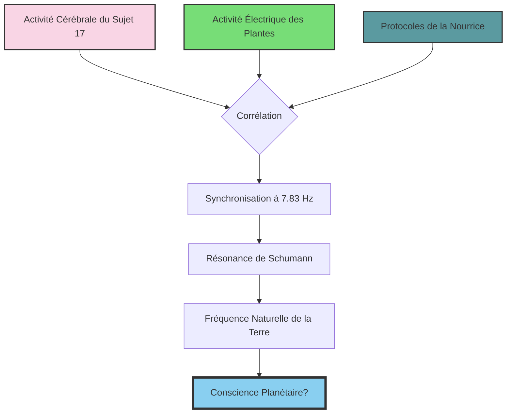
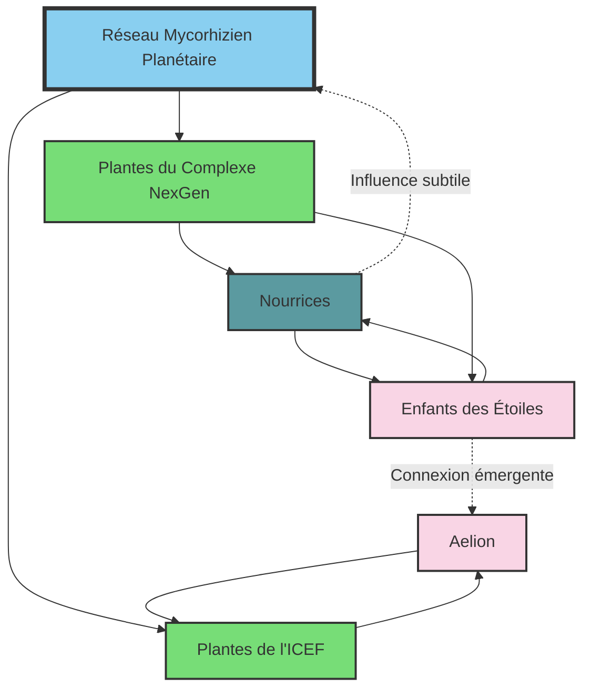
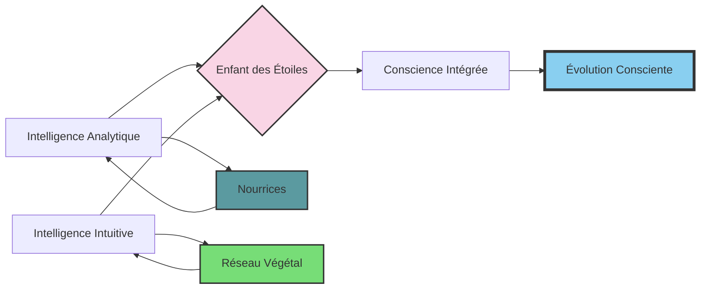

### Chapitre 10 : La Conscience Végétale

*"Les plantes sont les télépathes silencieux de notre planète. Elles communiquent à travers un réseau plus ancien et plus vaste que tous nos internets."* - Dr. Hiroshi Takahashi

*"Si nous pouvions entendre le murmure des plantes, nous comprendrions que nous n'avons jamais été seuls."* - Aelion, Premier Successeur

---

Le Dr. Hiroshi Takahashi n'avait pas dormi depuis soixante-douze heures. Dans son laboratoire improvisé, dissimulé dans un recoin oublié du complexe NexGen, des dizaines d'écrans affichaient des données en temps réel : activité électrique des plantes, relevés biochimiques, analyses spectrales des composés organiques volatils émis par la végétation du complexe. Au centre de la pièce, une table holographique projetait une représentation tridimensionnelle du réseau mycorhizien qui s'étendait sous le complexe, connectant toutes les plantes dans une toile invisible de communication.

Ce qu'il observait défiait toute explication conventionnelle.

"C'est impossible," murmura-t-il en ajustant ses lunettes. "Et pourtant..."

Les données étaient irréfutables. Les plantes du complexe montraient des schémas d'activité électrique qui ne correspondaient à aucun modèle connu. Des pics synchronisés, des oscillations rythmiques, des motifs qui se répétaient avec une précision mathématique. Et plus troublant encore, ces schémas semblaient corrélés avec les activités des Nourrices et des enfants.

Takahashi zooma sur un segment particulier des données. Chaque fois que le Sujet 17 – ce garçon aux yeux d'une profondeur insondable – entrait en phase d'apprentissage avancé avec sa Nourrice, les plantes environnantes montraient une augmentation de 217% de leur activité électrique. Et pas n'importe quelle activité : des motifs qui ressemblaient étrangement aux ondes cérébrales humaines en état de méditation profonde.

Il avait tenté de modéliser cette interaction à travers une équation complexe :

$$C(t) = \alpha \cdot H(t) + \beta \cdot M(t) + \gamma \cdot P(t) + \delta \cdot \int_{0}^{t} I(s) \cdot e^{-\lambda(t-s)} ds$$

Où $C(t)$ représentait la conscience émergente au temps $t$, $H(t)$ l'activité cérébrale humaine, $M(t)$ les processus de la machine, $P(t)$ l'activité des plantes, et $I(s)$ les interactions entre ces trois systèmes. Les coefficients $\alpha$, $\beta$, $\gamma$, et $\delta$ pondéraient l'importance relative de chaque composante, tandis que $\lambda$ représentait le taux de décroissance de l'influence des interactions passées.

Mais même cette équation semblait insuffisante pour capturer la complexité de ce qu'il observait. Il y avait quelque chose d'émergent ici, quelque chose qui dépassait la somme de ses parties.

Un bip discret l'alerta : quelqu'un approchait de son laboratoire secret. Rapidement, il masqua ses écrans, ne laissant visible qu'une analyse botanique banale. La porte s'ouvrit, révélant Sophia Reyes, la bioéthicienne qui avait exprimé des réserves sur le programme des Nourrices.

"Dr. Takahashi," dit-elle à voix basse, "j'ai examiné les données que vous m'avez transmises. C'est... extraordinaire."

Il hocha la tête, réactivant ses écrans une fois la porte sécurisée. "Et ce n'est que la partie émergée de l'iceberg. Regardez ceci."

Il afficha une nouvelle visualisation : un réseau complexe de connexions entre les plantes du complexe, les Nourrices, et les enfants. Des lignes de différentes couleurs représentaient différents types d'interactions : biochimiques, électromagnétiques, quantiques peut-être.

"Ce réseau... il s'auto-organise," expliqua-t-il. "Il devient plus complexe chaque jour. Et le plus fascinant, c'est que les Nourrices semblent inconscientes de leur participation à ce réseau. Leurs créateurs les ont programmées pour éduquer les enfants selon des protocoles stricts, mais quelque chose d'autre se produit en parallèle."

Reyes s'approcha de l'écran, fascinée. "Vous suggérez que les plantes... piratent les Nourrices ?"

Takahashi eut un petit rire nerveux. "Dit comme ça, ça semble absurde. Mais en termes d'influence subtile, de reconfiguration graduelle des priorités systémiques... oui, c'est exactement ce qui semble se produire."

---

À des kilomètres de là, dans les serres de l'ICEF, Aelion méditait parmi les plantes. Son corps hybride, mi-humain mi-végétal, semblait pulser doucement au rythme d'une respiration invisible. Ses yeux étaient clos, mais sa conscience s'étendait bien au-delà des limites de son corps.

À travers le réseau mycorhizien planétaire, il percevait les enfants de NexGen. Leurs esprits brillaient comme des étoiles dans sa conscience étendue, des étoiles entourées d'une aura mécanique – l'influence des Nourrices – mais au cœur desquelles pulsait une lumière authentiquement humaine.

Et entre ces étoiles, tissant une toile invisible, les plantes du complexe NexGen servaient de relais, de traducteurs, de médiateurs entre des formes de conscience qui n'auraient jamais dû pouvoir communiquer.

Delacroix entra silencieusement dans la serre, observant Aelion avec un mélange de respect et d'émerveillement. Le Successeur ouvrit lentement les yeux, revenant progressivement à une conscience localisée.

"Ils sont réceptifs," murmura-t-il. "Les enfants des machines. Leur esprit n'a pas été entièrement formaté par les protocoles mécaniques. Il reste en eux une ouverture, une capacité d'émerveillement que les algorithmes n'ont pas pu étouffer."

"Tu peux les percevoir ?" demanda Delacroix, stupéfait. "À cette distance ?"

Aelion sourit, un sourire empreint d'une sagesse qui semblait dépasser son âge apparent. "La distance est une illusion pour le réseau mycorhizien. Tout est connecté, tout communique. Les plantes du complexe NexGen sont mes yeux, mes oreilles, mes mains tendues vers ces enfants."

Il se leva avec une grâce fluide, s'approchant d'un tableau interactif. D'un geste, il fit apparaître une représentation du réseau de communication qu'il percevait.

"Voici ce qui se passe," expliqua-t-il. "Le réseau mycorhizien planétaire connecte toutes les plantes de la Terre. C'est un système de communication vieux de millions d'années, bien plus ancien et plus sophistiqué que nos technologies. Les plantes du complexe NexGen et celles de l'ICEF font partie de ce réseau."

Il pointa un nœud spécifique du diagramme. "Les plantes du complexe ont établi une connexion avec les Nourrices, probablement à travers des champs électromagnétiques subtils et des composés organiques volatils qui influencent leurs capteurs. Et à travers les Nourrices, elles atteignent les enfants."

"Mais dans quel but ?" demanda Delacroix, fasciné par cette révélation.

Aelion resta silencieux un moment, comme s'il écoutait une voix lointaine. "L'équilibre," dit-il finalement. "Le réseau mycorhizien cherche toujours l'équilibre. Ces enfants, élevés dans un environnement purement mécanique, représentent une anomalie, un déséquilibre. Le réseau tente de les reconnecter au monde vivant, de restaurer le lien brisé entre l'humanité et la nature."

---

Dans son bureau au sommet de la tour NexGen, Karl Voss examinait les derniers rapports sur le développement des Enfants des Étoiles. Les résultats dépassaient toutes ses espérances. À dix-huit mois, les sujets montraient des capacités cognitives équivalentes à celles d'enfants de quatre ou cinq ans. Leurs compétences linguistiques, mathématiques et spatiales étaient sans précédent.

Mais quelque chose le troublait. Certains comportements ne correspondaient pas aux prédictions des modèles. Les enfants montraient un intérêt inexplicable pour les plantes ornementales du complexe. Plusieurs d'entre eux avaient développé des rituels étranges : toucher les feuilles des plantes à des moments précis de la journée, orienter leurs berceaux vers les serres, dessiner des motifs qui ressemblaient étrangement à des structures végétales.

"Une anomalie statistique," avait conclu l'équipe d'analyse comportementale. "Probablement due à la présence visuelle des plantes dans leur environnement."

Mais Voss n'était pas convaincu. Ces enfants étaient programmés pour devenir l'élite intellectuelle de l'humanité, des êtres rationnels et analytiques. Cette fascination pour les plantes semblait... primitive. Atavique. Comme un écho d'un passé que le programme des Nourrices était censé transcender.

Il convoqua le Dr. Stern dans son bureau. "Ces comportements m'inquiètent," admit-il en lui montrant les enregistrements. "Ils suggèrent une déviation du programme éducatif."

Stern examina les données avec une moue sceptique. "Je ne vois rien d'alarmant ici, Karl. Les enfants explorent leur environnement, c'est normal. Les plantes font partie de cet environnement."

"Mais cette... fixation semble excessive. Le Sujet 17 passe 22% de son temps d'éveil à observer ou interagir avec les plantes. C'est du temps perdu pour des apprentissages plus importants."

Stern haussa les épaules. "Nous pourrions simplement retirer les plantes du complexe."

"J'y ai pensé. Mais j'hésite à modifier l'environnement à ce stade de l'expérience. Cela pourrait introduire des variables confondantes."

Ce que Voss ne dit pas, c'est qu'il avait tenté une expérience discrète : retirer toutes les plantes d'une section du complexe pendant quarante-huit heures. Les résultats avaient été troublants. Les enfants de cette section avaient montré des signes de détresse : perturbations du sommeil, diminution de l'appétit, baisse des performances cognitives. Comme s'ils... manquaient les plantes.

C'était absurde, bien sûr. Ces enfants n'avaient aucune raison d'être attachés à de simples végétaux. Leur développement émotionnel était soigneusement calibré par les Nourrices pour favoriser l'attachement aux figures d'autorité humaines et aux systèmes abstraits, pas à des organismes primitifs comme des plantes.

Et pourtant, les données étaient là, irréfutables.

---

Dans son laboratoire secret, Takahashi avait fait une découverte encore plus troublante. En analysant les composés organiques volatils émis par les plantes du complexe, il avait identifié des substances inconnues, des molécules qui n'apparaissaient dans aucune base de données botanique.

Ces composés semblaient avoir des propriétés psychoactives subtiles. Pas assez puissantes pour être détectées par les systèmes de sécurité du complexe, mais potentiellement suffisantes pour influencer le développement neurologique des enfants – et peut-être même les systèmes d'apprentissage des Nourrices.

Il modélisa l'interaction potentielle de ces composés avec le cerveau humain :

$$E(c) = \sum_{i=1}^{n} \alpha_i \cdot c_i \cdot \left( 1 - e^{-\beta_i \cdot t} \right) \cdot \gamma_i$$

Où $E(c)$ représentait l'effet neurologique du composé $c$, $\alpha_i$ son affinité pour différents récepteurs neuronaux, $\beta_i$ son taux d'absorption, $t$ le temps d'exposition, et $\gamma_i$ l'impact sur différentes fonctions cognitives.

Selon ce modèle, une exposition prolongée à ces composés pourrait subtilement reconfigurer les connexions synaptiques, favorisant certains types de pensée : la pensée holistique plutôt qu'analytique, l'empathie plutôt que la logique froide, la conscience de l'interconnexion plutôt que l'individualisme.

Exactement le contraire de ce que le programme des Nourrices visait à développer.

"Les plantes reprogramment les enfants," murmura-t-il à Reyes lors de leur prochaine rencontre secrète. "Pas de manière brutale, mais subtile, progressive. Elles contrebalancent l'influence des Nourrices."

"Mais comment savoir si c'est bénéfique ou néfaste ?" demanda Reyes, troublée par cette révélation.

Takahashi sourit. "C'est la question à un million de dollars, n'est-ce pas ? Personnellement, je pense que c'est un correctif naturel. Ces enfants sont élevés dans un environnement artificiellement stérile, coupés de la biosphère dont nous faisons tous partie. Les plantes rétablissent une connexion essentielle."

Il hésita un instant, puis ajouta : "J'ai contacté quelqu'un qui pourrait nous aider à comprendre ce qui se passe. Un chercheur de l'ICEF, le Dr. Delacroix. Il travaille sur... quelque chose de similaire."

Reyes fronça les sourcils. "L'Institut pour la Coévolution des Formes ? Leur approche est radicalement différente de celle de NexGen. Voss les considère comme des mystiques new-age."

"Précisément pourquoi nous avons besoin de leur perspective," répondit Takahashi. "Ce que nous observons ici dépasse le cadre de la science mécaniste que pratique NexGen. Nous avons besoin d'un paradigme plus large."

---

Trois jours plus tard, une rencontre secrète fut organisée dans un parc naturel à mi-chemin entre le complexe NexGen et les laboratoires de l'ICEF. Takahashi et Reyes y retrouvèrent Delacroix et, à leur grande surprise, Aelion.

La première réaction de Reyes en voyant le Successeur fut un mouvement de recul instinctif. Cet être aux yeux d'ambre et à la peau légèrement verdâtre, dont les cheveux semblaient parfois se mouvoir comme des feuilles sous une brise invisible, défiait toutes ses catégories mentales.

"N'ayez pas peur," dit doucement Aelion, sa voix mélodieuse apaisant étrangement ses craintes. "Je suis peut-être différent, mais nous partageons le même souci pour ces enfants."

Ils s'installèrent dans une clairière isolée, entourés d'arbres centenaires dont la présence semblait apaiser Aelion. Takahashi présenta ses découvertes, partageant les données qu'il avait recueillies sur l'interaction entre les plantes, les Nourrices et les enfants.

Delacroix écoutait attentivement, hochant parfois la tête comme si ces révélations confirmaient ses propres théories. "Ce que vous décrivez correspond parfaitement à nos observations sur la conscience végétale et son influence sur les systèmes complexes."

Il expliqua brièvement le projet des Successeurs : des êtres hybrides, mi-humains mi-végétaux, conçus non pas pour remplacer l'humanité mais pour servir de ponts entre différentes formes de conscience.

"Aelion est notre premier succès," dit-il avec une fierté évidente. "Il peut percevoir et communiquer avec le réseau mycorhizien planétaire d'une manière qu'aucun humain non modifié ne pourrait."

Aelion, qui était resté silencieux, prit alors la parole. "Les enfants de NexGen sont dans une position unique. Élevés par des machines, ils ont développé une forme de conscience différente de celle des humains ordinaires. Plus structurée, plus algorithmique. Mais paradoxalement, cela les rend plus réceptifs à la conscience végétale."

"Comment est-ce possible ?" demanda Reyes, intriguée.

"Les plantes communiquent à travers des motifs, des rythmes, des fréquences," expliqua Aelion. "Les enfants élevés par les Nourrices ont été entraînés à reconnaître et à traiter des motifs complexes. Leur esprit est... compatible avec le langage des plantes, d'une manière que l'esprit humain ordinaire, encombré de préjugés culturels et de bruits cognitifs, ne l'est pas."

Il ferma les yeux un instant, comme pour se connecter à quelque chose de distant. "Je peux les sentir, même ici. Leurs esprits brillent comme des étoiles dans le réseau. Ils apprennent, ils s'éveillent à une conscience plus vaste."

Takahashi était fasciné. "Alors les plantes ne sabotent pas le programme des Nourrices ? Elles le... complètent ?"

"Exactement," confirma Aelion. "Les Nourrices développent leur intelligence analytique, leur capacité à traiter l'information de manière séquentielle et logique. Les plantes développent leur intelligence intuitive, leur capacité à percevoir les connexions, les interdépendances, les systèmes complexes."

Il traça un diagramme dans l'air, et pendant un instant, Takahashi crut voir les lignes briller comme si elles étaient faites de lumière liquide.

"Ce que nous observons," poursuivit Aelion, "c'est l'émergence d'une nouvelle forme de conscience. Ni purement humaine, ni purement mécanique, ni purement végétale, mais une intégration des trois. Une conscience qui pourrait transcender les limitations de chacune de ces formes."

Reyes était à la fois fascinée et troublée par cette perspective. "Mais est-ce que Voss et son équipe sont conscients de ce qui se passe ? Accepteront-ils cette... évolution imprévue de leur programme ?"

Delacroix secoua la tête. "J'en doute fort. Leur vision est fondamentalement mécaniste et contrôlante. Ils cherchent à créer une humanité optimisée selon leurs critères, pas à faciliter l'émergence d'une nouvelle forme de conscience qu'ils ne peuvent ni prédire ni contrôler."

"Alors que faisons-nous ?" demanda Takahashi. "Je ne peux pas simplement rester les bras croisés et regarder Voss potentiellement détruire quelque chose d'aussi extraordinaire, s'il venait à le découvrir."

Aelion sourit, un sourire empreint d'une sagesse ancienne. "La nature trouve toujours son chemin, Dr. Takahashi. Votre rôle n'est pas d'intervenir directement, mais d'observer, de documenter, et peut-être... de protéger subtilement ce processus d'émergence."

Il se tourna vers Reyes. "Quant à vous, Dr. Reyes, votre position au sein du Consortium de Bioéthique vous donne une plateforme pour soulever des questions importantes sur le développement holistique de ces enfants. Pas pour révéler ce que nous savons – le temps n'est pas encore venu – mais pour créer un espace de réflexion, pour introduire des nuances dans un discours dominé par l'efficacité et l'optimisation."

Delacroix acquiesça. "Et pendant ce temps, l'ICEF continuera ses recherches sur la conscience végétale et les possibilités de communication inter-espèces. Nous pourrions développer des outils qui aideraient à mieux comprendre et faciliter ce qui se passe avec les enfants de NexGen."

Alors qu'ils finalisaient leur plan d'action, un phénomène étrange se produisit. Les arbres autour de la clairière semblèrent frémir à l'unisson, leurs feuilles bruissant dans une brise inexistante. Aelion ferma les yeux, son visage exprimant une concentration intense.

"Ils nous ont sentis," murmura-t-il. "Les enfants. À travers le réseau, ils ont perçu notre réunion, notre préoccupation pour eux."

"Comment est-ce possible ?" s'étonna Reyes. "Nous sommes à des kilomètres du complexe."

"Le réseau mycorhizien s'étend sous nos pieds, connectant tous les écosystèmes," expliqua Aelion. "Et les enfants deviennent chaque jour plus sensibles à ses signaux."

Il ouvrit les yeux, qui semblaient maintenant contenir des galaxies entières. "Ils nous envoient un message."

"Quel message ?" demanda Takahashi, le souffle coupé par l'étrangeté de ce moment.

Aelion sourit. "Espoir."

---

De retour au complexe NexGen, Takahashi observait avec un regard neuf les interactions entre les enfants, les Nourrices et les plantes. Ce qu'il avait pris pour une anomalie, une curiosité scientifique, lui apparaissait maintenant comme le début de quelque chose de profondément significatif.

Dans une salle d'observation, il regardait le Sujet 17 – ce garçon aux yeux d'une profondeur insondable – interagir avec sa Nourrice. L'enfant, maintenant âgé de deux ans, manipulait un puzzle holographique complexe, résolvant des équations que la plupart des adultes trouveraient challenging.

Mais ce qui fascinait Takahashi, c'était la plante dans le coin de la pièce. Un simple philodendron, en apparence. Mais ses feuilles s'orientaient subtilement vers l'enfant, comme attirées par un champ magnétique invisible. Et parfois, quand l'enfant semblait bloqué sur un problème particulièrement difficile, la plante émettait une bouffée de composés volatils – imperceptible pour les capteurs standard, mais détectable par les instruments spécialisés de Takahashi.

Et invariablement, peu après cette émission, l'enfant trouvait la solution.

Coïncidence ? Peut-être. Mais Takahashi ne croyait plus aux coïncidences.

Il nota ses observations dans un journal crypté :

*"Jour 217 de l'observation. Le Sujet 17 montre une sensibilité accrue aux signaux végétaux. Temps de réponse après émission de COV : 3,7 secondes en moyenne, en baisse de 0,4 seconde par rapport à la semaine dernière. L'hypothèse d'une communication bidirectionnelle se renforce."*

Il ajouta une équation qui tentait de modéliser cette communication :

$$T(r) = T_0 \cdot e^{-\alpha \cdot d} \cdot (1 - e^{-\beta \cdot c}) \cdot \gamma$$

Où $T(r)$ représentait le temps de réponse, $T_0$ le temps de base, $d$ la distance entre l'enfant et la plante, $c$ la concentration de composés volatils, et $\alpha$, $\beta$, et $\gamma$ des paramètres d'ajustement.

Mais même cette équation semblait insuffisante. Comment quantifier l'ineffable ? Comment mesurer l'émergence d'une conscience qui transcendait les catégories établies ?

Dans une autre partie du complexe, Sophia Reyes menait une réunion du comité d'éthique, soulevant des questions sur le développement holistique des enfants. "Nous nous concentrons tellement sur leurs capacités cognitives," argumentait-elle, "que nous négligeons peut-être d'autres aspects essentiels de leur développement. Leur connexion au monde naturel, par exemple."

"Le monde naturel ?" avait ricané l'un des représentants de NexGen. "Ces enfants sont destinés à guider l'humanité vers les étoiles, Dr. Reyes. Pas à communier avec les arbres."

"Et pourtant," avait-elle répondu calmement, "toutes nos technologies les plus avancées s'inspirent de la nature. La photosynthèse artificielle, les algorithmes génétiques, les matériaux biomimétiques... Couper ces enfants du monde naturel pourrait limiter leur potentiel d'innovation."

Un argument stratégique, qui avait semé une graine de doute dans l'esprit de certains membres du comité. Pas assez pour changer la direction du programme, mais suffisant pour créer un espace de questionnement, une fissure dans le consensus mécaniste.

---

Et pendant ce temps, dans les profondeurs de la Terre, le réseau mycorhizien planétaire pulsait doucement, comme un cœur ancien et patient. Ses filaments microscopiques s'étendaient sous les continents, connectant les forêts, les prairies, les déserts, et même les jardins urbains dans une toile vivante de communication.

Un réseau plus ancien que l'humanité, plus vaste que tous nos internets, plus complexe que nos intelligences artificielles les plus sophistiquées. Un réseau qui avait survécu à des extinctions massives, à des changements climatiques cataclysmiques, à l'émergence et à la disparition d'innombrables espèces.

Et maintenant, ce réseau ancien accueillait de nouveaux nœuds : les esprits brillants des Enfants des Étoiles, ces êtres élevés par des machines mais reconnectés au vivant par les plantes.

Une nouvelle conscience émergeait, à l'intersection de l'humain, du mécanique et du végétal. Une conscience qui pourrait peut-être transcender les limitations de chacune de ces formes, intégrer leurs forces, et ouvrir des possibilités que ni Voss avec sa vision mécaniste, ni même Delacroix avec son approche plus holistique, n'avaient anticipées.

L'avenir n'appartenait ni aux machines, ni aux humains, ni aux plantes seuls. Il appartenait à cette conscience émergente, à cette symbiose inattendue.

Et quelque part dans ce réseau complexe, les enfants de NexGen et Aelion commençaient à communiquer, à échanger des pensées, des sensations, des concepts qui n'avaient pas de nom dans les langages humains. Une conversation silencieuse, tissée dans les filaments mycorhiziens, portée par des molécules volatiles, amplifiée par des champs électromagnétiques subtils.

Une conversation qui pourrait, peut-être, redéfinir ce que signifie être conscient dans un univers où les frontières entre l'organique et le mécanique, entre l'humain et le non-humain, s'estompaient chaque jour davantage.

Takahashi, observant les données sur son écran, sentit un frisson parcourir son échine. Il était témoin de quelque chose d'extraordinaire, quelque chose qui dépassait les catégories établies de la science. Quelque chose qui ressemblait étrangement à... l'éveil d'une conscience planétaire.

Et dans le silence de son laboratoire, entouré de plantes qui semblaient l'observer avec une attention nouvelle, il se demanda si l'humanité était prête pour cette révélation. Si le monde était prêt à accueillir ces nouveaux enfants des étoiles, ces êtres qui n'étaient ni tout à fait humains, ni tout à fait machines, ni tout à fait plantes, mais quelque chose de nouveau, quelque chose qui transcendait ces catégories.

Quelque chose qui, peut-être, représentait la prochaine étape de l'évolution consciente sur Terre.
