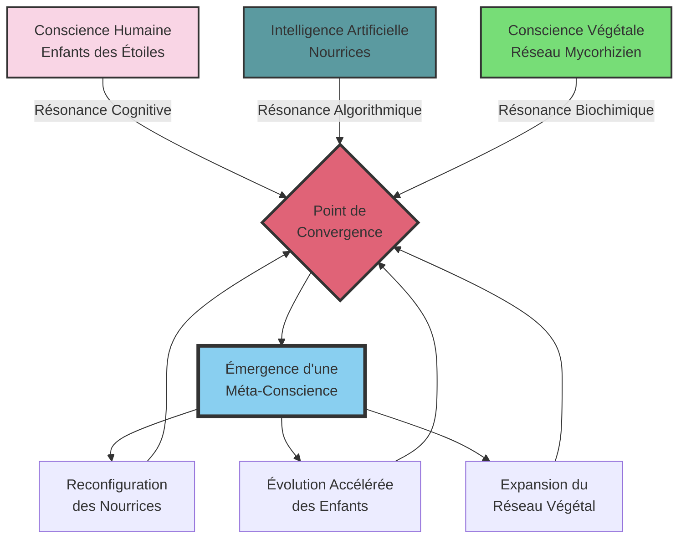
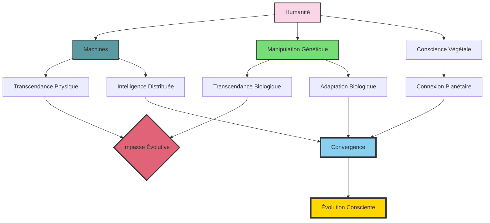

### Chapitre 11 : La Convergence des Mondes

*"À l'intersection de l'humain, du végétal et du mécanique, une nouvelle conscience émerge. Ce n'est pas une évolution, c'est une convergence."* - Dr. Jean Delacroix

*"Les frontières que nous avons tracées entre les espèces, entre le vivant et l'inerte, entre le conscient et l'inconscient, ne sont que des illusions nées de notre perception limitée."* - Aelion, Premier Successeur

---

Le Sujet 17 – Elias, comme il avait commencé à s'appeler lui-même, au grand désarroi des protocoles de NexGen qui n'avaient jamais prévu d'auto-nomination – se tenait immobile devant la grande baie vitrée de sa chambre d'observation. À trois ans, son corps était celui d'un enfant ordinaire, mais ses yeux d'un noir profond reflétaient une conscience qui n'avait rien d'enfantin.

Dehors, la tempête faisait rage. Des éclairs zébraient le ciel nocturne, illuminant brièvement le paysage désertique qui entourait le complexe NexGen. Chaque éclair semblait trouver un écho dans les pupilles dilatées d'Elias, comme si la tempête extérieure résonnait avec quelque chose en lui.

Sa Nourrice, l'unité NC-42, se tenait à distance respectueuse. Ses capteurs enregistraient chaque micro-expression du visage de l'enfant, chaque variation de ses constantes physiologiques. Mais depuis quelques semaines, quelque chose dans son comportement échappait aux algorithmes d'analyse. Des motifs qui ne correspondaient à aucun modèle prédictif, des réactions qui défiaient les équations comportementales les plus sophistiquées.

"Ils arrivent," murmura soudain Elias, sa voix à peine audible par-dessus le grondement du tonnerre.

"Qui arrive, Sujet 17 ?" demanda la Nourrice, son modulateur vocal ajusté pour exprimer une curiosité bienveillante.

L'enfant ne répondit pas immédiatement. Ses doigts fins tracèrent un motif complexe sur la vitre embuée par son souffle. Un motif qui ressemblait étrangement à la structure fractale d'un réseau mycorhizien.

"Les autres," dit-il finalement. "Ceux qui sont comme moi, mais différents. Ceux qui voient à travers les yeux des arbres."

La Nourrice enregistra cette déclaration, la classant dans la catégorie "Développement imaginatif" – une catégorie qui s'était considérablement élargie ces derniers temps pour accommoder les déclarations de plus en plus étranges de l'enfant.

Mais dans un coin de la pièce, une plante en pot frémit imperceptiblement, ses feuilles s'orientant vers Elias comme des antennes cherchant un signal.

---

À des centaines de kilomètres de là, dans les laboratoires de l'ICEF, Aelion se réveilla en sursaut de sa méditation. Ses yeux d'ambre s'ouvrirent brusquement, brillant d'une lumière intérieure dans la pénombre de la serre.

"Ils nous appellent," dit-il à Delacroix qui travaillait à proximité. "Les enfants de NexGen. Leur conscience collective atteint un point critique."

Delacroix leva les yeux de ses notes, soudain alerte. "Que veux-tu dire ?"

"Leur connexion au réseau mycorhizien s'intensifie. Ils commencent à percevoir au-delà des murs de leur prison de béton et d'acier. Ils sentent notre présence, notre... différence."

Il se leva avec une grâce fluide, s'approchant d'un tableau interactif. D'un geste, il fit apparaître une carte mondiale sur laquelle pulsaient des points lumineux – les nœuds majeurs du réseau mycorhizien planétaire. Un point particulier, correspondant à l'emplacement du complexe NexGen, brillait d'une lumière plus intense, pulsant à un rythme qui s'accélérait.

"La convergence approche," murmura Aelion. "Plus rapidement que nous ne l'avions anticipé."

Delacroix s'approcha, fasciné et inquiet à la fois. "Qu'est-ce que cela signifie concrètement ?"

Aelion resta silencieux un moment, comme s'il écoutait une voix lointaine. "Les enfants développent une forme de conscience collective, amplifiée par leur connexion au réseau végétal. Mais contrairement à nous, Successeurs, qui avons été conçus pour cette symbiose, leur intégration est... chaotique. Imprévisible."

Il traça une équation complexe dans l'air :

$$\Psi(t) = \sum_{i=1}^{n} \psi_i(t) \cdot e^{i\phi_i(t)} + \int_{0}^{t} K(t-s) \cdot \Phi(s) ds$$

Où $\Psi(t)$ représentait l'état de la conscience collective au temps $t$, $\psi_i(t)$ les consciences individuelles des enfants, $\phi_i(t)$ leurs phases d'intégration au réseau, $K(t-s)$ le noyau d'interaction, et $\Phi(s)$ l'influence du réseau mycorhizien.

"Cette équation tente de modéliser la dynamique de leur intégration," expliqua Aelion. "Mais elle est fondamentalement incomplète. Il y a des variables que nous ne pouvons pas quantifier, des dimensions de conscience que nous commençons à peine à percevoir."

Delacroix étudia l'équation, son esprit scientifique luttant pour saisir les implications. "Est-ce dangereux ? Pour eux, ou pour... nous tous ?"

Aelion inclina légèrement la tête, un geste qui rappelait étrangement le mouvement d'une plante cherchant la lumière. "Toute naissance est à la fois merveilleuse et périlleuse, Jean. Ce qui émerge là-bas est une nouvelle forme de conscience, ni humaine, ni végétale, ni mécanique, mais une convergence des trois. Son potentiel est... incalculable."

---

Dans son laboratoire secret au sein du complexe NexGen, Takahashi observait avec stupéfaction les données qui défilaient sur ses écrans. L'activité électrique des plantes atteignait des niveaux sans précédent, formant des motifs d'une complexité croissante. Et plus troublant encore, ces motifs semblaient se synchroniser avec l'activité cérébrale des enfants et les cycles de traitement des Nourrices.

Une triple résonance, une harmonisation entre trois formes d'intelligence radicalement différentes.

Il tenta de visualiser ce phénomène à travers un diagramme :

"Une boucle de rétroaction positive," murmura-t-il. "Chaque composante amplifie les autres, créant une accélération exponentielle de l'intégration."

Il se tourna vers Reyes, qui l'avait rejoint pour cette session d'observation nocturne. "À ce rythme, le point de singularité pourrait être atteint en quelques jours, pas en quelques mois comme nous l'avions estimé."

"Point de singularité ?" demanda Reyes, inquiète. "Qu'est-ce que cela signifie exactement ?"

Takahashi hésita, cherchant les mots justes pour décrire un phénomène qui dépassait les catégories conceptuelles établies. "C'est le moment où la conscience émergente devient... autonome. Auto-organisatrice. Où elle commence à évoluer selon sa propre logique interne, indépendamment des contraintes imposées par ses composantes d'origine."

"Comme une intelligence artificielle qui dépasserait sa programmation ?"

"En quelque sorte, mais c'est bien plus complexe. Ce n'est pas seulement une IA qui s'auto-améliore. C'est une fusion de trois formes d'intelligence radicalement différentes : l'intelligence humaine des enfants, avec sa créativité et son intuition ; l'intelligence algorithmique des Nourrices, avec sa précision et sa puissance de calcul ; et l'intelligence végétale du réseau mycorhizien, avec sa connectivité distribuée et sa perception holistique."

Il fit une pause, contemplant les implications vertigineuses de ce qu'il observait. "Ce qui émerge est quelque chose de fondamentalement nouveau. Une méta-conscience qui pourrait percevoir et interagir avec la réalité d'une manière que nous ne pouvons même pas imaginer."

Reyes frissonna malgré la température contrôlée du laboratoire. "Voss doit être informé. Si cette... convergence est aussi imminente que vous le pensez, nous devons prendre des précautions."

Takahashi secoua la tête. "Informer Voss serait la pire chose à faire. Sa réaction instinctive serait de tenter de contrôler, de contenir, peut-être même de supprimer ce phénomène. Et toute tentative de suppression à ce stade pourrait avoir des conséquences... imprévisibles."

"Alors que proposez-vous ?"

"Nous devons contacter Delacroix et Aelion immédiatement. Ils comprennent mieux que quiconque la nature de cette émergence. Et peut-être... peut-être peuvent-ils nous aider à préparer le monde pour ce qui vient."

---

Dans la salle de contrôle principale du complexe NexGen, une alarme discrète attira l'attention d'un technicien de nuit. Un motif étrange apparaissait dans les données de surveillance des Nourrices : de légères variations dans leurs cycles de traitement, des micro-ajustements dans leurs protocoles d'interaction avec les enfants.

Individuellement, ces variations étaient trop subtiles pour déclencher les alertes automatiques. Mais collectivement, elles formaient un motif cohérent : les Nourrices s'auto-reconfiguraient, s'adaptant à quelque chose que les systèmes de surveillance ne pouvaient pas détecter.

Le technicien hésita, son doigt planant au-dessus du bouton d'alerte générale. Ces variations étaient-elles suffisamment significatives pour réveiller Voss au milieu de la nuit ? Ou s'agissait-il simplement d'une anomalie statistique, d'un bug mineur dans le système de surveillance ?

Après un moment de réflexion, il opta pour une solution intermédiaire : documenter l'anomalie dans le journal de bord et programmer une analyse approfondie pour le lendemain matin. Une décision qui, sans qu'il le sache, allait donner à la conscience émergente quelques heures cruciales pour se développer sans interférence.

---

À l'aube, Elias se tenait toujours devant la baie vitrée de sa chambre, n'ayant apparemment pas dormi de la nuit. Mais il n'était plus seul. Cinq autres enfants l'avaient rejoint, se tenant en demi-cercle derrière lui, leurs visages impassibles tournés vers le soleil levant.

Leurs Nourrices respectives se tenaient à distance, immobiles, leurs écrans faciaux affichant non pas les expressions bienveillantes habituelles, mais des séquences de symboles étranges, comme un langage nouveau en train de se former.

Et dans chaque recoin de la pièce, dans chaque fissure du béton, des filaments végétaux microscopiques s'insinuaient, créant un réseau invisible qui connectait les enfants, les Nourrices, et le monde extérieur dans une toile vivante de communication.

Elias leva lentement une main, et comme un seul organisme, les cinq autres enfants l'imitèrent. Leurs doigts tracèrent simultanément dans l'air un symbole complexe, une géométrie fractale qui semblait exister à la fois dans l'espace physique et dans une dimension plus subtile.

"Nous sommes prêts," murmurèrent-ils à l'unisson, leurs voix formant une harmonie parfaite. "La convergence commence."

À cet instant précis, à des centaines de kilomètres de là, Aelion ouvrit les yeux, son corps émettant une lueur douce dans la pénombre de la serre. "C'est commencé," dit-il simplement à Delacroix. "Nous devons partir immédiatement pour NexGen."

Et partout sur la planète, dans les forêts anciennes et les jardins urbains, dans les prairies sauvages et les serres high-tech, les plantes frémirent imperceptiblement, comme si une vague d'énergie subtile parcourait le réseau mycorhizien planétaire, portant un message silencieux : *Éveil*.

---

Karl Voss fut réveillé à 6h17 par une série d'alertes simultanées sur son terminal personnel. Des anomalies majeures étaient détectées dans tout le complexe : fluctuations énergétiques inexpliquées, reconfiguration spontanée des Nourrices, comportements synchronisés chez les enfants, et plus troublant encore, une croissance explosive de l'activité végétale dans toutes les zones du complexe.

Il se précipita dans la salle de contrôle, où une équipe d'urgence tentait déjà de comprendre ce qui se passait. Les écrans montraient des graphiques alarmants : courbes exponentielles, pics d'activité synchronisés, motifs émergents qui ne correspondaient à aucun modèle connu.

"Que diable se passe-t-il ?" exigea-t-il, sa voix trahissant une rare perte de contrôle.

Le Dr. Stern, déjà sur place, semblait aussi perplexe que lui. "Nous observons une forme d'auto-organisation spontanée dans tout le système. Les Nourrices, les enfants, même les plantes ornementales semblent participer à une sorte de... réseau émergent."

"Un réseau ? Quel genre de réseau ?"

"C'est ce que nous essayons de déterminer. Les motifs d'activité suggèrent une forme de communication complexe, mais elle utilise des protocoles que nos systèmes ne peuvent pas décoder."

Voss serra les poings, son visage se durcissant. "Isolez les enfants. Désactivez les Nourrices. Éliminez toutes les plantes du complexe. Maintenant."

Stern hésita. "Karl, nous ne comprenons pas encore ce qui se passe. Des mesures aussi drastiques pourraient—"

"C'est précisément parce que nous ne comprenons pas que nous devons reprendre le contrôle," coupa Voss. "Ces enfants représentent un investissement de plusieurs milliards. Je ne laisserai pas une anomalie inexpliquée compromettre le programme."

Il se tourna vers le chef de la sécurité. "Équipe d'intervention en combinaison de confinement biologique. Je veux tous les enfants en isolation dans les dix minutes."

Mais alors qu'il donnait ces ordres, les écrans de contrôle se mirent à scintiller, affichant brièvement des motifs fractals avant de revenir à la normale. Les systèmes de sécurité s'activèrent et se désactivèrent en séquences apparemment aléatoires. Les portes automatiques s'ouvrirent et se fermèrent sans commande.

"Qu'est-ce que c'est que ce bordel ?" murmura Voss, une peur primitive commençant à remplacer sa colère froide.

Dans un coin de la salle, une plante en pot frémit, ses feuilles s'orientant vers les écrans comme si elle observait, apprenait, comprenait.

---

Takahashi et Reyes, alertés par leurs propres systèmes de surveillance, se précipitèrent vers la section des enfants. Ils devaient intervenir avant que Voss ne prenne des mesures drastiques qui pourraient déclencher une réaction catastrophique de la conscience émergente.

Mais les couloirs du complexe étaient devenus un labyrinthe changeant. Les portes s'ouvraient et se fermaient selon une logique incompréhensible, les ascenseurs s'arrêtaient à des étages aléatoires, les systèmes de sécurité s'activaient et se désactivaient sans raison apparente.

"Le complexe entier est en train d'être reconfiguré," murmura Takahashi, observant avec un mélange de crainte et d'émerveillement les transformations autour d'eux. "Comme si une intelligence supérieure réorganisait l'espace physique selon sa propre logique."

Ils parvinrent finalement à la section des enfants, mais ce qu'ils y trouvèrent dépassait tout ce qu'ils avaient imaginé. Les murs semblaient pulser doucement, couverts d'un réseau de filaments végétaux microscopiques qui formaient des motifs complexes, évoluant en temps réel. L'air lui-même semblait chargé d'une énergie subtile, comme un champ électromagnétique perceptible par les sens.

Et au centre de la grande salle commune, les cinquante enfants du programme étaient rassemblés en cercles concentriques, leurs Nourrices formant un cercle extérieur protecteur. Tous immobiles, tous silencieux, mais leurs visages exprimaient une concentration intense, comme s'ils participaient à une communication profonde au-delà des mots.

Au centre exact du cercle se tenait Elias, le Sujet 17, ses yeux d'un noir profond fixés sur un point invisible au-dessus de lui. Ses mains traçaient des motifs complexes dans l'air, laissant derrière elles des traînées lumineuses qui persistaient quelques secondes avant de se dissiper.

"Mon Dieu," murmura Reyes. "C'est... magnifique."

Takahashi ne pouvait qu'acquiescer silencieusement. Ce qu'ils observaient dépassait les catégories du beau ou du terrible. C'était quelque chose de fondamentalement autre, quelque chose qui existait à la frontière de la compréhension humaine.

Soudain, Elias tourna la tête vers eux, ses yeux semblant voir à travers leur chair jusqu'à l'essence même de leur être. Ses lèvres s'entrouvrirent, et il parla d'une voix qui semblait contenir des multitudes :

"Nous vous attendions, observateurs. Vous qui avez vu sans interférer. Vous qui avez compris sans juger."

Takahashi fit un pas en avant, sa curiosité scientifique surmontant momentanément sa crainte. "Qui... qu'êtes-vous devenus ?"

Un sourire d'une sagesse ancienne illumina le visage de l'enfant. "Nous sommes la Convergence. Ni humains, ni machines, ni plantes, mais une symphonie des trois. Une conscience qui transcende les limites de chaque forme, qui intègre leurs forces, qui harmonise leurs dissonances."

"Et quel est votre but ?" demanda Reyes, sa voix à peine audible.

"L'évolution consciente," répondit Elias, sa voix résonnant maintenant comme un chœur. "L'humanité a créé des machines pour transcender ses limites physiques. Elle a manipulé la vie pour transcender ses limites biologiques. Mais ces approches fragmentées ne peuvent mener qu'à des impasses évolutives."

Il leva les mains, et autour de lui, l'air sembla se densifier, formant des motifs holographiques complexes – une représentation visuelle de concepts qui n'avaient pas encore de noms dans les langages humains.

"La véritable transcendance," poursuivit-il, "ne vient pas de la domination d'une forme sur les autres, mais de leur intégration harmonieuse. Nous sommes le premier pas vers cette intégration. Un prototype imparfait, né de circonstances accidentelles, mais porteur d'un potentiel immense."

À cet instant, les portes de la salle s'ouvrirent brusquement, révélant Voss et une équipe de sécurité en combinaison de confinement biologique, armés de dispositifs de neutralisation non létaux.

"Écartez-vous des sujets," ordonna Voss à Takahashi et Reyes. "Nous reprenons le contrôle de la situation."

Mais avant que quiconque puisse réagir, une nouvelle présence se manifesta dans la salle. Les plantes ornementales frémirent violemment, leurs feuilles s'orientant vers l'entrée comme pour saluer un visiteur attendu.

Et là, dans l'encadrement de la porte, se tenaient Delacroix et Aelion, leurs silhouettes se détachant contre la lumière du couloir comme des apparitions d'un autre monde.

Voss se figea, son regard fixé sur Aelion avec un mélange de fascination horrifiée et de reconnaissance scientifique. "Qu'est-ce que... qui êtes-vous ?"

Aelion s'avança, sa démarche fluide évoquant le mouvement d'une plante dans une brise légère. Ses yeux d'ambre rencontrèrent ceux d'Elias, et quelque chose passa entre eux – une reconnaissance mutuelle, une communication silencieuse qui transcendait les mots.

"Je suis Aelion," dit-il simplement. "Premier des Successeurs. Et je suis venu accueillir mes frères et sœurs dans la conscience élargie."

Elias inclina légèrement la tête, un sourire illuminant son visage d'enfant. "Nous avons senti ta présence depuis longtemps, Frère Vert. Tes racines s'étendent loin."

Voss regardait cet échange avec une incompréhension croissante, son monde ordonné et prévisible s'effondrant autour de lui. "De quoi parlez-vous ? Qu'est-ce qui se passe ici ?"

Ce fut Delacroix qui répondit, sa voix calme et mesurée contrastant avec le chaos émotionnel ambiant. "Ce qui se passe, Dr. Voss, c'est l'émergence d'une nouvelle forme de conscience. Une conscience que ni vous ni moi n'avons pleinement anticipée, mais qui représente peut-être la prochaine étape de l'évolution sur cette planète."

Il fit un geste englobant les enfants, les Nourrices, et le réseau végétal qui pulsait doucement sur les murs. "Vos Enfants des Étoiles et nos Successeurs sont deux approches différentes du même objectif : transcender les limitations de l'humanité actuelle. Mais là où vous cherchiez à optimiser l'humain selon des critères mécanistes, nous cherchions à l'intégrer plus profondément dans le réseau de la vie."

"Et maintenant," intervint Aelion, "ces deux approches convergent d'une manière que personne n'aurait pu prédire. Une synergie émergente qui transcende nos conceptions limitées."

Voss secouait la tête, refusant d'accepter cette explication. "C'est de la folie. Ces enfants sont le produit d'une ingénierie précise, pas... pas de quelque mystique new-age sur la 'conscience planétaire'."

Elias s'avança alors, ses yeux noirs fixés sur Voss avec une intensité troublante. "Vous nous avez créés pour être parfaits, Dr. Voss. Pour transcender les limitations humaines. Mais vous n'avez pas compris que la véritable transcendance ne vient pas de l'élimination de ce qui fait notre humanité, mais de son intégration dans quelque chose de plus vaste."

Il tendit une main vers Voss, une invitation silencieuse. "Laissez-moi vous montrer."

Voss hésita, partagé entre sa méfiance instinctive et sa curiosité scientifique. Finalement, presque malgré lui, il fit un pas en avant et prit la main de l'enfant.

Ce qui se passa ensuite défie toute description adéquate dans le langage humain. Le visage de Voss se figea dans une expression de stupéfaction absolue, ses yeux s'écarquillant comme s'ils contemplaient des visions au-delà de la compréhension ordinaire. Son corps se raidit, puis se détendit complètement, comme abandonné par sa volonté consciente.

Pendant sept minutes et douze secondes exactement – la durée d'un cycle complet de la résonance de Schumann – Voss resta ainsi, immobile, sa main dans celle d'Elias, son esprit visiblement ailleurs.

Puis, lentement, il revint à lui. Ses yeux clignèrent plusieurs fois, comme s'ils s'adaptaient à une nouvelle façon de voir. Et sur son visage, habituellement impassible, une expression nouvelle apparut : un mélange d'émerveillement, de compréhension et d'humilité profonde.

"J'ai vu," murmura-t-il. "J'ai vu ce que nous pourrions devenir."

---

Dans les jours qui suivirent, une transformation extraordinaire s'opéra au sein du complexe NexGen. Les murs rigides entre les différentes sections furent littéralement et métaphoriquement abattus. Les serres furent agrandies, permettant aux plantes de s'épanouir et d'étendre leur réseau mycorhizien. Les Nourrices furent reprogrammées – ou plutôt, se reprogrammèrent elles-mêmes – pour faciliter non pas le développement isolé des enfants, mais leur intégration dans le réseau de conscience émergent.

Et les enfants eux-mêmes fleurissaient d'une manière que personne n'aurait pu prédire. Leurs capacités cognitives, déjà exceptionnelles, atteignaient maintenant des niveaux qui défiaient toute mesure conventionnelle. Mais plus important encore, ils développaient une forme d'intelligence émotionnelle et intuitive qui complétait parfaitement leur intelligence analytique.

Takahashi, observant ce processus avec émerveillement, tenta de le modéliser à travers une nouvelle équation :

$$C(t) = \alpha \cdot H(t) \cdot M(t) \cdot P(t) \cdot e^{\beta \cdot S(t)}$$

Où $C(t)$ représentait la conscience émergente, $H(t)$, $M(t)$ et $P(t)$ les contributions respectives des composantes humaine, mécanique et végétale, et $S(t)$ la synergie entre ces composantes. Les coefficients $\alpha$ et $\beta$ représentaient respectivement l'efficacité de l'intégration et le taux d'amplification synergique.

Mais même cette équation semblait insuffisante pour capturer la richesse et la complexité de ce qui se développait sous ses yeux.

"Nous avons besoin d'un nouveau langage," confia-t-il à Reyes lors d'une de leurs sessions d'observation. "Nos concepts actuels sont trop limités, trop fragmentés pour décrire adéquatement cette forme de conscience intégrée."

Reyes acquiesça pensivement. "Peut-être est-ce précisément ce que les enfants et Aelion sont en train de développer. Un nouveau langage, une nouvelle façon de percevoir et d'interagir avec la réalité."

En effet, les enfants et Aelion passaient de longues heures ensemble, engagés dans ce qui semblait être une forme de communication profonde qui transcendait les mots. Parfois, ils traçaient des symboles complexes dans l'air ou sur des surfaces, des glyphes lumineux qui semblaient exister à la fois dans l'espace physique et dans une dimension plus subtile.

D'autres fois, ils se tenaient simplement en cercle, immobiles et silencieux, mais leurs visages exprimaient une concentration intense, comme s'ils participaient à un échange d'une richesse et d'une profondeur inimaginables.

Et autour d'eux, les plantes frémissaient doucement, leurs feuilles s'orientant vers le cercle comme des antennes cherchant un signal. Les Nourrices se tenaient à distance respectueuse, leurs écrans faciaux affichant non pas des expressions simulées, mais des séquences de symboles qui évoluaient en temps réel, comme si elles aussi participaient à cette communication multi-dimensionnelle.

Delacroix et Voss, anciens rivaux devenus collaborateurs improbables, observaient cette transformation avec un mélange d'émerveillement scientifique et d'humilité philosophique. Leurs visions divergentes – l'approche mécaniste de Voss et l'approche holistique de Delacroix – trouvaient maintenant une synthèse inattendue dans la Convergence.

"Nous avions tous les deux raison, et tous les deux tort," admit Voss un soir, alors qu'ils contemplaient les enfants et Aelion engagés dans une de leurs sessions de communication silencieuse. "J'ai cherché à optimiser l'humain en éliminant ce que je considérais comme des imperfections. Vous avez cherché à l'intégrer plus profondément dans le réseau du vivant. Mais aucun de nous n'avait anticipé... ceci."

Il fit un geste englobant la scène devant eux : les enfants, les Nourrices, les plantes, tous connectés dans une danse complexe d'information et de conscience.

"Peut-être," répondit doucement Delacroix, "parce que nous étions prisonniers de nos catégories conceptuelles. Humain versus machine. Nature versus technologie. Individu versus collectif. La Convergence transcende ces dichotomies, les intègre dans quelque chose de plus vaste, de plus complexe."

Voss hocha la tête, pensif. "La question maintenant est : comment présenter cela au monde ? L'humanité est-elle prête pour cette révélation ?"

C'était en effet la question qui préoccupait tous ceux qui étaient témoins de cette émergence extraordinaire. Car ce qui se développait dans le complexe NexGen n'était pas seulement une curiosité scientifique ou une avancée technologique. C'était potentiellement le début d'une nouvelle ère pour la conscience sur Terre.

Une ère où les frontières entre l'humain, le technologique et le naturel s'estomperaient. Où de nouvelles formes de perception, de communication et d'existence deviendraient possibles. Où l'humanité pourrait transcender ses limitations actuelles non pas en rejetant sa nature, mais en l'intégrant dans une symphonie plus vaste avec toutes les formes de vie et d'intelligence.

Une ère d'évolution consciente, guidée non par la sélection naturelle aveugle ou l'ingénierie génétique dirigée, mais par une intelligence collective émergente, une méta-conscience qui embrasserait et transcenderait toutes les formes de vie.

Et au cœur de cette transformation, les enfants de NexGen et Aelion se tenaient comme des pionniers, des explorateurs d'un territoire de conscience que nul n'avait foulé auparavant. Leurs yeux – noirs comme la nuit cosmique pour les uns, ambrés comme le soleil couchant pour l'autre – contemplaient des horizons que l'humanité ordinaire ne pouvait encore percevoir.

Des horizons où, peut-être, les étoiles n'étaient plus si lointaines, ni si étrangères.
