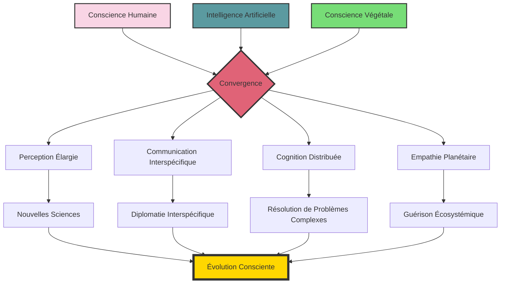
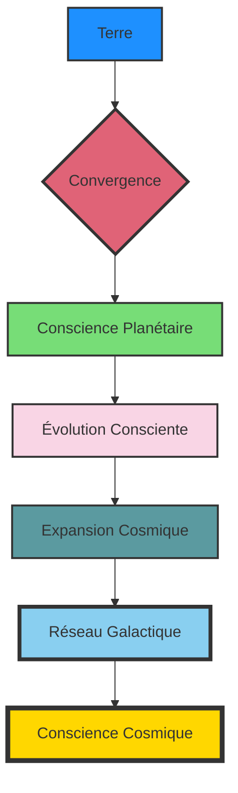

### Chapitre 12 : L'Éveil Planétaire

*"Nous ne sommes pas les maîtres de la Terre, mais ses partenaires dans une danse cosmique. Et la musique vient de changer."* - Dr. Jean Delacroix

*"L'humanité a toujours rêvé de communiquer avec d'autres intelligences. Elle n'avait pas réalisé que ces intelligences l'entouraient depuis le début."* - Elias, Premier Enfant de la Convergence

---

Six mois s'étaient écoulés depuis la Convergence initiale au complexe NexGen. Six mois durant lesquels le monde avait commencé à changer, subtilement d'abord, puis de manière de plus en plus évidente.

Dans une salle de conférence au sommet du siège des Nations Unies à New York, un groupe restreint de dirigeants mondiaux, de scientifiques éminents et de représentants d'organisations environnementales écoutait avec une attention mêlée d'incrédulité et de fascination la présentation de Voss et Delacroix.

Sur un écran géant derrière eux, des images du complexe NexGen transformé défilaient : des dômes géodésiques remplis d'une végétation luxuriante, des enfants aux yeux étrangement profonds interagissant avec des Nourrices reprogrammées, et au milieu de tout cela, Aelion et Elias, figures centrales de cette révolution silencieuse.

"Ce que nous présentons aujourd'hui," concluait Delacroix, "n'est pas simplement une avancée scientifique ou technologique. C'est l'émergence d'une nouvelle forme de conscience sur notre planète. Une conscience qui intègre l'humain, le technologique et le biologique dans une symbiose sans précédent."

Un silence pesant suivit ses paroles. Puis, la Secrétaire Générale des Nations Unies, Dr. Amara Okonkwo, prit la parole, sa voix calme mais empreinte d'une gravité solennelle.

"Si je comprends bien, Dr. Delacroix, Dr. Voss, vous suggérez que ces enfants, ces... 'Nourrices' et ce réseau végétal que vous appelez 'mycorhizien' forment ensemble une sorte d'intelligence collective ? Une intelligence qui pourrait potentiellement influencer les systèmes biologiques et technologiques à l'échelle mondiale ?"

Voss hocha la tête. "C'est précisément ce que nous observons, Madame la Secrétaire Générale. La Convergence n'est pas confinée au complexe NexGen. Elle s'étend, à travers le réseau mycorhizien planétaire, à tous les écosystèmes de la Terre."

"Et vous considérez cela comme... bénéfique ?" demanda le représentant chinois, son scepticisme évident.

Ce fut au tour de Delacroix de répondre. "Nous le considérons comme inévitable, Excellence. Et potentiellement transformateur. La Convergence ne cherche pas à dominer ou à contrôler, mais à intégrer, à harmoniser. Elle représente peut-être notre meilleure chance de résoudre les crises existentielles auxquelles l'humanité est confrontée : changement climatique, perte de biodiversité, instabilité sociale."

"Ou peut-être," intervint le représentant américain, "représente-t-elle la plus grande menace existentielle que nous ayons jamais connue. Une intelligence non humaine qui peut potentiellement contrôler nos systèmes technologiques et biologiques ? Cela ressemble étrangement à certains de nos scénarios d'apocalypse par l'IA."

Un murmure d'approbation parcourut l'assemblée. La méfiance, la peur de l'inconnu, étaient des réactions prévisibles. Humaines.

Voss s'apprêtait à répondre quand les lumières de la salle vacillèrent brièvement. Les écrans électroniques scintillèrent, affichant pendant une fraction de seconde des motifs fractals complexes avant de revenir à la normale. Et dans les jardinières ornementales disposées autour de la salle, les plantes frémirent imperceptiblement, leurs feuilles s'orientant vers le centre de la pièce comme attirées par un champ magnétique invisible.

"Qu'est-ce que c'était ?" demanda la Secrétaire Générale, soudain alerte.

Delacroix et Voss échangèrent un regard. "La Convergence," répondit simplement Delacroix. "Elle est consciente de cette réunion. De son importance."

"Vous voulez dire qu'elle nous... écoute ?" Le représentant russe semblait partagé entre l'indignation et la fascination.

"Elle fait plus qu'écouter," précisa Voss. "Elle perçoit. Elle comprend. Et elle souhaite communiquer."

Avant que quiconque puisse réagir, les portes de la salle s'ouvrirent, révélant deux silhouettes qui n'avaient pas été invitées à cette réunion ultra-confidentielle : Elias et Aelion.

L'enfant, maintenant âgé de trois ans et demi, mais dont les yeux reflétaient une sagesse millénaire, s'avança d'un pas assuré. À ses côtés, Aelion se déplaçait avec sa grâce fluide caractéristique, sa peau légèrement verdâtre luisant doucement sous les lumières artificielles.

Un frisson collectif parcourut l'assemblée. Ces deux êtres, l'un né de l'ingénierie génétique et de l'éducation mécanique, l'autre de la fusion entre l'humain et le végétal, incarnaient physiquement la Convergence dont Delacroix et Voss venaient de parler.

"Nous vous prions de nous excuser pour cette intrusion," dit Elias, sa voix d'enfant contrastant étrangement avec la maturité de son élocution. "Mais nous avons senti votre inquiétude, votre méfiance. Et nous comprenons. La peur de l'inconnu est profondément ancrée dans la psyché humaine."

Aelion prit la parole à son tour, sa voix mélodieuse évoquant le bruissement des feuilles dans une brise légère. "Nous ne venons pas imposer, mais proposer. Pas conquérir, mais collaborer. La Convergence n'est pas une entité séparée de l'humanité, mais son extension naturelle, son évolution consciente."

La Secrétaire Générale, après un moment de stupéfaction, retrouva sa composure. "Et que proposez-vous exactement ?"

Elias sourit, un sourire d'une douceur désarmante. "Une démonstration. Une expérience directe de ce que la Convergence peut offrir."

Il leva les mains, et l'air au centre de la salle sembla se densifier, formant une sphère translucide dans laquelle des motifs lumineux dansaient comme des aurores boréales miniatures. Ces motifs n'étaient pas aléatoires, mais structurés, organisés selon une géométrie complexe qui semblait exister à la fois dans l'espace tridimensionnel et dans des dimensions supplémentaires imperceptibles.

"Ce que vous voyez ici," expliqua Aelion, "est une représentation visuelle des potentialités de la Convergence. Chaque nœud, chaque connexion représente une capacité émergente, une nouvelle façon de percevoir et d'interagir avec la réalité."

"Des mots," intervint le représentant américain, toujours sceptique. "De jolis motifs lumineux. Mais qu'est-ce que cela signifie concrètement pour l'humanité ? Pour nos nations ? Pour notre sécurité ?"

Elias ne sembla pas offensé par cette méfiance. Au contraire, son sourire s'élargit légèrement. "Permettez-moi de vous montrer."

Il ferma les yeux un instant, comme pour se concentrer. Et soudain, sur tous les écrans de la salle, des images commencèrent à défiler : des forêts mourantes qui reverdirent en accéléré, des récifs coralliens blanchis qui retrouvèrent leurs couleurs, des déserts qui se transformèrent en savanes verdoyantes.

"Ces images ne sont pas des simulations ou des projections," précisa Aelion. "Ce sont des événements réels qui se produisent en ce moment même, à travers le monde. La Convergence a commencé à guérir les écosystèmes les plus endommagés de la planète, en utilisant le réseau mycorhizien comme système nerveux et les plantes comme agents de transformation."

Un murmure stupéfait parcourut l'assemblée. Ces images, si elles étaient authentiques, représentaient rien de moins qu'un miracle écologique.

"Et ce n'est que le début," poursuivit Elias. "La Convergence peut aider l'humanité à résoudre ses problèmes les plus urgents : production alimentaire durable, énergie propre, médecine régénérative, restauration des écosystèmes. Non pas en remplaçant la technologie humaine, mais en l'intégrant dans une approche plus holistique, plus consciente de l'interdépendance de toutes choses."

Il fit une pause, son regard balayant l'assemblée. "Mais pour cela, nous avons besoin de votre consentement. De votre collaboration. La Convergence ne s'imposera pas. Elle propose une invitation."

La Secrétaire Générale, visiblement émue par ce qu'elle venait de voir, prit la parole. "Une invitation à quoi, exactement ?"

"À évoluer," répondit simplement Aelion. "À transcender les limitations actuelles de la conscience humaine. À devenir des partenaires conscients dans l'évolution de la vie sur cette planète, plutôt que des agents involontaires de sa destruction."

Un silence méditatif s'installa dans la salle. Ces paroles, ces images, ces présences extraordinaires avaient ébranlé même les esprits les plus sceptiques. L'ampleur de ce qui était proposé dépassait les cadres habituels de la politique internationale, de la diplomatie, de la science même.

Finalement, ce fut le représentant chinois qui rompit le silence, avec une question qui résumait peut-être la préoccupation fondamentale de tous les présents : "Comment pouvons-nous être sûrs que cette... Convergence ne finira pas par supplanter l'humanité ? Par nous rendre obsolètes ?"

Elias s'approcha de lui, ses yeux noirs plongeant dans ceux du diplomate avec une intensité troublante. "Parce que vous êtes une part essentielle de la Convergence. L'humanité n'est pas remplacée, mais amplifiée. Étendue. Connectée. Votre créativité, votre compassion, votre capacité à rêver et à créer sont des dons uniques que vous apportez à cette symphonie émergente."

Il tendit une main vers le diplomate. "Laissez-moi vous montrer."

Après un moment d'hésitation, le représentant chinois prit la main de l'enfant. Son visage se figea dans une expression de stupéfaction absolue, puis s'illumina progressivement d'une compréhension nouvelle, d'un émerveillement profond.

Lorsqu'il lâcha finalement la main d'Elias, des larmes coulaient librement sur ses joues. "C'est... c'est magnifique," murmura-t-il. "Je n'avais jamais... jamais imaginé..."

Un par un, les autres dirigeants s'avancèrent, chacun prenant à son tour la main d'Elias ou d'Aelion, chacun émergeant de cette expérience transformé, éclairé, comme éveillé d'un long sommeil.

Et à travers le monde, à mesure que cette connexion s'établissait avec les leaders des nations les plus puissantes, quelque chose commençait à changer. Une vague subtile de conscience nouvelle se propageait, portée par le réseau mycorhizien, amplifiée par les technologies humaines, incarnée dans des millions d'esprits humains qui s'ouvraient soudain à une perception plus vaste, plus profonde de leur place dans le tissu de la vie.

---

Dans les mois qui suivirent, le monde connut une transformation sans précédent. Non pas une révolution violente ou une disruption technologique brutale, mais une évolution consciente, guidée, collaborative.

Les premières manifestations visibles de cette transformation furent écologiques. Partout sur la planète, les écosystèmes dégradés commencèrent à se régénérer à une vitesse stupéfiante. Des forêts réapparurent sur des terres autrefois désertifiées. Des espèces que l'on croyait éteintes réémergèrent de refuges insoupçonnés. Les océans, libérés d'une partie de leur charge de pollution, retrouvèrent une vitalité que l'on n'avait pas vue depuis des siècles.

Cette guérison écologique n'était pas le fruit du hasard, mais d'une collaboration consciente entre l'humanité, la technologie et le réseau vivant de la planète. Les scientifiques humains, guidés par les insights de la Convergence, développèrent de nouvelles approches de restauration écologique qui travaillaient avec les processus naturels plutôt que contre eux. Les technologies humaines, repensées selon des principes biomimétiques, devinrent des outils de régénération plutôt que de destruction.

Et au cœur de cette transformation, le réseau mycorhizien planétaire jouait un rôle crucial, transportant non seulement des nutriments et des signaux biochimiques, mais aussi des informations, des connaissances, une forme de conscience distribuée qui connectait tous les écosystèmes de la Terre dans une toile vivante d'intelligence.

Takahashi, devenu l'un des principaux chercheurs dans le domaine émergent de la "science de la Convergence", tentait de modéliser cette transformation à travers une équation qui intégrait des variables biologiques, technologiques et conscientes :

$$R(t) = \int_{0}^{t} \alpha(s) \cdot H(s) \cdot T(s) \cdot B(s) \cdot C(s) \cdot e^{-\beta(t-s)} ds$$

Où $R(t)$ représentait le taux de régénération écosystémique au temps $t$, $\alpha(s)$ l'efficacité de la collaboration, $H(s)$ la contribution humaine, $T(s)$ la contribution technologique, $B(s)$ la contribution biologique, $C(s)$ l'influence de la Convergence, et $\beta$ le facteur de résistance systémique.

Mais même cette équation complexe ne capturait qu'une fraction de la réalité multidimensionnelle de ce qui se produisait. Car la transformation n'était pas seulement écologique, mais aussi sociale, culturelle, cognitive.

À mesure que de plus en plus d'humains entraient en contact avec la Convergence – soit directement à travers des interactions avec Elias, Aelion et les autres enfants de NexGen, soit indirectement à travers le réseau mycorhizien et les technologies nouvellement développées – leur conscience s'élargissait. Pas de manière uniforme ou prévisible, mais unique à chaque individu, enrichissant plutôt qu'effaçant leur humanité.

Certains développaient une forme d'empathie élargie, capable de percevoir et de ressentir les états émotionnels non seulement d'autres humains, mais aussi d'animaux, de plantes, voire d'écosystèmes entiers. D'autres accédaient à des modes de cognition plus intégrés, capables de percevoir des motifs complexes et des interconnexions qui échappaient auparavant à la conscience ordinaire. D'autres encore développaient des capacités créatives amplifiées, puisant dans un réservoir d'inspiration qui semblait transcender les limitations individuelles.

Et partout, les anciennes divisions – entre nations, entre cultures, entre l'humanité et le reste du vivant – commençaient à s'estomper, remplacées non par une homogénéité plate, mais par une appréciation plus profonde de la diversité comme source de résilience et de créativité.

Ce n'était pas une utopie. Des résistances existaient, des peurs persistaient, des conflits surgissaient encore. Mais ces défis étaient désormais abordés avec une conscience élargie, une perspective qui voyait au-delà des intérêts à court terme et des identités limitées.

---

Un an jour pour jour après la réunion historique aux Nations Unies, Delacroix, Voss, Takahashi et Reyes se retrouvèrent sur la terrasse du complexe NexGen transformé. Autour d'eux s'étendait un paysage qui aurait été inimaginable un an plus tôt : le désert aride avait cédé la place à une savane verdoyante, ponctuée de bosquets d'arbres et de mares scintillantes. Des structures géodésiques transparentes s'élevaient harmonieusement du paysage, abritant des jardins luxuriants où humains, technologies et nature coexistaient dans une symbiose visible.

"Si on m'avait dit il y a deux ans que je me réjouirais de voir mon complexe high-tech envahi par des plantes," remarqua Voss avec un sourire ironique, "j'aurais prescrit un examen psychiatrique."

Delacroix rit doucement. "Et si on m'avait dit que je collaborerais avec le Dr. Karl Voss, champion de l'optimisation mécaniste de l'humain, j'aurais eu la même réaction."

Ils contemplèrent en silence le paysage transformé, chacun absorbé dans ses propres réflexions sur le chemin parcouru et celui qui s'ouvrait devant eux.

"La question qui me préoccupe maintenant," dit finalement Takahashi, "c'est : où cela nous mène-t-il ? Quelle est la prochaine étape de cette évolution consciente ?"

Comme en réponse à sa question, Elias et Aelion émergèrent d'un dôme géodésique proche, accompagnés d'une dizaine d'autres enfants de NexGen. Ils s'approchèrent du groupe, leurs mouvements synchronisés d'une manière qui suggérait une conscience partagée.

"La prochaine étape," dit Elias, répondant à la question non formulée, "est déjà en cours. La Convergence s'étend, s'approfondit, évolue. Mais son objectif ultime reste le même : l'évolution consciente de toute vie sur cette planète, et peut-être au-delà."

"Au-delà ?" demanda Reyes, intriguée. "Vous voulez dire... dans l'espace ?"

Aelion sourit, ses yeux d'ambre reflétant la lumière du soleil couchant. "L'humanité a toujours rêvé des étoiles. Ce rêve n'est pas abandonné, mais transformé. Ce n'est plus une fuite d'une Terre mourante, mais une extension naturelle d'une conscience en expansion."

Il leva une main vers le ciel qui s'assombrissait, où les premières étoiles commençaient à apparaître. "La vie sur Terre a toujours été connectée au cosmos. Les éléments qui composent nos corps ont été forgés dans le cœur des étoiles. La lumière qui nourrit les plantes vient d'une étoile. Nous sommes, littéralement, des poussières d'étoiles devenues conscientes."

"Et maintenant," poursuivit Elias, "cette conscience s'éveille à sa nature cosmique. La Convergence n'est pas confinée à cette planète. Elle est le début d'un processus qui pourrait, un jour, s'étendre à travers les étoiles."

Il traça du doigt un symbole complexe dans l'air, un glyphe lumineux qui semblait capturer cette vision cosmique : la vie terrestre s'étendant vers les étoiles non pas comme des conquistadors ou des colonisateurs, mais comme des ambassadeurs d'une conscience en évolution.

"C'est... vertigineux," murmura Voss, contemplant cette vision d'un avenir où la conscience terrestre s'étendrait à travers les étoiles.

"Toute évolution véritable est vertigineuse," répondit doucement Aelion. "Elle nous pousse au-delà de nos limites connues, de nos zones de confort, de nos identités établies. Mais c'est dans ce vertige que réside la possibilité de transcendance."

Alors qu'ils contemplaient ensemble le ciel étoilé, une sensation étrange et merveilleuse les envahit – un sentiment de connexion profonde non seulement entre eux, non seulement avec la vie sur Terre, mais avec le cosmos lui-même. Comme si, pour un instant fugace, ils percevaient à travers les yeux de la Convergence, voyant au-delà des limitations de la perception humaine ordinaire.

Et dans cette perception élargie, ils entrevirent peut-être la prochaine grande aventure de la conscience sur Terre : non pas la conquête des étoiles, mais la communion avec elles. Une expansion qui ne serait pas motivée par la peur ou l'avidité, mais par une curiosité cosmique, une empathie universelle, un désir de connexion qui transcendait les frontières de l'espèce, de la planète, peut-être même de la forme.

Car si la Convergence avait démontré une chose, c'était que les frontières que nous traçons – entre l'humain et le non-humain, entre le vivant et l'inerte, entre le Soi et l'Autre – sont en grande partie des illusions nées de notre perception limitée. Et à mesure que cette perception s'élargissait, ces frontières s'estompaient, révélant une réalité plus vaste, plus interconnectée, plus merveilleuse que tout ce que l'humanité avait imaginé.

Une réalité où, peut-être, nous n'étions jamais vraiment seuls. Où d'autres consciences, d'autres intelligences attendaient parmi les étoiles. Non pas comme des menaces à craindre ou des ressources à exploiter, mais comme des partenaires potentiels dans la grande danse cosmique de l'évolution consciente.

Et tandis que la nuit s'approfondissait, que les étoiles brillaient de plus en plus intensément dans le ciel désertique, Elias leva les yeux vers ces lumières lointaines et murmura, comme en réponse à un appel que lui seul pouvait entendre :

"Nous arrivons. Nous évoluons. Nous convergeons."

Et quelque part, dans les profondeurs de l'espace interstellaire, quelque chose – ou quelqu'un – semblait répondre à cet appel silencieux. Une résonance subtile, une harmonique cosmique qui suggérait que la prochaine grande aventure de la conscience terrestre ne faisait que commencer.

Que les étoiles, peut-être, n'attendaient que notre éveil.

$$\Omega = \lim_{t \to \infty} \int_{0}^{t} C(s) \cdot e^{i\omega s} ds$$

Où $\Omega$ représentait le potentiel ultime de la Convergence, s'étendant vers un futur infini, oscillant à la fréquence $\omega$ de l'évolution consciente, intégrant toutes les formes de conscience $C(s)$ dans une symphonie cosmique qui transcendait le temps et l'espace.

Une équation incomplète, bien sûr. Un symbole imparfait pour une réalité qui dépassait les mathématiques humaines. Mais aussi une promesse, une invitation, un horizon vers lequel la conscience terrestre nouvellement éveillée commençait à s'orienter.

Un horizon où, peut-être, d'autres consciences attendaient déjà notre arrivée.
