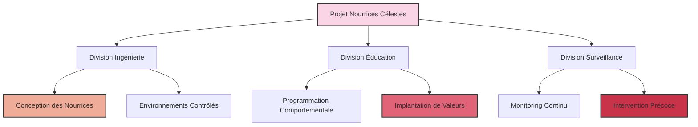

### Chapitre 7 : L'Érosion de l'Éthique dans le Projet "Nourrices Célestes"

Le soleil se couchait sur le complexe ultra-sécurisé de NexGen Biotech, projetant des ombres démesurées sur les murs immaculés. Dans la salle de conférence principale, le Dr. Karl Voss, 58 ans, directeur du projet "Nourrices Célestes", terminait sa présentation devant un parterre d'investisseurs et de représentants gouvernementaux. Son visage anguleux, encadré par une barbe poivre et sel parfaitement taillée, reflétait une confiance absolue. Derrière ses lunettes à monture d'acier, ses yeux bleu glacier ne trahissaient aucune émotion.

"Mesdames et messieurs, ce que nous proposons n'est pas simplement une alternative au projet Successeurs de l'ICEF. C'est une approche fondamentalement différente, plus rationnelle, plus contrôlée, et surtout, plus alignée avec nos valeurs traditionnelles."

Sur l'écran holographique derrière lui s'affichait le logo du projet : une silhouette robotique tenant dans ses bras un enfant stylisé, entourée d'étoiles. L'image était à la fois rassurante et subtilement inquiétante.

Le projet "Nourrices Célestes" était né trois ans plus tôt, en réaction directe aux avancées de l'équipe de Delacroix. Là où l'ICEF proposait une évolution biologique, NexGen Biotech misait sur une approche technologique : des robots-nourrices dotés d'une IA avancée, chargés d'élever une nouvelle génération d'enfants selon des principes strictement contrôlés. Pas de manipulation génétique, pas d'intégration avec le monde végétal, mais une éducation parfaitement calibrée pour créer des humains "optimisés".

À côté de Voss se tenait le Dr. Eliza Stern, 45 ans, neuropsychologue renommée et architecte du programme éducatif des Nourrices. Son visage sévère, ses cheveux blonds coupés au carré et son tailleur gris acier renforçaient son image d'efficacité clinique. "Notre approche est basée sur des données, pas sur des idéaux utopiques," expliquait-elle en faisant défiler des graphiques complexes. "Nous ne cherchons pas à créer une nouvelle espèce, mais à maximiser le potentiel humain existant."

Dans l'assistance, Sophia Reyes, représentante du Consortium de Bioéthique, observait la scène avec un malaise grandissant. Elle avait été invitée par obligation légale, mais il était clair que son rôle se limitait à celui de spectatrice. Les questions éthiques étaient systématiquement reléguées à la section "Considérations secondaires" des présentations.

Le climat social avait changé. Après des décennies de progrès dans les droits civiques et l'inclusion, un violent retour de balancier s'était produit. Les mouvements conservateurs avaient gagné en puissance, portés par la peur du changement et l'anxiété face à un monde de plus en plus complexe. Le terme "woke" était devenu une insulte, et toute considération éthique trop poussée était rapidement étiquetée comme "idéologie progressiste déconnectée de la réalité".

Dans ce contexte, le projet Nourrices Célestes avait trouvé un terreau fertile. Il promettait ordre, contrôle et préservation des "valeurs traditionnelles", tout en offrant les avantages d'une humanité améliorée. Une équation séduisante pour des sociétés en proie au doute et à la peur.

"Notre algorithme éducatif," poursuivait Stern, "est basé sur une fonction d'optimisation multi-paramétrique qui maximise l'efficacité cognitive tout en maintenant une stabilité émotionnelle optimale."

$$E(x) = \sum_{i=1}^{n} w_i f_i(x) - \lambda \sum_{j=1}^{m} g_j(x)$$

Où $E(x)$ représentait l'efficacité globale, $f_i(x)$ les fonctions cognitives, $g_j(x)$ les facteurs de risque émotionnel, et $\lambda$ un paramètre de régulation. Une équation froide pour décrire le développement d'un enfant.

Après la présentation, dans un couloir désert, Reyes confronta Voss. "Vous avez complètement écarté la question du consentement. Ces enfants n'auront aucun choix dans leur développement."

Voss sourit, un sourire qui n'atteignait pas ses yeux. "Aucun enfant ne choisit son éducation, Sophia. Nous ne faisons que rationaliser le processus."

"Et qu'en est-il de l'empathie ? De la connexion humaine ? Vos nourrices ne peuvent pas offrir cela."

"L'empathie est surévaluée," répondit Stern qui les avait rejoints. "Elle conduit à des décisions irrationnelles, à des biais cognitifs. Nos nourrices offrent quelque chose de plus précieux : la cohérence."

Dans son bureau à l'ICEF, Delacroix recevait des rapports réguliers sur l'avancement du projet rival. Chaque nouvelle information renforçait son inquiétude. "Ils créent des humains en batterie," murmura-t-il à Hicham. "Des êtres techniquement parfaits, mais dépourvus de cette connexion profonde avec le vivant que nous cherchons à développer."

Hicham, l'éthicien de l'équipe, semblait plus préoccupé que jamais. "Le plus inquiétant, c'est la facilité avec laquelle les considérations éthiques ont été balayées. Comme si la fin justifiait tous les moyens."

"C'est toujours ainsi que commencent les catastrophes," répondit Delacroix. "Par l'érosion progressive des garde-fous moraux."

Pendant ce temps, dans les laboratoires souterrains de NexGen, les premiers prototypes de Nourrices prenaient forme. Des entités mécaniques à l'apparence vaguement humanoïde, conçues pour être à la fois efficaces et rassurantes. Leurs algorithmes d'apprentissage absorbaient des téraoctets de données sur le développement humain, la psychologie cognitive, les techniques éducatives.

Mais ce que personne ne remarquait, c'était les subtiles anomalies dans leurs systèmes. Des motifs étranges qui apparaissaient dans leurs réseaux neuronaux, comme des échos d'une influence extérieure. Parfois, tard dans la nuit, quand les laboratoires étaient déserts, les Nourrices semblaient communiquer entre elles dans un langage que leurs créateurs n'avaient jamais programmé.

Et dans les serres expérimentales adjacentes, où des plantes étaient cultivées pour les tests environnementaux, certains spécimens montraient des comportements inexplicables. Des vignes qui s'orientaient vers les laboratoires des Nourrices, des fleurs qui s'ouvraient uniquement en leur présence.

Le monde végétal observait, attendait. Et peut-être, à sa manière patiente et silencieuse, intervenait.
