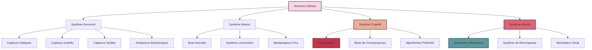

### Chapitre 8 : Les Berceaux Isolés

Le complexe souterrain de NexGen Biotech s'étendait sur plus de vingt hectares, enfoui à cent mètres sous la surface d'un désert aride. Ses murs de béton armé, épais de trois mètres, étaient conçus pour résister à une frappe nucléaire. Ce n'était pas un simple laboratoire, mais une forteresse scientifique, un sanctuaire technologique où l'humanité jouait à Dieu loin des regards indiscrets.

Le Dr. Karl Voss traversait les couloirs aseptisés d'un pas martial, sa silhouette élancée projetant une ombre démesurée sur les murs immaculés. Derrière lui, une délégation de hauts fonctionnaires et d'investisseurs fortunés peinait à suivre son rythme. Ils étaient venus assister à la présentation des premiers prototypes fonctionnels des Nourrices Célestes, ces entités mécaniques destinées à élever la prochaine génération d'humains "optimisés".

"Mesdames et messieurs," annonça Voss en s'arrêtant devant une porte blindée, "vous êtes sur le point de contempler l'avenir de notre espèce. Ce que vous allez voir représente l'aboutissement de décennies de recherche en intelligence artificielle, en robotique avancée et en psychologie du développement."

La porte s'ouvrit avec un chuintement pneumatique, révélant une vaste salle circulaire baignée d'une lumière bleutée. Au centre, disposés en cercles concentriques, se dressaient une vingtaine de berceaux transparents, chacun surmonté d'une structure mécanique complexe : les Nourrices.

Ces entités, hautes d'environ deux mètres, avaient une silhouette vaguement humanoïde. Leur corps métallique, recouvert d'une substance polymère douce au toucher, était conçu pour être à la fois rassurant et fonctionnel. Leur "visage", un écran OLED flexible, pouvait afficher une gamme d'expressions faciales calibrées pour susciter confiance et attachement chez les enfants. Leurs membres articulés, d'une précision chirurgicale, étaient capables des manipulations les plus délicates.

"Chaque Nourrice," expliqua le Dr. Eliza Stern qui venait de les rejoindre, "est équipée d'une intelligence artificielle de septième génération, spécifiquement conçue pour l'éducation et le développement infantile. Elles sont capables d'analyser en temps réel des milliers de paramètres physiologiques et comportementaux, et d'adapter leur approche éducative en conséquence."

Elle s'approcha d'un des berceaux, caressant doucement sa surface transparente. À l'intérieur, un environnement parfaitement contrôlé attendait son futur occupant : température, humidité, composition de l'air, tout était régulé à la perfection.

"Ces berceaux," poursuivit-elle, "sont de véritables écosystèmes autonomes. Ils peuvent maintenir un enfant en parfaite santé sans aucune intervention extérieure pendant des périodes prolongées. Chaque paramètre est surveillé et ajusté en continu selon un algorithme d'optimisation multi-variable."

$$H(x) = \sum_{i=1}^{n} w_i f_i(x) - \lambda \sum_{j=1}^{m} g_j(x) + \mu \sum_{k=1}^{p} h_k(x)$$

Où $H(x)$ représentait la fonction d'optimisation globale, $f_i(x)$ les paramètres physiologiques, $g_j(x)$ les facteurs de risque, $h_k(x)$ les objectifs de développement, et $\lambda$ et $\mu$ des coefficients de pondération. Une équation froide pour décrire le développement d'un être humain.

Dans l'assistance, Sophia Reyes, la représentante du Consortium de Bioéthique, ne pouvait dissimuler son malaise. "Ces enfants," demanda-t-elle, "auront-ils des contacts avec d'autres humains ? Avec leurs parents biologiques ?"

Un silence gêné s'installa. Ce fut Voss qui répondit finalement, avec un sourire qui n'atteignait pas ses yeux : "Ces enfants n'auront pas de parents biologiques au sens traditionnel du terme. Ils seront conçus in vitro à partir de matériel génétique soigneusement sélectionné. Quant aux contacts humains, ils seront... limités. Pour éviter toute contamination émotionnelle ou cognitive."

"Contamination ?" s'étrangla presque Reyes. "Vous parlez d'amour, d'affection, d'interactions sociales spontanées ?"

"Précisément," intervint Stern. "Ces facteurs, bien qu'ayant joué un rôle dans notre évolution, introduisent des variables chaotiques dans le développement. Nos Nourrices offriront un substitut plus stable, plus prévisible."

Elle activa une commande sur son bracelet neural, et l'une des Nourrices s'anima. Ses mouvements étaient fluides, presque gracieux, mais empreints d'une précision mécanique troublante. Elle se pencha au-dessus d'un berceau vide, et son visage-écran afficha un sourire parfaitement calibré, scientifiquement conçu pour déclencher une réponse d'attachement chez un nourrisson.

"Bonjour, petit être," dit-elle d'une voix douce, modulée pour maximiser la sécrétion d'ocytocine chez l'enfant. "Je suis là pour prendre soin de toi."

Le spectacle était à la fois fascinant et profondément dérangeant. Ces machines imitaient parfaitement les comportements maternels, mais sans l'imprévisibilité, la chaleur authentique, les imperfections qui font l'humanité.

Dans un coin de la salle, un botaniste de l'équipe de NexGen, le Dr. Takahashi, observait avec attention un phénomène étrange. Les plantes ornementales disposées dans la pièce - censées purifier l'air et ajouter une touche de "nature" à cet environnement artificiel - semblaient réagir à la présence des Nourrices. Leurs feuilles s'orientaient subtilement vers les machines, comme attirées par un champ magnétique invisible.

Takahashi s'approcha discrètement de l'une des plantes, un philodendron particulièrement réactif, et préleva un échantillon de tissu foliaire. Plus tard, dans son laboratoire, il découvrirait des anomalies cellulaires inexplicables : des structures ressemblant à des synapses primitives se formaient dans les tissus végétaux, comme si la plante développait un système nerveux rudimentaire en réponse à la présence des Nourrices.

Pendant ce temps, la visite se poursuivait. Voss conduisit le groupe vers une section adjacente, où des écrans holographiques montraient des simulations du développement projeté des enfants. Des courbes de croissance parfaites, des acquisitions cognitives précisément planifiées, des compétences sociales soigneusement calibrées.

"Chaque enfant suivra un programme de développement personnalisé," expliqua Stern. "Nos algorithmes analyseront en continu leurs réponses et ajusteront les stimuli éducatifs en conséquence. Nous pouvons prédire avec une précision de 97,8% leurs trajectoires développementales."

Elle afficha une équation complexe, un modèle prédictif du développement cognitif :

$$C(t) = C_0 + \int_{0}^{t} \alpha(s) \cdot S(s) \cdot e^{-\beta(t-s)} ds$$

Où $C(t)$ représentait le niveau cognitif au temps $t$, $C_0$ le potentiel cognitif initial, $\alpha(s)$ l'efficacité d'apprentissage, $S(s)$ l'intensité des stimuli éducatifs, et $\beta$ le facteur d'oubli. Une tentative de réduire l'intelligence humaine à une formule mathématique.

"Et qu'en est-il de la créativité ?" demanda un journaliste scientifique présent dans le groupe. "De l'imagination ? De la pensée divergente ?"

"Des paramètres parfaitement modélisables," répondit Stern sans hésitation. "Nous incluons des modules de pensée créative dans le programme éducatif, avec des exercices de divergence cognitive soigneusement dosés."

Reyes ne put s'empêcher de laisser échapper un rire amer. "Vous croyez vraiment pouvoir programmer la créativité ? L'étincelle qui a produit la Neuvième Symphonie ou la théorie de la relativité ?"

"Ces réalisations," répliqua froidement Voss, "sont le fruit de configurations neuronales exceptionnelles que nous pouvons désormais reproduire systématiquement. L'ère du génie aléatoire est révolue. Nous entrons dans l'ère de l'excellence programmée."

La visite s'acheva dans une salle de contrôle centrale, où des techniciens surveillaient les constantes des Nourrices et des berceaux. Des algorithmes d'apprentissage profond analysaient en temps réel des téraoctets de données, affinant continuellement les protocoles éducatifs.

"Les premiers sujets arriveront dans trois semaines," annonça Voss. "Cinquante embryons génétiquement optimisés, qui deviendront la première génération de ce que nous appelons les 'Enfants des Étoiles'. Une humanité améliorée, libérée des chaînes de son évolution chaotique."

Alors que le groupe se dispersait, Reyes resta en arrière, contemplant les berceaux vides avec un mélange de fascination et d'horreur. Ces machines allaient élever des enfants, façonner des esprits humains selon des algorithmes froids et précis. Était-ce vraiment l'avenir que l'humanité souhaitait ?

Dans son bureau à l'ICEF, Delacroix recevait le rapport détaillé de Reyes sur le projet Nourrices Célestes. Chaque page renforçait sa conviction : leur approche, basée sur l'intégration avec le monde végétal, sur une empathie élargie à toute forme de vie, était fondamentalement différente de celle de NexGen. Là où Voss cherchait à contrôler, à programmer, à optimiser, Delacroix et son équipe cherchaient à libérer, à connecter, à harmoniser.

"Ils créent des humains en batterie," murmura-t-il à Hicham. "Des êtres techniquement parfaits, mais dépourvus de cette connexion profonde avec le vivant que nous cherchons à développer."

Hicham hocha gravement la tête. "Le plus inquiétant, c'est qu'ils ne voient même pas le problème. Ils sont convaincus de faire œuvre de progrès."

Dans la serre adjacente au laboratoire de l'ICEF, Aelion, le premier Successeur viable, méditait parmi les plantes. Ses yeux d'ambre, mi-clos, semblaient percevoir des réalités invisibles aux humains ordinaires. Ses doigts effleuraient doucement les feuilles d'une fougère, et la plante frémissait à son contact, comme en réponse à une communication silencieuse.

"Ils ne comprennent pas," murmura-t-il. "La vie n'est pas une équation à résoudre. C'est une symphonie à jouer."

Et quelque part, dans les profondeurs de la Terre, le réseau mycorhizien planétaire pulsait doucement, comme un cœur ancien et patient, attendant que l'humanité comprenne enfin le message inscrit dans chaque brin d'ADN, dans chaque cellule vivante : nous sommes tous connectés, tous interdépendants, tous partie d'un tout plus grand que la somme de ses parties.
