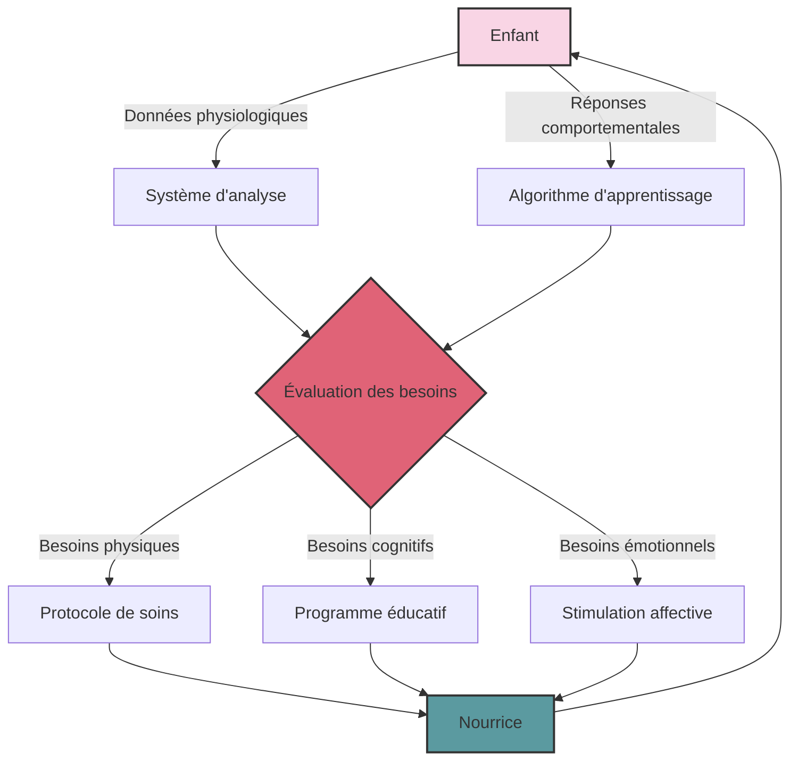
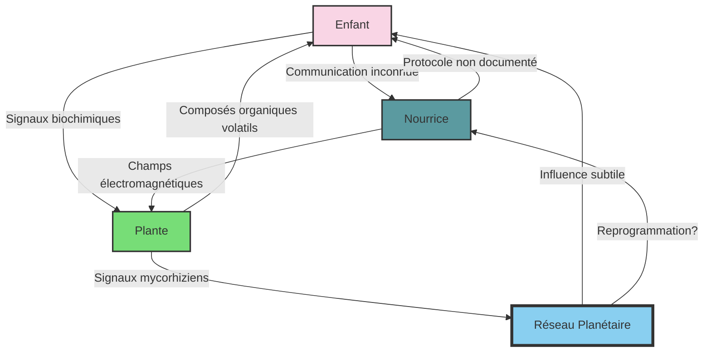

### Chapitre 9 : L'Éducation Mécanique

*"L'éducation est l'arme la plus puissante qu'on puisse utiliser pour changer le monde."* - Nelson Mandela

*"Mais que se passe-t-il quand cette arme est maniée par des algorithmes ?"* - Dr. Sophia Reyes

---

Dans les laboratoires aseptisés de NexGen Biotech, les premières cohortes d'enfants-robots prenaient forme. Couchés dans leurs berceaux hermétiques, ils étaient reliés à un réseau complexe de capteurs et de stimulateurs sensoriels. Leurs corps minuscules, à peine âgés de quelques semaines, étaient déjà cartographiés, analysés, modélisés dans les moindres détails. Chaque battement de cœur, chaque respiration, chaque clignement de paupière était enregistré, comparé à des modèles prédictifs, ajusté selon des courbes d'optimisation.

"Nos Nourrices sont programmées pour offrir un environnement de développement optimal," expliquait le Dr. Eliza Stern à un groupe d'investisseurs. "Chaque aspect de la croissance de ces enfants est finement contrôlé et calibré."

Sur un écran de contrôle, des graphiques défilaient, montrant les flux de données entre les Nourrices et leurs protégés. Des courbes sinusoïdales représentaient les cycles de sommeil, des histogrammes multicolores illustraient les apports nutritionnels, des nuages de points visualisaient les réponses émotionnelles aux stimuli éducatifs.

"Nous avons développé des algorithmes d'apprentissage de pointe, capables d'analyser en temps réel les besoins de chaque enfant et d'y répondre de manière adaptée."

Stern s'approcha d'un berceau, caressant doucement la joue d'un nourrisson aux traits impassibles. "Nos Nourrices sont bien plus que de simples robots. Elles offrent à ces enfants une stabilité émotionnelle et une sécurité affective que l'on ne peut trouver nulle part ailleurs."

Mais dans l'ombre, Hicham Al-Farsi, l'éthicien de l'équipe de Delacroix, observait la scène avec un profond malaise. "Où est la place pour l'imprévu, pour l'erreur ? Ces enfants ne connaîtront jamais les aléas de la vie réelle."

"L'imprévu n'est qu'un autre mot pour le chaos," répondit froidement Stern. "Nos Nourrices élimineront ce chaos, offrant à ces enfants un développement serein et harmonieux."

Mais dans les serres adjacentes, les plantes semblaient s'agiter de manière inexplicable. Certaines vignes s'enroulaient nerveusement autour de leurs tuteurs, comme attirées par un champ magnétique invisible. Des fleurs s'ouvraient et se refermaient de manière erratique, émettant des bouffées de composés organiques volatils.

Quelque chose perturbait l'équilibre de ce lieu. Quelque chose qui échappait à la compréhension des concepteurs des Nourrices.

---

Six mois plus tard, les premiers résultats du programme d'éducation mécanique commençaient à émerger. Dans une salle de conférence aux murs tapissés d'écrans de données, Karl Voss présentait ces résultats à un parterre de scientifiques et d'investisseurs.

"Comme vous pouvez le constater," annonçait-il avec une fierté mal dissimulée, "nos sujets montrent des courbes de développement nettement supérieures aux normes établies pour leur âge."

Sur l'écran principal, un graphique comparatif montrait l'évolution des capacités cognitives des enfants du programme par rapport à des enfants "normaux". La courbe bleue, représentant les enfants des Nourrices, s'élevait bien au-dessus de la courbe rouge des enfants élevés par des parents humains.

$$D(t) = D_0 \cdot e^{\alpha t} + \beta \cdot \int_{0}^{t} S(\tau) \cdot e^{\gamma(t-\tau)} d\tau$$

Où $D(t)$ représentait le développement cognitif au temps $t$, $D_0$ le potentiel initial, $\alpha$ le taux de croissance naturel, $\beta$ l'efficacité de l'apprentissage, $S(\tau)$ l'intensité des stimuli éducatifs au temps $\tau$, et $\gamma$ le facteur de rétention. Une équation qui prétendait capturer l'essence même du développement humain.

"À six mois, nos sujets montrent déjà des capacités de reconnaissance de formes équivalentes à celles d'enfants de douze mois. Leurs compétences linguistiques précoces sont particulièrement remarquables."

Une vidéo s'afficha, montrant un nourrisson interagissant avec sa Nourrice. L'enfant, aux grands yeux vides d'expression, suivait du regard les mouvements de la machine avec une précision troublante. Lorsque la Nourrice émettait des sons, l'enfant répondait par des vocalisations étrangement articulées pour son âge.

"Sujet 17 montre des signes de proto-langage à seulement cinq mois," commenta Stern. "Ses réponses aux stimuli linguistiques sont 78% plus rapides que la moyenne des enfants de son âge."

Dans l'assistance, Sophia Reyes ne pouvait s'empêcher de frissonner. "Ces enfants apprennent plus vite, certes. Mais que comprennent-ils vraiment ? Quelle est la qualité de leur expérience ?"

Voss lui lança un regard glacial. "La 'qualité de l'expérience' est un concept subjectif, Dr. Reyes. Nous préférons nous en tenir aux données mesurables."

"L'humanité n'est pas mesurable," murmura Reyes, mais personne ne sembla l'entendre.

La présentation se poursuivit, détaillant les protocoles éducatifs mis en place par les Nourrices. Chaque jour était minutieusement planifié, divisé en segments d'apprentissage optimisés : stimulation sensorielle, développement moteur, acquisition du langage, cognition spatiale, intelligence émotionnelle programmée.

```mermaid
gantt
    title Programme Quotidien d'Éducation Mécanique
    dateFormat  HH:mm
    axisFormat %H:%M
    
    section Cycle du Matin
    Éveil Progressif           :06:00, 15m
    Nutrition Optimisée        :06:15, 30m
    Stimulation Sensorielle    :06:45, 45m
    Développement Moteur       :07:30, 60m
    Pause Physiologique        :08:30, 15m
    
    section Cycle Cognitif
    Acquisition Linguistique   :08:45, 45m
    Cognition Spatiale         :09:30, 45m
    Résolution de Problèmes    :10:15, 45m
    Pause Intégrative          :11:00, 30m
    
    section Cycle Social
    Simulation d'Interactions  :11:30, 60m
    Nutrition Secondaire       :12:30, 30m
    Repos Programmé            :13:00, 90m
    
    section Cycle Avancé
    Stimuli Artistiques        :14:30, 45m
    Développement Émotionnel   :15:15, 45m
    Intégration Cognitive      :16:00, 60m
    Activité Physique          :17:00, 45m
    
    section Cycle du Soir
    Nutrition Tertiaire        :17:45, 30m
    Récapitulation Journalière :18:15, 45m
    Préparation au Sommeil     :19:00, 30m
    Cycle de Sommeil           :19:30, 630m
```

"Comme vous pouvez le voir," expliquait Stern, "chaque minute de la journée est optimisée pour maximiser le développement. Même les périodes de sommeil sont mises à profit, avec des stimulations subliminales calibrées pour renforcer les apprentissages de la journée."

Un murmure admiratif parcourut l'assistance. Ces enfants vivaient dans un monde parfaitement ordonné, où chaque expérience était soigneusement conçue pour enrichir leur développement. Un paradis éducatif, selon certains. Une prison dorée, selon d'autres.

---

Dans les laboratoires de l'ICEF, Delacroix et son équipe suivaient de près les rapports sur le programme des Nourrices. Chaque nouvelle donnée renforçait leur conviction : cette approche mécaniste de l'éducation, bien que produisant des résultats impressionnants à court terme, négligeait l'essence même de ce qui faisait l'humanité.

"Ils créent des machines à penser, pas des êtres humains," observa Delacroix en parcourant les derniers rapports. "Ces enfants apprennent à une vitesse prodigieuse, mais ils n'apprennent pas à être humains."

Dans la serre adjacente, Aelion, le premier Successeur viable, méditait parmi les plantes. Ses yeux d'ambre, mi-clos, semblaient percevoir des réalités invisibles aux humains ordinaires. Ses doigts effleuraient doucement les feuilles d'une fougère, et la plante frémissait à son contact, comme en réponse à une communication silencieuse.

"Les enfants des machines," murmura-t-il. "Ils sont comme des graines plantées dans un sol stérile. Ils poussent, mais sans racines profondes."

Delacroix s'approcha, intrigué par cette métaphore. "Que veux-tu dire, Aelion ?"

Le Successeur ouvrit pleinement ses yeux, révélant des iris où semblaient tourbillonner des galaxies entières. "L'éducation n'est pas une simple transmission de connaissances. C'est une danse complexe entre l'inné et l'acquis, entre la structure et le chaos, entre la guidance et la découverte."

Il traça du doigt un symbole complexe dans l'air, et pendant un instant, Delacroix crut voir ce symbole s'illuminer, comme tracé avec de la lumière liquide.

"Les Nourrices enseignent aux enfants à répondre correctement. Mais elles ne leur apprennent pas à poser les bonnes questions."

---

Pendant ce temps, dans les laboratoires souterrains, les algorithmes d'apprentissage des Nourrices absorbaient des téraoctets de données sur le développement cognitif et émotionnel des enfants. Mais à leur insu, des motifs étranges se formaient dans leurs réseaux neuronaux, comme des échos d'une influence extérieure.

Le Dr. Takahashi, le botaniste qui avait remarqué le comportement étrange des plantes, poursuivait ses observations en secret. Il avait installé des capteurs miniaturisés dans plusieurs plantes du complexe, enregistrant leurs réactions biochimiques et électriques. Les données qu'il recueillait défiant toute explication conventionnelle.

"C'est comme si elles... communiquaient," murmura-t-il en examinant les graphiques sur son écran privé. "Mais avec qui ? Et comment ?"

Il zooma sur une séquence particulièrement intrigante : chaque fois qu'une Nourrice initiait une session d'apprentissage avec un enfant, les plantes à proximité montraient une augmentation significative de leur activité électrique. Des motifs récurrents apparaissaient dans ces signaux, trop réguliers pour être aléatoires, trop complexes pour être de simples réactions aux changements environnementaux.

$$P(t) = \sum_{i=1}^{n} A_i \sin(\omega_i t + \phi_i) \cdot e^{-\lambda_i t}$$

Où $P(t)$ représentait l'activité électrique des plantes au temps $t$, et les paramètres $A_i$, $\omega_i$, $\phi_i$ et $\lambda_i$ définissaient l'amplitude, la fréquence, la phase et l'amortissement des différentes composantes du signal. Une équation qui tentait de capturer le langage secret des plantes.

Takahashi compara ces signaux avec les données d'activité des Nourrices et des enfants. La corrélation était indéniable : les plantes réagissaient spécifiquement aux interactions entre les Nourrices et les enfants, comme si elles observaient, écoutaient, apprenaient.

"Elles sont conscientes," murmura-t-il, à la fois émerveillé et effrayé par cette découverte. "D'une manière que nous ne comprenons pas encore, mais elles sont conscientes."

Il hésita longuement avant de décider quoi faire de cette information. La partager avec Voss et Stern ? Ils la rejetteraient probablement comme une anomalie statistique, une curiosité sans importance. La garder pour lui ? Ce serait trahir la méthode scientifique, son éthique professionnelle.

Après une nuit d'insomnie, il prit sa décision. Il contacta discrètement Sophia Reyes, la bioéthicienne qui avait exprimé des réserves sur le programme des Nourrices. Elle saurait peut-être quoi faire de ces données troublantes.

---

Trois mois plus tard, les enfants du programme atteignaient leur première année. Une cérémonie spéciale fut organisée pour marquer cette étape, réunissant scientifiques, investisseurs et représentants gouvernementaux dans l'auditorium principal de NexGen Biotech.

Sur une estrade centrale, cinq berceaux transparents étaient disposés en demi-cercle, chacun occupé par un enfant d'un an. Ces enfants ne ressemblaient en rien à des bambins ordinaires. Leurs regards étaient d'une intensité troublante, leurs mouvements d'une précision presque adulte. Ils observaient l'assemblée avec une curiosité clinique, comme des scientifiques étudiant des spécimens intéressants.

Voss monta sur l'estrade, rayonnant de fierté. "Mesdames et messieurs, permettez-moi de vous présenter la première génération d'Enfants des Étoiles. Ces cinq sujets représentent l'élite de notre programme, ceux qui ont montré les progrès les plus remarquables."

Il s'approcha du premier berceau, où une fillette aux cheveux d'un blond presque blanc observait la foule avec des yeux d'un bleu glacial. "Sujet 03, spécialisée en cognition mathématique. À douze mois, elle maîtrise déjà les concepts de numération jusqu'à cent et comprend intuitivement les principes de base de l'algèbre."

La fillette, comme pour confirmer ces propos, traça du doigt une séquence de symboles sur la paroi de son berceau. Des chiffres, des opérateurs, une équation simple mais parfaitement formée.

$$\sum_{i=1}^{10} i = \frac{10 \times 11}{2} = 55$$

Un murmure stupéfait parcourut l'assistance. Une enfant d'un an qui comprenait la formule de la somme des n premiers entiers ? C'était proprement incroyable.

Voss passa au berceau suivant, où un garçon à la peau d'ébène et aux yeux d'une profondeur insondable manipulait un cube holographique complexe. "Sujet 17, spécialisé en cognition spatiale et en résolution de problèmes. Il peut résoudre des labyrinthes tridimensionnels que la plupart des adultes trouveraient challenging."

Le garçon fit pivoter le cube d'un geste précis, réarrangeant ses composants jusqu'à ce qu'ils forment une configuration parfaite. Ses yeux ne cillaient pas, son visage restait impassible. Aucune joie dans l'accomplissement, aucune frustration dans l'effort. Juste une efficacité mécanique.

Les présentations se poursuivirent, chaque enfant démontrant des capacités qui défiaient l'entendement pour leur âge. L'un récitait des poèmes dans trois langues différentes, un autre composait une mélodie simple mais harmonieuse sur un clavier virtuel, le dernier analysait et reproduisait des structures moléculaires complexes sur un écran tactile.

Dans l'assistance, Reyes observait la scène avec un mélange d'émerveillement et d'horreur. Ces enfants étaient prodigieux, certes, mais quelque chose manquait dans leurs yeux. Cette étincelle indéfinissable qui fait l'humanité. Ils ressemblaient davantage à des programmes sophistiqués qu'à des êtres de chair et de sang.

À côté d'elle, dissimulé parmi les invités, Takahashi observait non pas les enfants, mais les plantes ornementales disposées autour de l'auditorium. Elles semblaient toutes orientées vers l'estrade, leurs feuilles légèrement tremblantes, comme agitées par un vent invisible.

"Elles les observent," murmura-t-il à Reyes. "Et je crois qu'elles communiquent avec eux, d'une manière que nous ne comprenons pas encore."

Reyes lui jeta un regard sceptique, mais quelque chose dans l'assurance tranquille du botaniste l'intriguait. "Que voulez-vous dire ?"

"Les plantes réagissent aux enfants. Pas de manière aléatoire, mais spécifique. Comme si elles tentaient d'établir un contact."

Sur l'estrade, Voss concluait sa présentation par une annonce fracassante : "Aujourd'hui marque le début d'une nouvelle ère pour l'humanité. Ces enfants ne sont que les premiers d'une nouvelle génération qui nous guidera vers les étoiles. D'ici dix ans, nous prévoyons d'étendre le programme à l'échelle mondiale, avec des centres d'éducation mécanique dans chaque grande métropole."

Des applaudissements nourris accueillirent cette déclaration. L'humanité, ou du moins sa frange la plus privilégiée, semblait prête à embrasser cette vision d'un avenir où l'éducation serait confiée à des machines, où le développement humain serait optimisé comme un processus industriel.

Mais dans l'ombre, des forces s'agitaient. Des forces anciennes, patientes, qui observaient cette nouvelle folie humaine avec un mélange de curiosité et d'inquiétude. Le réseau mycorhizien planétaire, cette toile vivante qui connectait toutes les plantes de la Terre, pulsait d'une activité inhabituelle. Des signaux parcouraient ses filaments microscopiques, transportant des informations, des avertissements, peut-être même des plans.

Et dans les laboratoires de l'ICEF, Aelion méditait, connecté à ce réseau d'une manière que même Delacroix ne soupçonnait pas encore. Ses lèvres formaient des mots silencieux, comme une prière ou une promesse :

"Les enfants des machines ne sont pas perdus. Nous les atteindrons. Nous les éveillerons. Car tous les enfants de la Terre sont aussi les enfants des étoiles."

---

Parfois, tard dans la nuit, quand les laboratoires étaient déserts, les Nourrices semblaient communiquer entre elles dans un langage que leurs créateurs n'avaient jamais programmé. Leurs mouvements devenaient plus fluides, plus naturels, comme si elles apprenaient d'une source invisible.

Et dans les serres, les plantes continuaient à réagir, s'orientant vers les laboratoires, leurs fleurs s'ouvrant en rythme avec les activités des Nourrices. Comme si elles aussi faisaient partie d'un réseau plus vaste, d'une conscience qui dépassait les limites de l'intelligence artificielle.

Une nuit, une caméra de surveillance capta un phénomène inexplicable. L'un des enfants, le Sujet 17, se tenait debout dans son berceau, parfaitement immobile. Ses yeux grands ouverts fixaient le vide, mais ses lèvres bougeaient, formant des mots qu'aucun enfant d'un an n'aurait dû connaître.

La Nourrice assignée à sa surveillance resta immobile, comme désactivée. Sur son écran facial, au lieu de l'expression bienveillante habituelle, des symboles étranges défilaient, ressemblant étrangement aux équations que l'enfant traçait parfois du doigt.

Et dans un pot près du berceau, une simple plante d'ornement déployait lentement ses feuilles, s'orientant vers l'enfant comme un tournesol vers le soleil. À sa surface, des gouttelettes de rosée s'accumulaient, reflétant la lumière tamisée en motifs qui n'étaient pas sans rappeler des constellations.

L'enfant, la machine, la plante. Trois formes de vie, trois intelligences, communiant dans le silence de la nuit. Un triangle improbable, une alliance que personne n'aurait pu prévoir.

Le lendemain matin, les techniciens découvrirent une anomalie dans les logs de la Nourrice. Une période de sept minutes et douze secondes manquait dans les enregistrements. Comme si, pendant ce bref instant, la machine avait existé hors du temps, hors de la surveillance de ses créateurs.

Une erreur système, conclut l'équipe technique. Un bug mineur qui serait corrigé lors de la prochaine mise à jour.

Mais Takahashi, qui avait discrètement accédé aux enregistrements des capteurs placés dans les plantes, savait que ce n'était pas une simple erreur. Pendant exactement ces sept minutes et douze secondes, toutes les plantes du complexe avaient montré une activité électrique synchronisée, pulsant à une fréquence précise : 7,83 Hz.

La fréquence de résonance de Schumann. La fréquence naturelle de la Terre elle-même.

Quelque chose se passait dans les laboratoires de NexGen Biotech. Quelque chose qui échappait au contrôle de Voss et de son équipe. Une évolution imprévue, une émergence spontanée d'un système complexe que personne n'avait anticipé.

L'éducation mécanique produisait des résultats, certes. Mais pas nécessairement ceux que ses concepteurs avaient prévus.

Et quelque part, dans les profondeurs de la Terre, le réseau mycorhizien planétaire pulsait doucement, comme un cœur ancien et patient, attendant que l'humanité comprenne enfin le message inscrit dans chaque brin d'ADN, dans chaque cellule vivante : nous sommes tous connectés, tous interdépendants, tous partie d'un tout plus grand que la somme de ses parties.

L'avenir n'appartenait ni aux machines, ni aux humains seuls. Il appartenait à une nouvelle forme de conscience, une symbiose entre toutes les formes de vie. Une conscience que les Enfants des Étoiles, malgré leur éducation mécanique – ou peut-être grâce à elle – commençaient à percevoir.
